# (03) Basic Version and Branch Management (Git)

## Data Diri
Nomor Urut: 1_001FLB_42
Nama: Abghi Fareihan Desailie

## Summary
Pada section 3 ini, saya belajar tentang Basic Version and Branch Management (Git)

#### Fitur Git sebagai Version Control System (VCS)
Git adalah salah satu version control system popular yang digunakan para developer untuk mengembangkan software secara bersama-bersama.

#### Kelebihan GIT
- Penyimpanan yang berbasis file (tidak menggunakan database/SQL).
- Gratis atau Opensource.
- Visual Control System yang terdistribusi.
Mendukung dalam proyek besar seperti kernel Linux.
- Akses yang hanya menggunakan command line tanpa menggunakan client-server.
- Tampilan aplikasi yang mudah dipahami untuk pengguna baru.

#### Git Branch
Branching adalah fitur umum digunakan dalam version control system. Dapat dikatakan bagian dari keseharian dalam proses development.
Branch umum digunakan saat kita akan menambahkan fitur baru atau memperbaiki bug. Penggunaan branch bertujuan agar perubahan tidak mengganggu file master.
Jika penambahan fitur atau perbaikan bug sudah selesai, branch dapat di merge kembali ke main (master) branch.

## Task

#### Task 01
##### Membuat repository github :

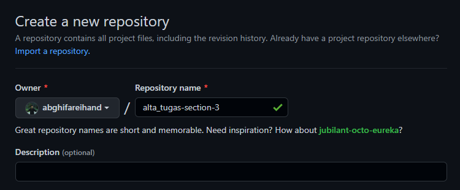

#### Task 02
##### Implementasi branch master, development, featureA, featureB :

Membuat branch development saat ada di branch master
``git checkout -b development``

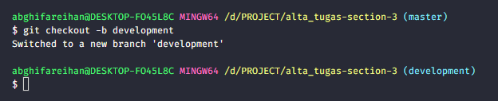

Membuat branch featureA saat ada di branch development
``git checkout -b featureA``

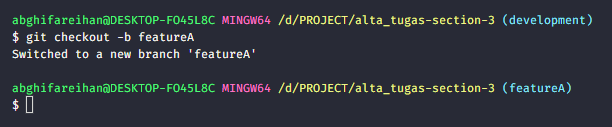

Membuat branch featureA saat ada di branch development
``git checkout -b featureA``

#### Task 03
##### Implementasi intruksi git untuk push, pull, stash dan merge :

#### PUSH
Menggunakan push untuk (upload) remote origin master
``git push origin master``

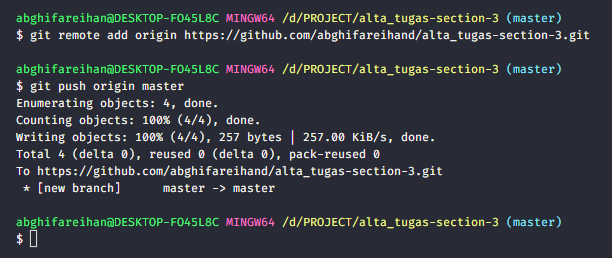

#### PULL
Membuat file dari browser github, lalu nanti akan di pull dari vscode

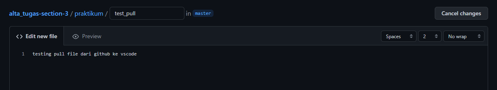

Menggunakan pull untuk meangakses (download) file dari luar (dari github)
``git pull origin master``

#### STASH
Menambahkan perubahan yang di simpan di memory stash, lalu di push
``git stash``
``git stash apply``

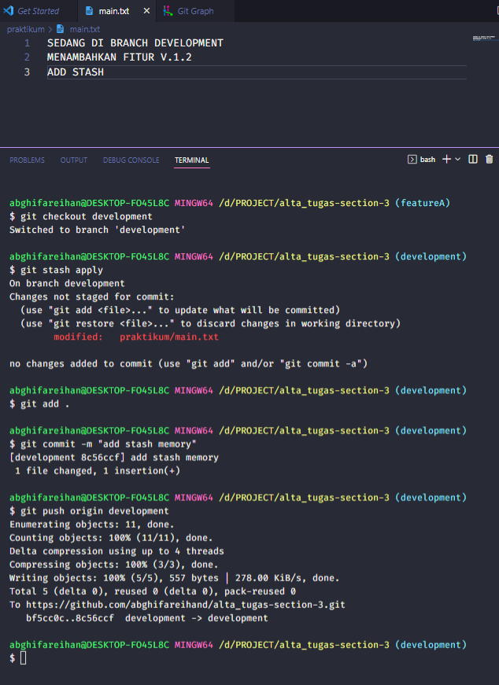

#### MERGE
Merge dari development ke branch master (yang artinya project tersebut sudah benar benar final)
``git checkout master``
``git merge --no-ff development``

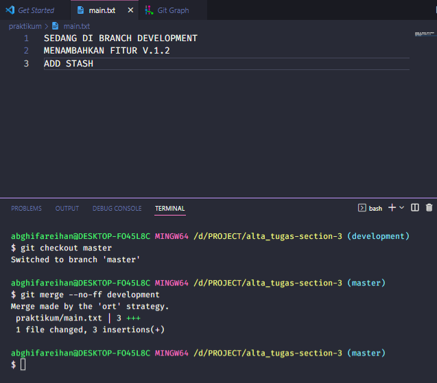

#### Task 04
##### Implementasi penangan conflict :

Contoh gambar di bawah ini, terjadinya conflict karena di branch featureB yang tadinya di merge ke featureA terjadi perubahan pada satu line (atau line yang sama)

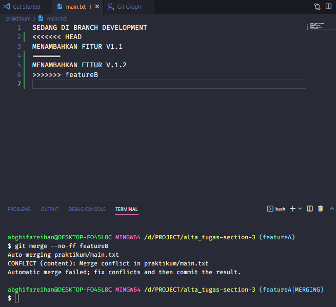

Cara mengatasinya yaitu dengan memilih salah satu oerubahan yang nantinya akan dipakai setelah itu di ``git add .`` lalu ``commit -m "fix conflict"`` dan setelah itu di push.

Disini saya memilih perubahan yang ada pada branch featureB

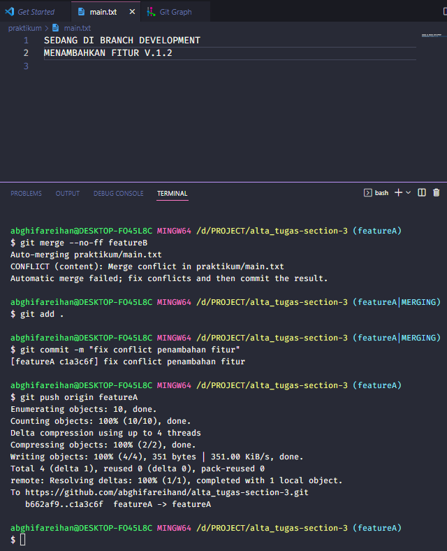

#### Task 05
##### Merge no fast forward :

Merge no forward dari branch fetureA ke branch development
``git merge --no-ff development``

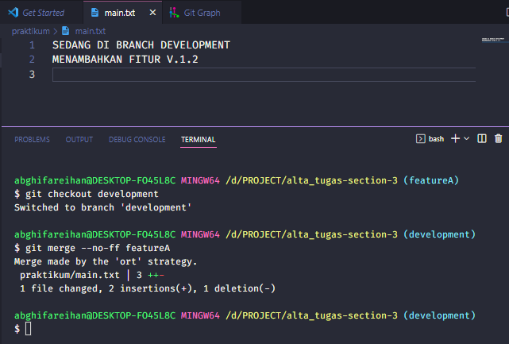

#### Task 06
##### Alamat repository : https://github.com/abghifareihand/alta_tugas-section-3

##### Graph

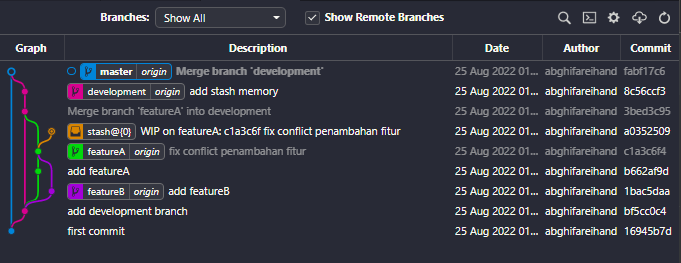

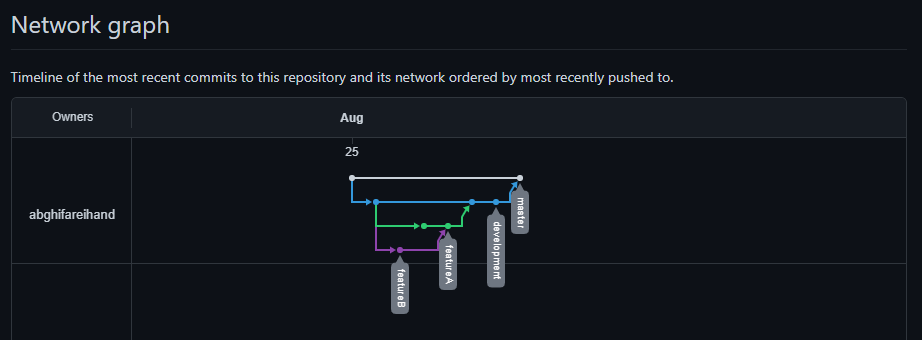