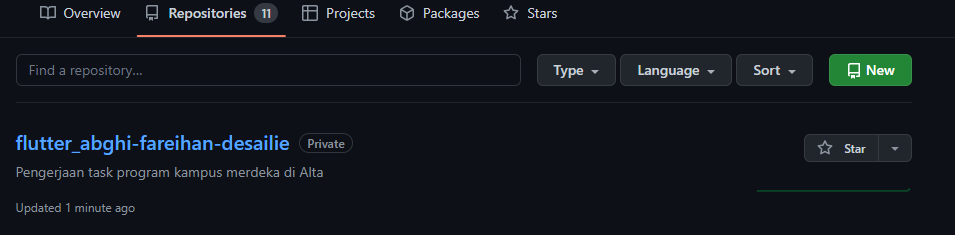
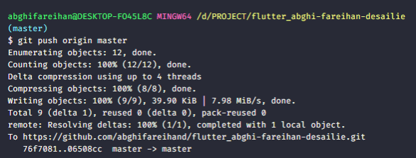
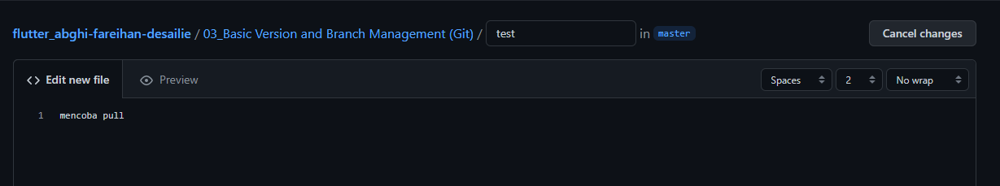
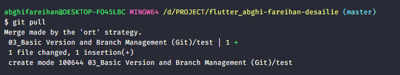
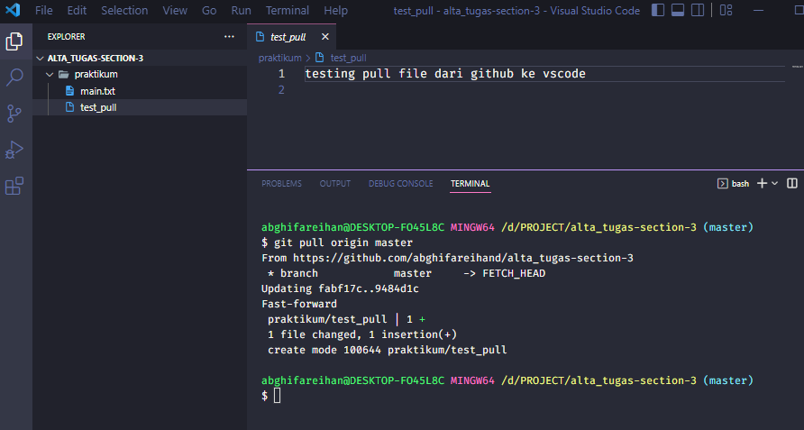
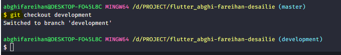

## Data Diri
No Peserta: 1_001FLB_42
Nama: Abghi Fareihan Desailie

## Summary
Pada section 3 ini, saya belajar tentang Basic Version and Branch Management (Git)

### Fitur Git sebagai Version Control System (VCS)
Git adalah salah satu version control system popular yang digunakan para developer untuk mengembangkan software secara bersama-bersama.

### Kelebihan GIT
- Penyimpanan yang berbasis file (tidak menggunakan database/SQL).
- Gratis atau Opensource.
- Visual Control System yang terdistribusi.
Mendukung dalam proyek besar seperti kernel Linux.
- Akses yang hanya menggunakan command line tanpa menggunakan client-server.
- Tampilan aplikasi yang mudah dipahami untuk pengguna baru.

### Git Branch
Branching adalah fitur umum digunakan dalam version control system. Dapat dikatakan bagian dari keseharian dalam proses development.
Branch umum digunakan saat kita akan menambahkan fitur baru atau memperbaiki bug. Penggunaan branch bertujuan agar perubahan tidak mengganggu file master.
Jika penambahan fitur atau perbaikan bug sudah selesai, branch dapat di merge kembali ke main (master) branch.

## Task

### Task 01
Saya membuat repository github dengan nama "abghifareihand/flutter_abghi-fareihan-desailie" berikut adalah bukti screenshots repository yang sudah saya buat 

### Task 02
Saya membuat repository github dengan nama "abghifareihand/flutter_abghi-fareihan-desailie" berikut adalah bukti screenshots repository yang sudah saya buat 

### Task 03
####Implementasi intruksi git, push, pull, stash

Penerapan push

Penerapan pull

Penerapan git, untuk pindah branch
