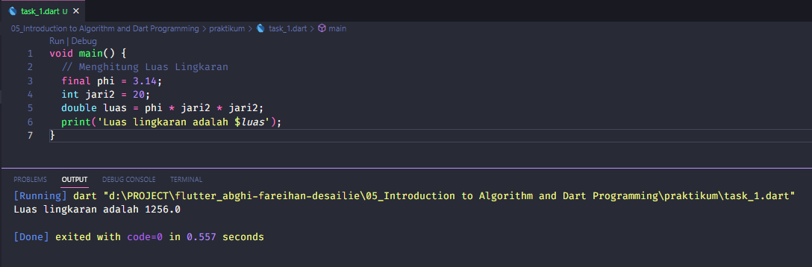
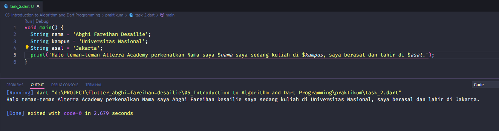

# (05) Introduction to Algorithm and Dart Programming

## Data Diri
Nomor Urut: 1_001FLB_42
Nama: Abghi Fareihan Desailie

## Summary
Pada section 5 ini, saya belajar tentang Introduction to Algorithm and Dart Programming. 
- Apa itu Dart ? Dart adalah bahasa pemograman yang dirancang untuk membuat aplikasi agar dapat berjalan dengan cepat.
- Kenapa (harus) Dart? Type safe, Null safety, Rich standart library, dan Multiplatform.

### Program Dart Sederhana
Fungsi Main
- Bagian yang dijalankan pertama kali
- Dapat memiliki tipe data void atau int
- Memiliki nama main
Perintah __print__ digunakan untuk menampilkan data ke layar.


### Variable
- Digunakan untuk menyimpan data
- Memiliki nama
- Memiliki tipe data

Deklarsi varibale. Menggunakan var dan diikuti nama variable secara otomatis tipe data varibale tersebut adalah Null. Contoh : 'var usia;'

Memberi nilai pada varibale. Contoh :
```
void main() {
    var usia;
    usia = 18;
}
```
Inisiasi Variable. Deklarasi danmemberi nilai variable secara bersamaan. Contoh :
```
void main() {
    var usia = 18;
}
```

### Konstanta
- Digunakan untuk menyimpan data
- Memiliki nama
- Memiliki tipe data
- Nilainya tetap (tidak bisa di ubah)

Membuat Konstanta. Menggunakan __final__, diikuti nama dan diberikan nilai secara langsung. Contoh :
```
void main() {
    final usia = 18;
}
```
Jadi, jika di bawahnya kita mau ubah usia nya itu tidak bisa, karena bersifat final tidak bisa diubah

### Tipe Data
- Jenis data yang dapat dikelola
- Tipe data sederhana disebut primitive data type

#### Jenis Tipe Data

##### int = Menggantikan var dengan int data harus bilangan bulat
```
void main() {
    int usia = 21;
}
```

##### double = Menggantikan var dengan int data harus bilangan pecahan, penulisan pecahan dengan tanda titik
```
void main() {
    double tinggi = 168.5;
}
```

##### bool = Menggantikan var dengan int data harus "true/false"
```
void main() {
    bool pria = true;
}
```

##### string = Menggantikan var dengan int data berupa text, penulisan text diawali dan diakhiri tanda kutip
```
void main() {
    String nama = 'Abghi;
}
```

### Operator
- Digunakan untuk operasi pengolahan data
- Data yang dikelola disebut operand

#### Contoh Operator :
- Arithmetic
- Assignment
- Comparison
- Logical


## Task

#### Task 01
##### Implementasikan rumus luas lingkaran pada program Dart?


- Pada baris ke 3 mendeklarasikan konstanta __phi__ dengan nilai 'final' 3.14. Artinya phi itu bersifat final tidak bisa di ubah.
- Pada baris ke 4 mendeklarasikan __jari2__ menggunakan tipe data int karna jari-jari nya nilainya bulat.
- Pada baris ke 5 mendeklarasikan __luas__ menggunakan tipe data double karna hasil dari luas kemungkinan nilainya pecahan.
- Pada baris ke 6 menampilkan nilai print dari luas lingkaran tersebut


#### Task 02
##### Buatlah 3 buah variable yang berisi string, lalu sambungkan seluruh string tersebut, dan tampilkan pada layar!


Saya menggunakan tipe data String pada nama, kampus, asal. Dan saya menggunakan cara inisiasi langsung.

Berikut adalah menggunakan cara lain :
```
void main() {
  String nama, kampus, asal;
  nama = 'Abghi';
  kampus = 'Universitas Nasional';
  asal = 'Jakarta';
  print('Halo teman-teman Alterra Academy perkenalkan Nama saya $nama saya sedang kuliah di $kampus, saya berasal dan lahir di $asal.');
}
```


