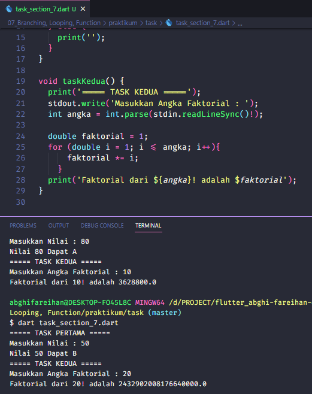

# (07) Branching, Looping, Function

## Data Diri
Nomor Urut: 1_001FLB_42
Nama: Abghi Fareihan Desailie

## Task

#### Task 01
Terdapat sebuah nilai:
a. jika nilai > 70: return A
b. jika nilai > 40: return B
c. jika nilai > 0: return C
d. selain itu return text kosong

Saya menggunakan standart input/output agar bisa melakukan peng-inputan angka secara dinamis

#### Task 02
Tampilkan nilai faktorial dari:
a. 10
b. 20
c. 30

Saya menggunakan standart input/output agar bisa melakukan peng-inputan angka secara dinamis

