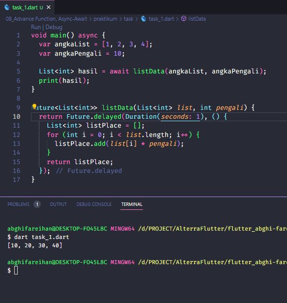
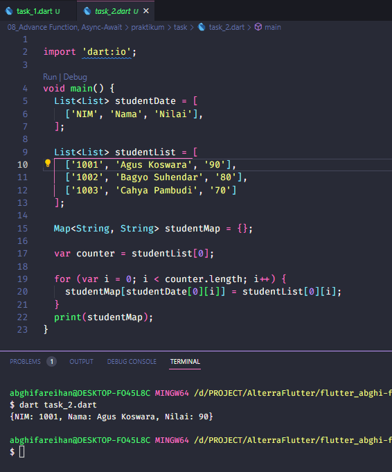

# (08) Advance Function, Async-Await

## Data Diri
Nomor Urut: 1_001FLB_42
Nama: Abghi Fareihan Desailie

## Task

#### Task 01
Buatlah sebuah fungsi dengan spesifikasi berikut:
a. menerima 2 parameter, yaitu data dan pengali
b. lakukan perulangan pada list data secara asynchronous
c. tiap perulangan, kalikan elemen list data dengan pengali
d. return list baru yang berisi hasil proses di atas

Pada task 1 ini saya menggunakan fungsi list yg terdapat 2 paramater dengan nama list dan pengali.
Tiap angka yang ada di list di kalikan ke angka pengali yaitu 10.
Saya menggunakan async await dengan durasi 1 detik, untuk menunggu output angka nya.

#### Task 02
Buatlah sebuah list dengan spesifikasi berikut
a. tiap element nya berupa list juga
b. tiap element wajib terdapat 2 data (sub element)

Buatlah sebuah Map dengan menggunakan elemen tersebut

Pada task 2 ini saya menggunakan list di dalam list yaitu List studentDate dan List studentDate, lalu di masukan ke map dan outputnya berupa map.

