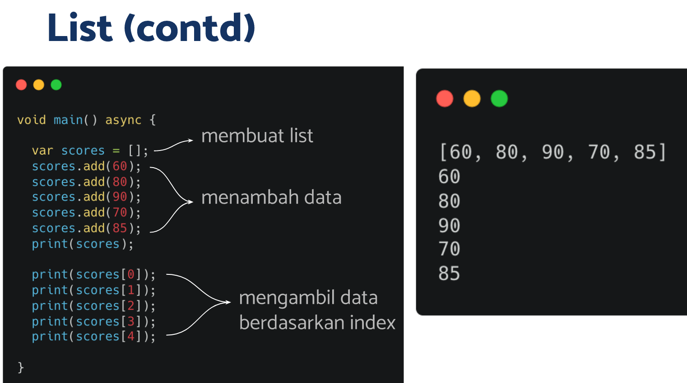
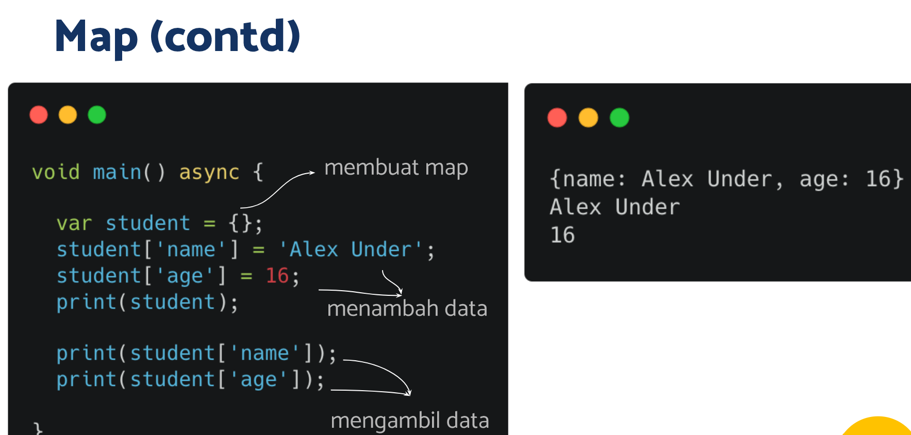

# (08) Advance Function, Async-Await

## Data Diri
Nomor Urut: 1_001FLB_42
Nama: Abghi Fareihan Desailie

## Summary
Pada section 8 ini, saya belajar tentang Advance Function, Async-Await


### Anonymous Function
- Tidak memiliki nama
- Fungsi sebagai data

```
var hello = () { // variable
    print('hello); // anonymous function
};

var jumlah = (int a, int b) {
    return a + b;
};

void main () {
    hello();
    print(jumlah(1. 2)); // memanggil anonymous function
}
```

### Arrow Function
- Dapat memiliki nama
- Berisi 1 data (dari proses maupun data statis)
- Nilai return fungsi ini diambil dari data tersebut

```
var hello = () => print('hello');
var jumlah = (int a, int b) => a + b;

void main () {
    hello();
    print(jumlah(1, 2));
}
```

### Async-Await
- Menjalankan beberapa proses tanpa perlu menunggu
- Proses ditulis dalam bentuk fungsi
- Await akan menunggu hingga proses async selesai


### Tipe Data Future
- Data yang dapat ditunggu
- Membawa data return dari fungsi async

Penggunaan Future
```
Future<String> P1 () {
    return Future.delayed(Duration(seconds: 1),() {
      return 'Hello dart P1';
    });
}

void main() async {

  var data = await P1();
  print(data);
}
```
 - Fungsi hello melakukan print di dalamnya
 - Fungsi jumlah memberi nilai saat dijalankan sehingga dapat dilakukan print

### Collection
Collection merupakan kumpulan data pada satu tempat

- List
Menyimpan data (elemen) secara berbaris, Tiap data memiliki index



- Map
Menyimpan data secara key-value, Key berguna selayaknya index pada list

