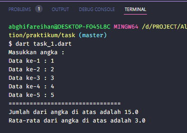
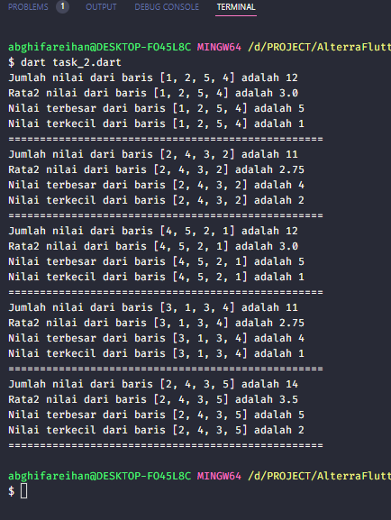

# (09) Collection

## Data Diri
Nomor Urut: 1_001FLB_42
Nama: Abghi Fareihan Desailie

## Task

#### Task 01
Buatlah sebuah program yang menerima 5 angka dari pengguna dan disimpan ke dalam array. Berdasarkan angka yang diberikan oleh pengguna hitunglah rata-ratanya.

```dart
void main() {
  List angka = []; // saya membuat list penampung untuk angka
  double total = 0; // tipe data untuk menghasilkan output pakai double dan di tuliskan angka awal 0
  double rata2; // menggunakan double karna berpotensi bilangan desimal ountuk rata rata

  print("Masukkan angka : ");
  for (int i = 0; i < 5; i++) { // menggunakan perulangan for
    stdout.write('Data ke-${i + 1} : '); // dan melakukan perulangan dari data ke-1
    var input = stdin.readLineSync();
    if (input != null) { // jika data nya tidak sama dengan null, alias datanya ke isi, maka data tersebut ankan di konversi dan menghasilkan nilai
      int data = int.parse(input);
      angka.add(data);
    }
  }
  for (var i = 0; i < angka.length; i++) { // melakukan perulangan untuk total dari panjang angka/data yang di masukkan
    total += angka[i]; // total = total + angka index i
  }
  print('================================');
  print('Jumlah dari angka di atas adalah ${total}');
  rata2 = total / angka.length; // menghitung rata rata, total di bagi dengan panjang angka. panjang angka nya adalah 5
  print('Rata-rata dari angka di atas adalah ${rata2}');
}
```




#### Task 02
Buatlah program array dua dimesnsi untuk matrix ukuran 5x4.
Lakukan perhitungan sebagai berikut:
a. Hitunglah jumlah nilai setiap barisnya
b. Hitunglah rata-rata nilai dari setiap barisnya
c. Carilah nilai terbesar dan terkecil pada setiap barisnya.

```dart
void main(List<String> args) {
  var nilai;
  var jumlah;
  var rata2;
  // saya membuat variable nilai, jumlah dan rata2 dengan tipe data var
  List matrix = [
    [1, 2, 5 ,4],
    [2, 4, 3 ,2],
    [4, 5, 2, 1],
    [3, 1, 3, 4],
    [2, 4, 3, 5]
  ]; // saya langsung input nilai matrix dengan menggunakan tipe data list

  for (nilai in matrix) {
    jumlah = nilai[0] + nilai[1] + nilai[2] + nilai[3]; // mencari jumlah dengan menambahkan masing2 angka pada index tersebut, dari index ke-0 sampai index ke-3

    rata2 = jumlah / nilai.length; // mencari rata rata dengan jumlah nilai di bagi dengan panjang dari nilai tersebut.

    int min = nilai[0]; // inisiasi min dengan nilai dari index ke 0
    int max = nilai[0]; // inisiasi min dengan nilai dari index ke 0

    for(int i = 0; i < nilai.length; i++) { // melkaukan perulangan for
      if (nilai[i] < min) {
        min = nilai[i]; // jika nilai tersebut kurang dari min / kurang dari (angka terkecil di baris nilai) nilai yg ada di baris maka menghasilkan nilai min
      }
      if (nilai[i] > max) {
        max = nilai[i]; // jika nilai tersebut lebih dari max / lebih dari (angka terbesar di baris nilai) nilai yg ada di baris maka menghasilkan nilai max
      }
    }
    print('Jumlah nilai dari baris $nilai adalah $jumlah');
    print('Rata2 nilai dari baris $nilai adalah $rata2');
    print('Nilai terbesar dari baris $nilai adalah $max');
    print('Nilai terkecil dari baris $nilai adalah $min');
    print('==================================================');

  }
}
```




#### Task 03
Buatlah program yang memanfaatkan parameter List<String> args untuk operasi aritmatika. Sebagai contoh :
a. 'dart namaProgram 5 + 4', untuk operasi penjumlahan angka pertama (5) dengan angka kedua (4).
a. 'dart namaProgram 5 - 4', untuk operasi pengurangan angka pertama (5) dengan angka kedua (4).
a. 'dart namaProgram 5 x 4', untuk operasi perkalian angka pertama (5) dengan angka kedua (4).
a. 'dart namaProgram 5 / 4', untuk operasi pembagian angka pertama (5) dengan angka kedua (4).


```dart
void main(List<String> args) { // memanfaatkan paramenter list argument
  if(args.length == 3) { // jika panjang args (list) sama dengan 3 maka akan menjalankan perintah di bawah
    final arg1 = double.parse(args[0]); // konversi args1 ke double pada args index ke 0 (angka 5)
    final arg2 = double.parse(args[2]); // konversi args2 ke double pada args index ke 2 (angka 4)
    if(args[1]=='+') { 
      print('${arg1+arg2}'); // jika args index ke-1 di input '+' maka akan terjadi penjumlahan antara args[0] dan args[2]. Atau args index ke-0 yaitu 4 dan args index ke-2 yaitu 5.
    } else if (args[1]=='-') { 
      print('${arg1-arg2}');  // jika args index ke-1 di input '-' maka akan terjadi pengurangan antara args[0] dan args[2].
    } else if (args[1]=='x') {
      print('${arg1*arg2}'); // jika args index ke-1 di input 'x' maka akan terjadi perkalian antara args[0] dan args[2].
    } else if (args[1]=='/') {
      print('${arg1/arg2}'); // jika args index ke-1 di input '/' maka akan terjadi pembagian antara args[0] dan args[2].
    }
  } else {
    print('Perintah yang dijalankan tidak sesuai'); // jika kita tidak meng input antara '+' '-' '/' 'x' akan terjadi output ini
  }
}
```