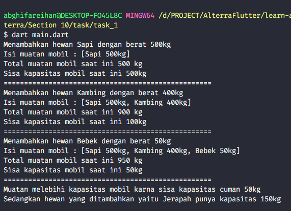

# (10) Dart Object Oriented Programming 1

## Data Diri
Nomor Urut: 1_001FLB_42
Nama: Abghi Fareihan Desailie

## Task

#### Task 01
Buatlah beberapa class dengan rangkaian berikut ini!

#### Task 02
Pada class mobil, tambahkan method totalMuatan untuk menghitung total muatan yang diangkut oleh mobil tersebut.

