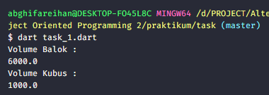

# (11) Dart Object Oriented Programming 2

## Data Diri

| Nomor       | Nama                    |
| ----------- | ----------------------- |
| 1_001FLB_42 | Abghi Fareihan Desailie |

## Task

#### Task 01

##### Soal :


##### Source Code :

```dart
class BangunRuang {
  double panjang, lebar, tinggi; // membuat atribut di class utama
  BangunRuang(this.panjang, this.lebar, this.tinggi); // membuat constructor

  double volume() {
    return 0;
  } // membuat method volume() di class utama
}

class Kubus extends BangunRuang {
  double sisi; // menambahkan atribut baru di class Kubus
  Kubus(super.panjang, super.lebar, super.tinggi, this.sisi);
  // super = memanggil atribut dari class utama
  // this = memanggil atribut dari class itu sendiri

  @override
  double volume() {
    print('Volume Kubus : ');
    return sisi * sisi * sisi;
  }
} // memanggil method dari class utama dan menambahkan rumus

class Balok extends BangunRuang {
  Balok(super.panjang, super.lebar, super.tinggi);
  // memanggil atribut dari class utama dengan super.

  @override
  double volume() {
    print('Volume Balok : ');
    return panjang * lebar * tinggi;
  }
}  // memanggil method dari class utama dan menambahkan rumus

void main() {
  List<BangunRuang> bangunRuang = []; // membuat penampung dengan list
  bangunRuang.add(Balok(10, 20, 30)); // input angka
  bangunRuang.add(Kubus(0, 0, 0, 10));

  for (var bangun in bangunRuang) { // menggunakan perulangan for
    print(bangun.volume()); // print volume class balok dan kubus
  }
}
```

##### Output :



<br>
<br>
<br>

#### Task 02

##### Soal :


##### Source Code :

```dart
class Matematika {
  hasil() {
    return 0;
  }
} // membuat method hasil() di class utama

class KelipatanPersekutuanTerkecil implements Matematika {
  int x; // membuat atribut di class child KPK
  int y;

  KelipatanPersekutuanTerkecil(this.x, this.y); // membuat constructor dengan memanggil atribut

  @override // wajib karna implement
  hasil() {
    for (int hasil = x;; hasil++) {
      if (hasil % x == 0 && hasil % y == 0) {
        print('KPK dari ${x} dan ${y} :');
        return hasil; // menggunakan return untuk mendapatkan (hasil) KPK
      }
    }
  }
}

class KelipatanPersekutuanTerbesar implements Matematika {
  int x; // membuat atribut di class child FPB
  int y;

  KelipatanPersekutuanTerbesar(this.x, this.y); // membuat constructor dengan memanggil atribut

  @override
  hasil() {
    for (int hasil = x; hasil > 0; hasil--) {
      if (x % hasil == 0 && x % hasil == 0) {
        print('FPB dari ${x} dan ${y} :');
        return hasil; // menggunakan return untuk mendapatkan (hasil) FPB
      }
    }
  }
}

void main() {
  List<Matematika> matematika = []; // membuat penampung dengan list
  matematika.add(KelipatanPersekutuanTerkecil(3, 5)); // menginputkan angka
  matematika.add(KelipatanPersekutuanTerbesar(3, 5));

  for (var operation in matematika) { // menggunakan perulangan for
    print(operation.hasil()); // print hasil perhitungan kpk dan fpb
  }
}

```

##### Output :


<br>
<br>
<br>

#### Task 03

##### Soal :


##### Source Code :

```dart
class Hewan {
  String? nama; // membuat atribut nama dan jenis dengan tipe data String
  String? jenis;

  Hewan(this.nama, this.jenis); // membuat constructor nama dan jenis

  void suara() {
    print('ada suaranya');
  } // membuat method suara yg akan di akses nanti pada setiap class child (jika memang ada suaranya)
}

class Kucing extends Hewan { // membuat class Kucing extends dari Hewan (artinya kucing termasuk bagian dari hewan)
  Kucing(super.nama, super.jenis); // memanggil atribut dari class utama dengan (super.)

  @override
  void suara() {
    print('Kucing Bernama ${nama} dan Jenis ${jenis} Suaranya Miaww Miaww');
  } // memanggil method suara

  void lari() {
    print('Kucing Bernama ${nama} dan Jenis ${jenis} Bisa Lari Kencang');
  } // membuat method baru dari class itu sendiri
}

class Unggas extends Hewan {
  String? keluarga; // membuat atribut baru di class Unggas

  Unggas(super.nama, super.jenis, this.keluarga); // this = akses atribut dari class itu sendiri

  @override
  void suara() {
    print('Belum diketahui');
  } // memanggil method suara
}

class Burung extends Unggas {
  Burung(super.nama, super.jenis, super.keluarga);

  void terbang() {
    print('Burung Dengan Nama ${nama} Bisa Terbang Wush Wush Wush');
  } // menambahkan method baru dari class ini, yaitu terbang().

  void suara() {
    print('Burung Bernama ${nama} dan Jenis ${jenis} Suaranya Prit Prit');
  } // memanggil method suara
}

void main() {
  var kucing = Kucing('Kitty', 'Persia'); // membuat object kucing, dan mengisi nama dan jenis
  kucing.suara(); // print method
  kucing.lari();

  var unggas = Unggas('', '', 'Burung'); // membuat object unggas, nama, jenis keluarga
  unggas.suara();

  var burung = Burung('Ocong', 'Kakatua', ''); // membuat object burung, nama, jenis keluarga
  burung.terbang();
}
```

##### Output :


<br>
<br>
<br>

#### Task 04

##### Soal :


##### Source Code :

```dart
class Manusia {
  int nik;
  String? nama, alamat;
  // membuat atribut di class utama nik, nama, alamat.
  // yang seharusnya class di bawahnya (child) memiliki atribut ini

  Manusia(this.nik, this.nama, this.alamat); // membuat constructor

  void belajar() {
    print('belajar itu wajib');
  } // membuat method di class utama
}

class Mahasiswa extends Manusia {
  int nim;
  String? prodi;
  // membuat atribut di class Mahasiswa

  Mahasiswa(super.nik, super.nama, super.alamat, this.nim, this.prodi);
  // memanggil atribut dari class utama (Manusia) dan class itu sendiri (Mahasiswa)

  void ipk() {
    print('IPK mahasiswa');
  } // menambahkan method

  void jadwalKuliah() {
    print('jadwal kuliah mahasiswa');
  } // menambahkan method

  @override
  void belajar() {
    print('Bagi Mahasiswa Belajar itu Harus');
  } // memanggil method dari class Utama (Manusia)
}

class Dosen extends Manusia {
  int nidn;
  String? jabatan, pangkat;
  // membuat atribut di class Dosen

  Dosen(super.nik, super.nama, super.alamat, this.nidn, this.jabatan,
      this.pangkat);
  // memanggil atribut dari class utama (Manusia) dan class itu sendiri (Dosen)


  void jadwalMengajar() {
    print('jadwal mengajar dosen');
  } // menambah method

  @override
  void belajar() {
    print('Bagi Mahasiswa Belajar itu Kewajiban');
  } // memanggil method dari class Utama (Manusia)
}

void main(List<String> args) {
  var mahasiswa1 = Mahasiswa(327604, 'Abghi', 'Jalan Merdeka', 1970, 'informatika'); // membuat object mahasiswa1
  print('Mahasiswa dengan NIK ${mahasiswa1.nik} dan Nama ${mahasiswa1.nama} prodinya ${mahasiswa1.prodi}');
  mahasiswa1.ipk();
  mahasiswa1.jadwalKuliah();
  mahasiswa1.belajar(); // dari method utama

  var mahasiswa2 = Mahasiswa(327628, 'Bambang', 'Jalan Bijaksana', 1972, 'komunikasi'); // membuat object mahasiswa2
  print('Mahasiswa dengan NIK ${mahasiswa2.nik} dan Nama ${mahasiswa2.nama} prodinya ${mahasiswa2.prodi}');
  mahasiswa2.ipk();
  mahasiswa2.jadwalKuliah();
  mahasiswa2.belajar(); // dari method utama

  var dosen = Dosen(32728, 'Bagus', 'Jalan Mangga', 1278, 'Dosen', 'S3'); // membuat object dosen
  print('Dosen dengan NIK ${dosen.nik} dan Nama ${dosen.nama} pangkatnya ${dosen.pangkat}');
  dosen.jadwalMengajar();
  dosen.belajar(); // dari method utama
}
```

##### Output :


<br>
<br>
<br>
