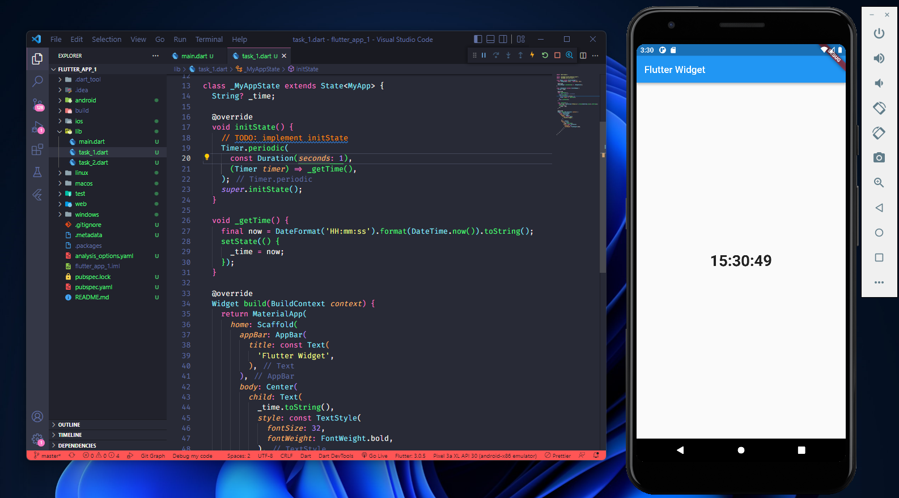
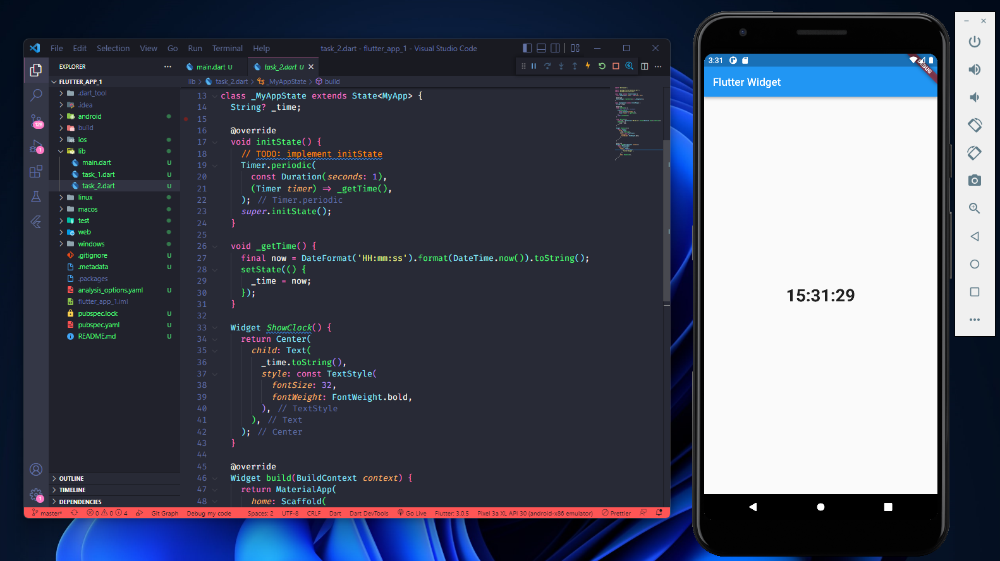

# (12) Introduction Flutter Widget

## Data Diri

| Nomor       | Nama                    |
| ----------- | ----------------------- |
| 1_001FLB_42 | Abghi Fareihan Desailie |

## Task

#### Task 01

**Buatlah Satetfull Widget yang kontennya dapat berubah setiap detik, sepeti contoh berikut ini!**

##### Source Code :

```dart
import 'dart:async';

import 'package:flutter/material.dart';
import 'package:intl/intl.dart';

class MyApp extends StatefulWidget {
  const MyApp({Key? key}) : super(key: key);

  @override
  State<MyApp> createState() => _MyAppState();
}

class _MyAppState extends State<MyApp> {
  String? _time;

  @override
  void initState() {
    // TODO: implement initState
    Timer.periodic(
      const Duration(seconds: 1),
      (Timer timer) => _getTime(),
    );
    super.initState();
  }

  void _getTime() {
    final now = DateFormat('HH:mm:ss').format(DateTime.now()).toString();
    setState(() {
      _time = now;
    });
  }

  @override
  Widget build(BuildContext context) {
    return MaterialApp(
      home: Scaffold(
        appBar: AppBar(
          title: const Text(
            'Flutter Widget',
          ),
        ),
        body: Center(
          child: Text(
            _time.toString(),
            style: const TextStyle(
              fontSize: 32,
              fontWeight: FontWeight.bold,
            ),
          ),
        ),
      ),
    );
  }
}

```

##### Output :



#### Task 02

**Dari widget tersebut, pisahkan menjadi beberapa widget tanpa mengubah tampilannya**

##### Source Code :

```dart
import 'dart:async';

import 'package:flutter/material.dart';
import 'package:intl/intl.dart';

class MyApp extends StatefulWidget {
  const MyApp({Key? key}) : super(key: key);

  @override
  State<MyApp> createState() => _MyAppState();
}

class _MyAppState extends State<MyApp> {
  String? _time;

  @override
  void initState() {
    // TODO: implement initState
    Timer.periodic(
      const Duration(seconds: 1),
      (Timer timer) => _getTime(),
    );
    super.initState();
  }

  void _getTime() {
    final now = DateFormat('HH:mm:ss').format(DateTime.now()).toString();
    setState(() {
      _time = now;
    });
  }

  Widget ShowClock() {
    return Center(
      child: Text(
        _time.toString(),
        style: const TextStyle(
          fontSize: 32,
          fontWeight: FontWeight.bold,
        ),
      ),
    );
  }

  @override
  Widget build(BuildContext context) {
    return MaterialApp(
      home: Scaffold(
        appBar: AppBar(
          title: const Text(
            'Flutter Widget ',
          ),
        ),
        body: ShowClock(),
      ),
    );
  }
}
```

##### Output :


