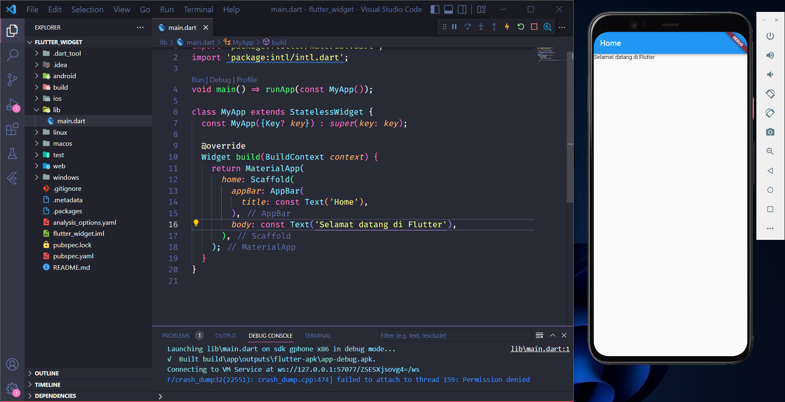

# (12) Introduction Flutter Widget

## Data Diri

Nomor Urut: 1_001FLB_42
Nama: Abghi Fareihan Desailie

## Summary

Pada section 12 ini, saya belajar tentang Introduction Flutter Widget : Stateless Widget, Statefull Widget, Built in Widget.

### Apa itu Flutter ?

Alat pengembangan antarmuka pengguna yang digunakan untuk membuat aplikasi mobile, dekstop dan web.

Keunggulan Flutter :

- Mudah diguBnakan dan dipelajari
- Produktivitas tinggi
- Dokumentasi lengkap
- Komunitas yang berkembang

##### Bagian dari Flutter :

- SDK (Software Development Kit) adalah alat-alat untuk membantu proses pengembangan aplikasi
- Framework adalah perlengkapan untuk membentuk aplikasi yang dapat dikustomisasi

##### Membuat Project

Dilakukan dengan menjalankan perintah:
`flutter create <nama_project>`

##### Menjalankan Project

- Masuk direktori project
- jalankan perintah:
  `flutter run`

##### Struktur Direktori

direktori platform:

- **android**
- **ios**
- **web**

direktori project:

- **lib** - ruang kerja utama
- **test** - aktivitas pengujian

##### File Utama

- Pertama kali dibaca dan dijalankan
- Dalam direktori **lib**

### Widget

- Digunakan untuk membuat antarmuka (UI)
- Berupa class
- Dapat terdiri dari beberapa widget lainnya

#### Jenis Widget

##### 1. Stateless Widget :

- Tidak bergantung pada perubahan data
- Hanya fokus pada tampilan
- Dibuat dengan extends pada class StatelessWidget

```dart
class MyWidget extends StatelessWidget {
  const MyWidget({Key? key}) : super(key: key);

  @override
  Widget build(BuildContext context) {

  }
}
```

##### 2. Statefull Widget

- Mementingkan pada perubahan data
- Dibuat dengan extends pada class StatefulWidget
- 1 widget menggunakan 2 class (widget dan state)

```dart
class MyWidget extends StatefulWidget {
  const MyWidget({Key? key}) : super(key: key);

  @override
  State<MyWidget> createState() => _MyWidgetState();
}

class _MyWidgetState extends State<MyWidget> {
  @override
  Widget build(BuildContext context) {

  }
}
```

##### 3. Built in Widget

- Widget yang dapat langsung digunakan
- Sudah ter-install bersama Flutter

**MaterialApp**
Membangun aplikasi dengan desain material

```dart
const MaterialApp(
    home: Text('Selamat datang di Flutter'),
);
```

**Scaffold**
Membentuk sebuah halaman

```dart
const Scaffold(
    body: Text('Selamat datang di Flutter'),
);
```

**AppBar**
Membentuk application bar yang terletak pada bagian atas halaman

```dart
AppBar(
    title: const Text('Home'),
);
```

**Text**
Menampilkan text

```dart
const Text('Haloo...');
```

**Example :**

