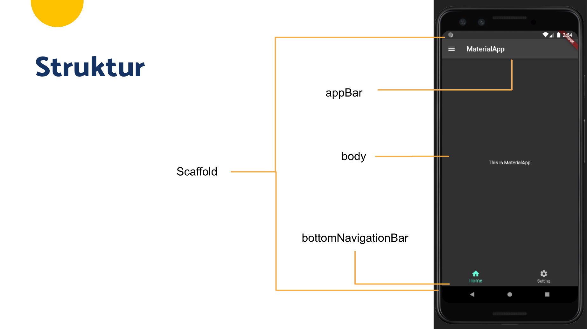
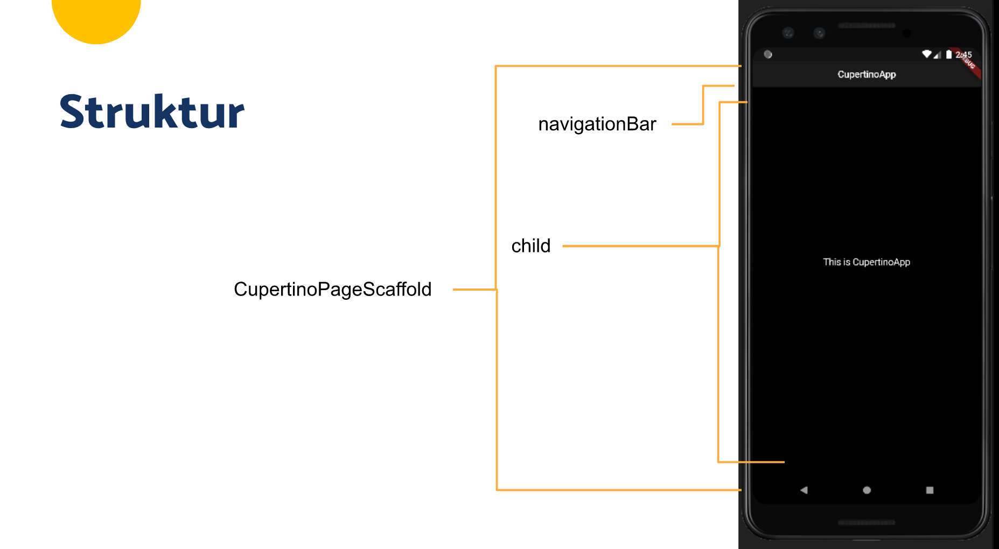

# (13) Platform Widget

## Data Diri

Nomor Urut: 1_001FLB_42
Nama: Abghi Fareihan Desailie

## Summary

Pada section 13 ini, saya belajar tentang Platform Widget : Memanfaatkan widget dengan gaya berbeda pada Android (MaterialApp) dan iOS (CupertinoApp).

### MaterialApp

- Widget dasar yang **mengemas seluruh widget** dalam aplikasi
- Widget yang digunakan pada sistem **Android**
- Di-import dari **package:flutter/material.dart**

#### Struktur

Widget yang pertama kali dibuka, diletakan pada bagian **home**

```dart
MaterialApp(
    theme: ThemeData.dark(), // mengatur tema aplikasi
    home: const HomePage(), // halaman utama
);
```

Mengatur halaman utama juga dapat dilakukan dengan menggunakan **routes** dan **initialRoute**

```dart
MaterialApp(
    theme: ThemeData.dark(), // mengatur tema aplikasi
    initialRoute: 'home', // route utama
    routes: {
        home: (_) => const HomePage(), // mendaftarkan halaman pada routes
    },
);
```

#### Scaffold

Widget dasar untuk membangun sebuah halaman pada MaterialApp
Struktur : Membentuk tata letak dasar sebuah halaman yang ditulis melalui properti-properti



<br>
<br>
<br>
<br>

### CupertinoApp

- Widget dasar yang **mengemas seluruh widget** dalam aplikasi
- Widget yang digunakan pada sistem **iOS**
- Di-import dari **package:flutter/cupertino.dart**

#### Struktur

- Variabel **\_themeDark** dibuat untuk menyimpan tema
- Diperlukan karena Cupertino tidak menyediakan **ThemeData.dark()** seperti material

```dart
final _themeDark = const CupertinoThemeData.raw( // membuat dasat tema
    Brightness.dark, // mengatur brightness tema menjadi dark
    null,
    null,
    null,
);
```

Widget yang pertama dibuka, diletakkan pada bagian **home**

```dart
CupertinoApp(
    theme: _themeDark, // menagtur tema aplikasi
    home: const HomePage(), // halaman utama
);
```

#### CupertinoPageScaffold

Widget dasar untuk membangun sebuah halaman pada CupertinoApp
Struktur : Memebntuk tata letak dasar sebuah halaman yang ditulis melalui properti-properti


