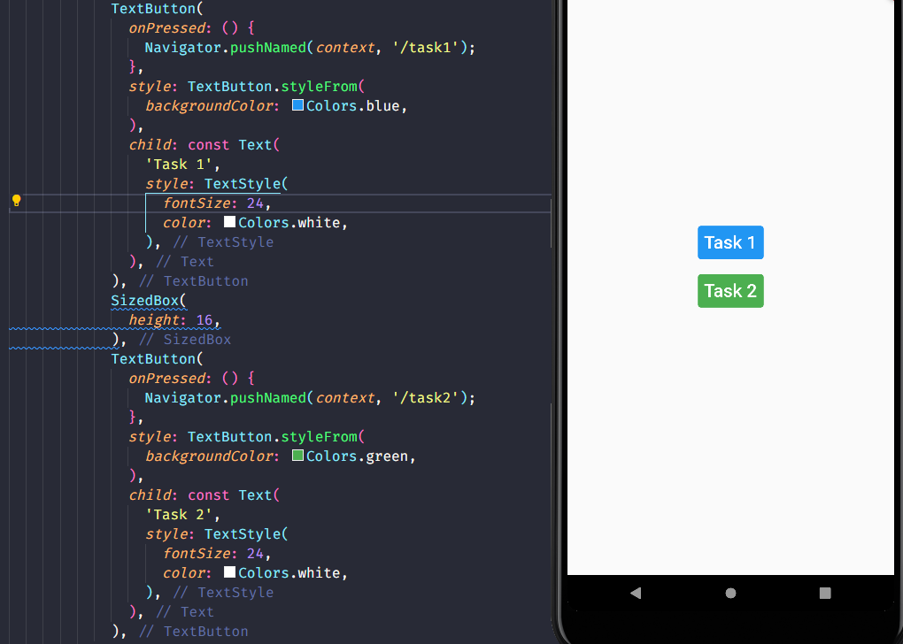

# (14) Flutter Command Line Interface (CLI) and Flutter Package Management

## Data Diri

| Nomor       | Nama                    |
| ----------- | ----------------------- |
| 1_001FLB_42 | Abghi Fareihan Desailie |

## Task

Pada task ini saya membuat satu project, dan di HomePage ada 2 Button yang mengarah ke masing-masing task atau berpindah halaman.

isi folder main :

```dart
void main() {
  runApp(const MyApp());
}

class MyApp extends StatelessWidget {
  const MyApp({Key? key}) : super(key: key);

  @override
  Widget build(BuildContext context) {
    return MaterialApp(
      home: const HomePage(),
      routes: {
        '/task1': (context) => SatuPage(), // mengarah ke task1
        '/task2': (context) => DuaPage(), // mengarah ke task2
      },
    );
  }
}
```



#### Task 01

Menambahkan package badges:
`badges: ^2.0.3`

dan import di file :
`import 'package:badges/badges.dart';`


**Source Code Task 1**

```dart
import 'package:flutter/material.dart';
import 'package:badges/badges.dart'; // import package badges

class SatuPage extends StatelessWidget {
  const SatuPage({Key? key}) : super(key: key);

  @override
  Widget build(BuildContext context) {
    return Scaffold( // membuat scaffold atau halaman
      body: Center( // dibikin center
        child: Column(
          mainAxisAlignment: MainAxisAlignment.center, // agar tata letak axis center
          children: [
            Chip(
              padding: EdgeInsets.all(4),
              backgroundColor: Colors.deepPurple,
              label: Text(
                'BADGE',
                style: TextStyle(
                  color: Colors.white,
                  fontSize: 24,
                ),
              ),
            ),
            SizedBox(
              height: 8,
            ),
            Badge(
              toAnimate: false,
              shape: BadgeShape.square,
              badgeColor: Colors.deepPurple,
              borderRadius: BorderRadius.circular(30),
              badgeContent: Text(
                'BADGE',
                style: TextStyle(
                  color: Colors.white,
                  fontSize: 20,
                ),
              ),
            ),
          ],
        ),
      ),
    );
  }
}

```

**Output Task 1**


<br>
<br>
<br>
<br>
<br>
<br>
#### Task 02

Menambahkan package barcode:
`barcode_widget: ^2.0.3`

dan import di file :
`import 'package:barcode_widget/barcode_widget.dart';`


**Source Code Task 2**

```dart
import 'package:flutter/material.dart';
import 'package:barcode_widget/barcode_widget.dart'; // import package barcode

class DuaPage extends StatelessWidget {
  const DuaPage({Key? key}) : super(key: key);

  @override
  Widget build(BuildContext context) {
    return Scaffold(
      body: Center(
        child: Column(
          mainAxisAlignment: MainAxisAlignment.center,
          children: const [
            MyBarcode(
              textBarcode: 'Alterra Academy', // memanggil textBarcode dan isi datanya
            ),
            SizedBox(
              height: 26,
            ),
            MyBarcode(
              textBarcode: 'Flutter Asik', // memanggil textBarcode dan isi datanya
            ),
            SizedBox(
              height: 26,
            ),
            MyBarcode(
              textBarcode: 'Abghi Fareihan Desailie', // memanggil textBarcode dan isi datanya
            ),
          ],
        ),
      ),
    );
  }
}

class MyBarcode extends StatelessWidget { // saya membuat Widget MyBarcode() agar bisa menambahkan barcode dengan 1 widget dan hanya mengubah data (text nya saja)
  final String textBarcode; // inisiasi textBarcode

  const MyBarcode({
    Key? key,
    required this.textBarcode,
  }) : super(key: key);

  @override
  Widget build(BuildContext context) {
    return Container(
      padding: EdgeInsets.all(16),
      decoration: const BoxDecoration(
        color: Colors.grey,
      ),
      child: BarcodeWidget(
        barcode: Barcode.code128(),
        data: textBarcode, // menambahkan textBarcode ke dalam data barcode
        width: 200,
      ),
    );
  }
}
```

**Output Task 2**


