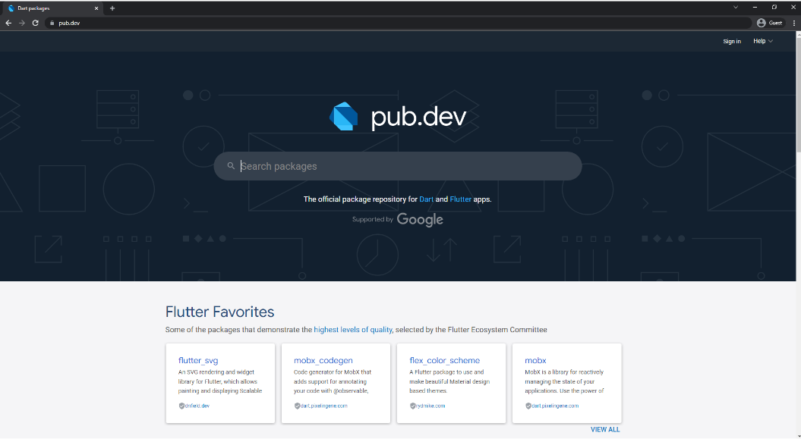

# (14) Flutter Command Line Interface (CLI) and Flutter Package Management

## Data Diri

Nomor Urut: 1_001FLB_42
Nama: Abghi Fareihan Desailie

## Summary

Pada section 14 ini, saya belajar tentang Flutter Command Line Interface (CLI) and Flutter Package Management : Flutter CLI, Important CLI Commands, Packages Management.

### Flutter CLI

- Alat yang digunakan untuk berinteraksi dengan Flutter SDK
- Perintah dijalankan dalam terminal

### Important CLI Commands

- **Flutter Doctor**
  Perintah untuk menampilkan informasi software yang dibutuhkan flutter.
  `flutter doctor`
   
- **Flutter Create**
  Perintah untuk membuat project aplikasi flutter baru di directory tertentu.
  `flutter create <app_name>`
   
- **Flutter Run**
  Perintah untuk menjalankan project aplikasi di device yang tersedia.
  `flutter run <dart_file>`
   
- **Flutter Emulator**
  Perintah untuk menampilkan daftar emulator yang terinstall.
  `flutter emulators`
   
- **Flutter Channel**
  Perintah untuk menampilkan daftar flutter channel yang tersedia dan menunjukan channel yang digunakan saat ini.
  `flutter channel`
   
- **Flutter Pub**
  Flutter pub get, untuk menambahkan packages atau dependencies yang ada di pubspec.yaml
  `flutter pub add <packages_name>`
  Flutter pub get, untuk mendownload semua packages atau dependencies yang ada di pubspec.yaml
  `flutter pub get`
   
- **Flutter Build**
  Perintah untuk memproduksi sebuah file aplikasi untuk keperluan deploy atau publish ke AppStore, PlayStore, dll.
  `flutter build <directory>`
   
- **Flutter Clean**
  Perintah untuk menghapus folder build serta file lainnya yang dihasilkan saat menjalankan aplikasi di emulator. Perintah ini akan memperkecil ukuran dari project tersebut.
  `flutter clean`

### Packages Management

- Flutter mendukung sharing packages
- Packages dibuat developers lain
- Mempercepat pengembangan aplikasi karena tidak perlu membuat semuanya dari awal atau from scratch
- Mendapatkan packages di website pub.dev

##### Cara menambahkan packages

- Cari package di pub.dev
- Copy baris dependencies yang ada di bagian installing
- Buka pubspec.yaml
- Paste barisnya dibawah dependencies pubspec.yaml
- Run flutter pub get di terminal
- Import package di file dart agar bisa digunakan
- Stop atau restart aplikasi jika dibutuhkan

##### Website pub.dev

