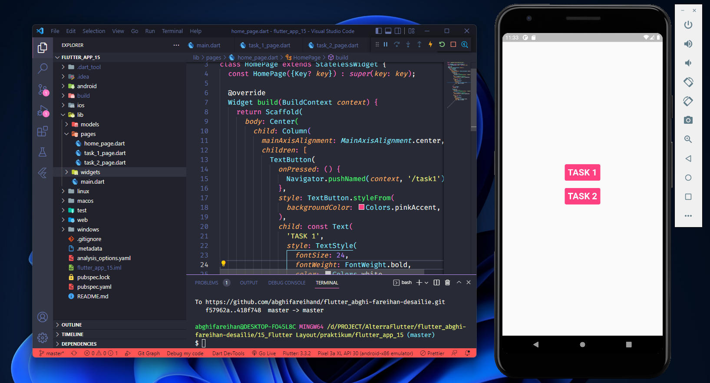
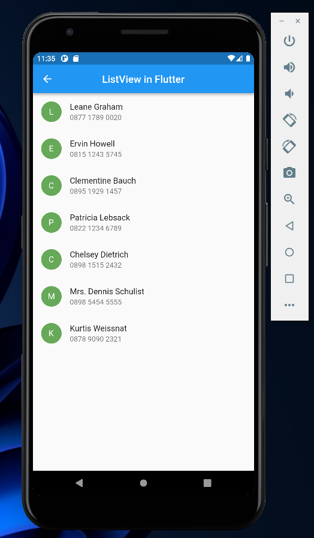
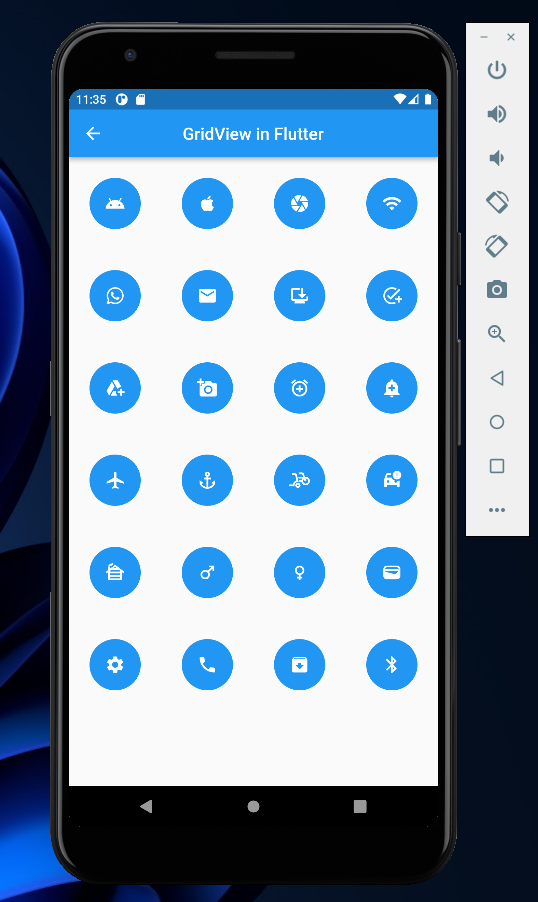

# (15.5) Flutter Layout

## Data Diri

| Nomor       | Nama                    |
| ----------- | ----------------------- |
| 1_001FLB_42 | Abghi Fareihan Desailie |

## Task

Pada Task 15 ini, saya membuat satu project yang mencakup jawaban dari Task 01 dan Task 02. Jadi di file `main.dart` terdapat route menuju `task_1_page.dart` dan `task_2_page.dart`. Lalu terdapat button pada halaman `home_page` agar dapat berpindah halaman melalui button.



**File `main.dart`**

```dart
void main() {
  runApp(const MyApp());
}

class MyApp extends StatelessWidget {
  const MyApp({super.key});

  @override
  Widget build(BuildContext context) {
    return MaterialApp(
      debugShowCheckedModeBanner: false,
      home: const HomePage(),
      routes: {
        '/task1': (context) => const TaskSatuPage(),
        '/task2': (context) => const TaskDuaPage(),
      },
    );
  }
}
```

<br>

#### Task 01

##### Membuat List View

**File `pages/task_1_page.dart`**

```dart
class TaskSatuPage extends StatelessWidget {
  const TaskSatuPage({super.key});

  @override
  Widget build(BuildContext context) {
    return Scaffold(
      appBar: AppBar(
        title: const Text('ListView in Flutter'),
        centerTitle: true,
      ),
      body: const ListViewChat(), // memanggil widget list view di bawah
    );
  }
}

class ListViewChat extends StatelessWidget {
  const ListViewChat({super.key});

  @override
  Widget build(BuildContext context) {
    return ListView.builder( // menampilkan listview
      itemBuilder: (context, index) => ChatWidget(dataChats[index]), // memanggil ChatWidget dan mengambil dataChats (yang ada di folder models)
      itemCount: dataChats.length, // panjang dari dataChats (yang ada di folder models)
    );
  }
}
```

<br>

**File `widgets/chat_widget.dart`**

```dart
class ChatWidget extends StatelessWidget {
  final Chats listChat;
  const ChatWidget(this.listChat, {super.key});

  @override
  Widget build(BuildContext context) {
    return ListTile(
      leading: CircleAvatar(
        backgroundColor: const Color(0xff66A958),
        child: Text(
          listChat.avatarUrl,
          style: const TextStyle(
            color: Colors.white,
          ),
        ),
      ),
      title: Text(listChat.name),
      subtitle: Text(listChat.phone),
    );
  }
}
```

<br>

**File `models/chats.dart`**

```dart
class Chats {
  String avatarUrl, name, phone; // membuat atribut

  Chats({
    required this.avatarUrl,
    required this.name,
    required this.phone,
  }); // membuat parameter
}

List dataChats = [ // membuat list yang terdiri dari avatarUrl, name, phone. yang nantinya akan di panggil
  Chats(
    avatarUrl: 'L',
    name: 'Leane Graham',
    phone: '0877 1789 0020',
  ),
  Chats(
    avatarUrl: 'E',
    name: 'Ervin Howell',
    phone: '0815 1243 5745',
  ),
  Chats(
    avatarUrl: 'C',
    name: 'Clementine Bauch',
    phone: '0895 1929 1457',
  ),
  Chats(
    avatarUrl: 'P',
    name: 'Patricia Lebsack',
    phone: '0822 1234 6789',
  ),
  Chats(
    avatarUrl: 'C',
    name: 'Chelsey Dietrich',
    phone: '0898 1515 2432',
  ),
  Chats(
    avatarUrl: 'M',
    name: 'Mrs. Dennis Schulist',
    phone: '0898 5454 5555',
  ),
  Chats(
    avatarUrl: 'K',
    name: 'Kurtis Weissnat',
    phone: '0878 9090 2321',
  ),
];
```

**Output ListView :**



<br>
<br>
<br>

#### Task 02

##### Membuat Grid View

**File `pages/task_2_page.dart`**

```dart
class TaskDuaPage extends StatelessWidget {
  const TaskDuaPage({super.key});

  @override
  Widget build(BuildContext context) {
    return Scaffold(
      appBar: AppBar(
        title: const Text('GridView in Flutter'),
        centerTitle: true,
      ),
      body: const GridViewIcon(), // memanggil widget grid view di bawah
    );
  }
}

class GridViewIcon extends StatelessWidget {
  const GridViewIcon({super.key});

  @override
  Widget build(BuildContext context) {
    return GridView.builder(
      gridDelegate: const SliverGridDelegateWithFixedCrossAxisCount(
        crossAxisCount: 4, // jumlah grid horizontal
      ),
      itemBuilder: (context, index) => IconWidget(dataIcons[index]), // memanggil IconWidget dan mengambil dataIcons (yang ada di folder models)
      itemCount: dataIcons.length, // panjang dari dataIcons (yang ada di folder models)
    );
  }
}

```

<br>

**File `widgets/icon_widget.dart`**

```dart
class IconWidget extends StatelessWidget {
  final IconData gridIcon; // membuat atribut dari IconData (materialApp)
  const IconWidget(this.gridIcon, {super.key});

  @override
  Widget build(BuildContext context) {
    return Container(
      height: 24,
      width: 24,
      margin: const EdgeInsets.all(24),
      decoration: const BoxDecoration(
        color: Colors.blue, // membuat bg icon warna blu
        shape: BoxShape.circle, // membuat bg icon bentuk circle atau bulat
      ),
      child: Icon(
        gridIcon, // memanggil icon
        color: Colors.white, // warna icon
      ),
    );
  }
}
```

<br>

**File `models/icons.dart`**

```dart
final List<IconData> dataIcons = [ // membuat list icon dari IconData (materialApp) =  wajib import materialapp
  Icons.android,
  Icons.apple,
  Icons.camera,
  Icons.wifi,
  Icons.whatsapp,
  Icons.email,
  Icons.browser_updated,
  Icons.add_task,
  Icons.add_to_drive_rounded,
  Icons.add_a_photo,
  Icons.add_alarm,
  Icons.add_alert,
  Icons.airplanemode_active,
  Icons.anchor,
  Icons.bike_scooter,
  Icons.car_crash,
  Icons.cabin,
  Icons.male,
  Icons.female,
  Icons.wallet,
  Icons.settings,
  Icons.phone,
  Icons.archive,
  Icons.bluetooth,
];
```

**Output GridView :**



**Record :**

