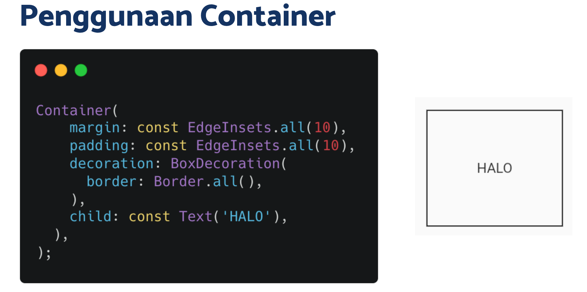
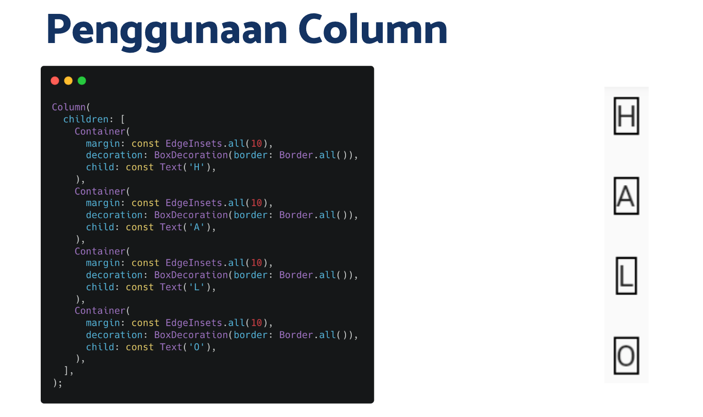
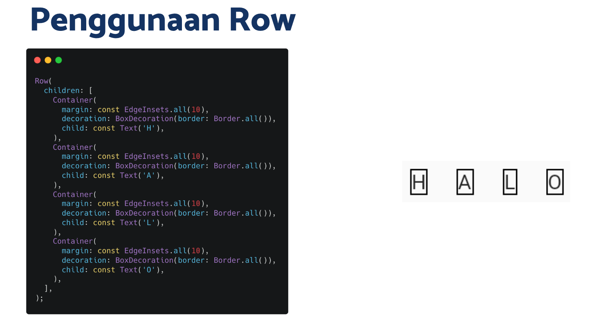
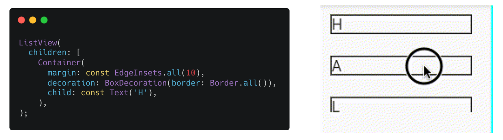
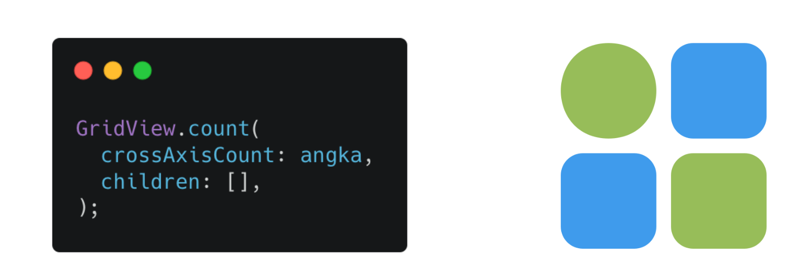
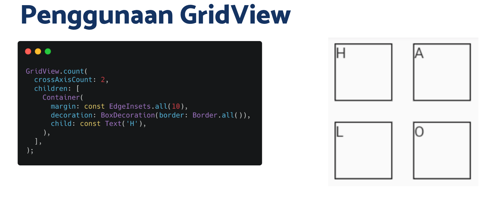

# (15) Flutter Layout

## Data Diri

Nomor Urut: 1_001FLB_42
Nama: Abghi Fareihan Desailie

## Summary

Pada section 15 ini, saya belajar tentang Flutter Layout : Apa itu Layout? , Single-child Layout, Multi-child Layout

<br>

### Apa itu Layout?

- Untuk mengatur tata letak
- Layout berbentuk widget yang mengatur widget di dalamnya

### Single-child Layout

1.  **Container**

    - Membuat sebuah box
    - Membungkus widget lain
    - Box memiliki margin, padding, dan border

    ```dart
    Container(
        child: Text(teks),
    );
    ```

    

    <br>

2.  **Center**

    - Membentuk sebuah box
    - Membungkus widget lain
    - Memenuhi lebar dan tinggi ruang di luarnya
    - Meletakkan widget berada di bagian tengah

    ```dart
    Center(
        child: Text(teks),
    );
    ```

    <br>

3.  **Sized Box**

    - Membuat sebuah box
    - Membungkus widget lain
    - Box dapat diatur lebar dan tingginya
    - Lebih sederhana dari container

    ```dart
    SizedBox(
        width: 100,
        height: 150,
        child: Text(teks),
    );

    ```

<br>
<br>

### Multi-child Layout

1. **Column**

   - Mengatur widgets secara **vertical**

   ```dart
   Column(
       children: const [
           Text(teks),
           Text(teks),
           Text(teks),
           Text(teks),
       ],
   );
   ```

   

   <br>

2. **Row**

   - Mengatur widgets secara **horizontal**

   ```dart
   Row(
       children: const [
           Text(teks),
           Text(teks),
           Text(teks),
           Text(teks),
       ],
   );
   ```

   

   <br>

3. **ListView**

   - Mengatur widgets dalam bentuk **list**
   - Memiliki kemampuan scroll

   

   <br>

4. **GridView**

   - Mengatur widgets dalam bentuk **galeri**

   

   
