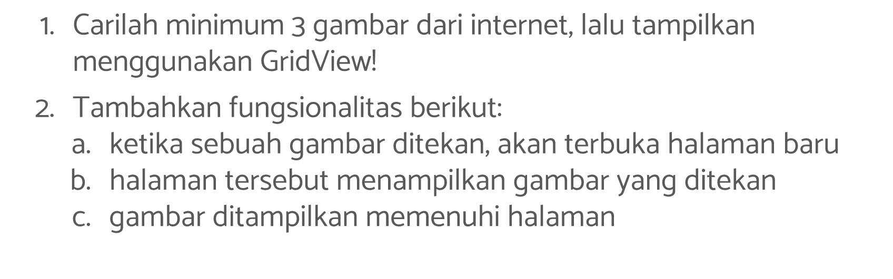
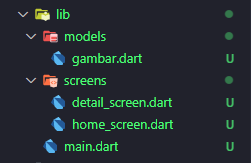
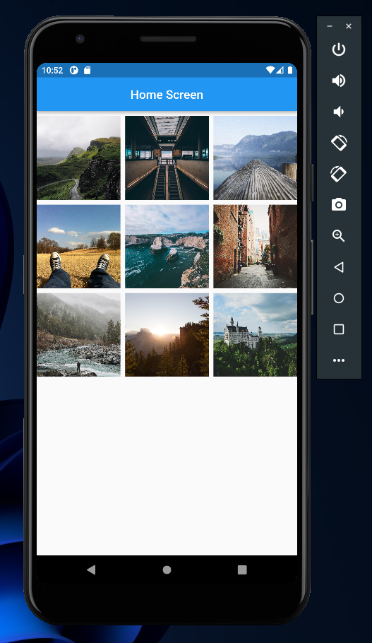
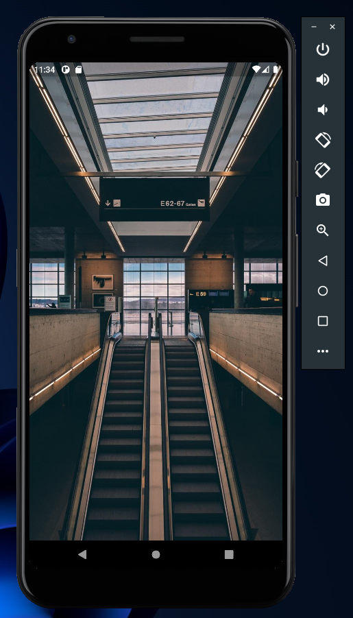

# (16) Assets

## Data Diri

| Nomor       | Nama                    |
| ----------- | ----------------------- |
| 1_001FLB_42 | Abghi Fareihan Desailie |

## Task



**Di folder lib saya membuat folder screens dan models, dan berisikan file di bawah ini :**



#### Task 01

Saya membuat folder models yang berisi class Gambar, disini saya mengambil 9 gambar dari internet.
Berikut adalah isi dari file `gambar.dart`

```dart
class Gambar {
  String imageUrl; // membuat atribut imageUrl

  Gambar({
    required this.imageUrl,
  });
}

List<Gambar> dataGambar = [ // membuat list penampung untuk imageUrl
  Gambar(
    imageUrl:
        'https://i.picsum.photos/id/1018/3914/2935.jpg?hmac=3N43cQcvTE8NItexePvXvYBrAoGbRssNMpuvuWlwMKg',
  ),
  Gambar(
    imageUrl:
        'https://i.picsum.photos/id/1033/2048/1365.jpg?hmac=zEuPfX7t6U866nzXjWF41bf-uxkKOnf1dDrHXmhcK-Q',
  ),
  Gambar(
    imageUrl:
        'https://i.picsum.photos/id/1051/4928/3264.jpg?hmac=-O25O5Q9z7LI8gDrUkTUmDJir4F9cp1RadCwShIDGms',
  ),
  Gambar(
    imageUrl:
        'https://i.picsum.photos/id/103/2592/1936.jpg?hmac=aC1FT3vX9bCVMIT-KXjHLhP6vImAcsyGCH49vVkAjPQ',
  ),
  Gambar(
    imageUrl:
        'https://i.picsum.photos/id/1050/6000/4000.jpg?hmac=HhCXFcOrIrNguK7GqP6VhICXPa5FmcLZdug505qiEZM',
  ),
  Gambar(
    imageUrl:
        'https://i.picsum.photos/id/1047/3264/2448.jpg?hmac=ksy0K4uGgm79hAV7-KvsfHY2ZuPA0Oq1Kii9hqkOCfU',
  ),
  Gambar(
    imageUrl:
        'https://i.picsum.photos/id/1044/4032/2268.jpg?hmac=BXmoMkaurlzpTLYQupXLipcmI1sFbgT5sIz98Ob5VZE',
  ),
  Gambar(
    imageUrl:
        'https://i.picsum.photos/id/1037/5760/3840.jpg?hmac=fZe213BcO2KPQEJKChsdHnVYg-6kAtQMTZV24f1fS94',
  ),
  Gambar(
    imageUrl:
        'https://i.picsum.photos/id/1040/4496/3000.jpg?hmac=kvZONlBpTcZ16PuE_g2RWxlicQ5JKVq2lqqZndfafBY',
  ),
];
```

<br>

Lalu, untuk menampilkan grid nya saya menggunakan `GridView.Builder`

```dart
GridView.builder(
          gridDelegate: const SliverGridDelegateWithFixedCrossAxisCount(
            crossAxisCount: 3, // untuk mengatur banyaknya grid horizontal
            crossAxisSpacing: 8, // untuk mengatur spasi (margin) secara horizontal pada masing masing gambar
            mainAxisSpacing: 8, // untuk mengatur spasi (margin) secara vertical pada masing masing gambar
          ),
          itemBuilder: (context, index) {
            final gambar = dataGambar.elementAt(index); // inisiasi gambar yang mengambil data dari dataGambar (yang ada di models)
            return InkWell(
              onTap: () => Navigator.of(context).push(
                MaterialPageRoute(
                  builder: (context) => DetailScreen(gambar),
                ),
              ),
              child: GridTile(
                child: Image.network(
                  gambar.imageUrl,
                  fit: BoxFit.cover,
                ),
              ),
            );
          },
          itemCount: dataGambar.length, // untuk menampilkan dataGambar sebanyak yang ada di models (length)
        ),
```

**Ini adalah output sesuai soal nomor 1 :**



#### Task 02

Ketika gambar di tekan, masuk ke halaman `detail_screen.dart` Saya memakai `InkWell` agar gambar bisa di tekan atau di Tap.

Berikut code di file `home_screen.dart`

```dart
return InkWell( // menggunakan inkwell
              onTap: () => Navigator.of(context).push(
                MaterialPageRoute( // menggunakan materialpageroute untuk berpindah halaman
                  builder: (context) => DetailScreen(gambar), // jadi ketika gambar di klik akan masuk ke halaman DetailScreen() serta mengambil data dari `gambar`
                ),
              ),
              child: GridTile(
                child: Image.network(
                  gambar.imageUrl, // lalu ini untuk mengambil gambar.imageUrl
                  fit: BoxFit.cover,
                ),
              ),
            );
```

<br>

Kemudian di file `detail_screen.dart`

```dart
class DetailScreen extends StatelessWidget {
  final Gambar gambar; // saya membuat atribut gambar mengambil dari list Gambar (di models)
  const DetailScreen(this.gambar, {super.key});

  @override
  Widget build(BuildContext context) {
    return Scaffold(
      body: InkWell( // lalu saya tambahkan inkwell lagi biar bisa di tap
        child: Container(
          height: double.infinity, // saya bikin double.infinity agar gambar memenuhi layar (jadi fullscreen) setelah di tap atau di tekan.
          child: Image.network(
            gambar.imageUrl,  // mengambil gambar dari imageUrl
            fit: BoxFit.cover,
          ),
        ),
        onTap: () {
          Navigator.pop(context);
          // fungsi ini jika gambar di tap lagi maka akan kembali ke halaman gridview (home_screen.dart), jadi kita tidak perlu menekan navigasi back pada emulator jika ingin kembali ke halaman seebelumnya
        },
      ),
    );
  }
}
```

<br>

**Ini adalah output sesuai soal nomor 2 :**
Jadi ketika gambar di `HomeScreen` di klik, akan mengarah ke `DetailScreen` untuk menampilkan gambarnya secara penuh


