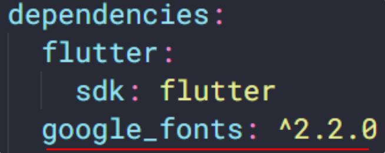

# (16) Assets

## Data Diri

Nomor Urut: 1_001FLB_42
Nama: Abghi Fareihan Desailie

## Summary

Pada section 16 ini, saya belajar tentang Assets : Assets, Image, Font

### Assets

- File yang di bundled dan di deployed bersamaan dengan aplikasi
- Tipe tipe assets, seperti: static data (JSON files), icons, images, dan font file (ttf).

**Menentukan Assets**

- Flutter menggunakan `pubspec.yaml`
- Pubspec.yaml terletak pada root project, untuk mengidentifikasi assets yang dibutuhkan aplikasi
- Gunakan karakter `/` untuk memasukan semua assets dibawah satu directory name

Example :

```dart
assets:
 - assets/my_icon.png
 - assets/background.jpg

assets:
 - assets/
```

<br>
<br>

### Image

- Image atau gambar akan membuat tampilan aplikasi menjadi lebih menarik
- Flutter mendukung format gambar seperti JPEG, WebP, GIF, Animated Web/GIF, PNG, BMP dan WBMP
- Menampilkan gambar dari project asset dan internet

**Loading Images**

- Gunakan widget Image
- Membutuhkan properti image dengan nilai class AssetImage()


<br>

- Menggunakan method Image.asset, mendapatkan image yang sudah ditambahkan dalam project.
- Menggunakan method Image.network, mendapatkan data image melalui internet dengan menggunakan string url nya


<br>
<br>

### Font

- Penggunaan font dengan style tertentu akan menjadi keunikan pada aplikasi
- Penentuan font yang mau dipakai biasanya oleh UI designer
- Penerapan font menggunakan custom font atau dari package

#### Custom Font

Cara menggunakan custom font :

**Step 1:** Cari dan download font (Ex. https://fonts.google.com/)


<br>

**Step 2:** Import file .ttf


<br>

**Step 3:** Daftarkan font di pubspec.yaml


<br>

**Step 4:** Mengatur font sebagai default


<br>

**Step 5:** Gunakan font di spesifik widget


<br>

#### Font dari package

Cara menggunakan font dari package :

**Step 1:** Tambahkan package `google_fonts` di dependencies



<br>

**Step 2:** Import package di file dart

```dart
import 'package:google_fonts/google_fonts.dart'
```

<br>

**Step 3:** Gunakan font dengan memanggil `GoogleFonts.namaFont()`


