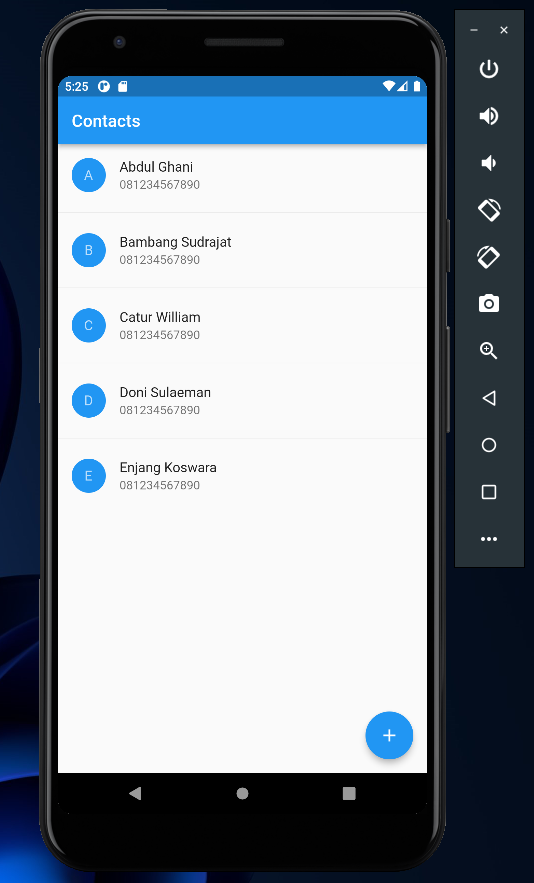
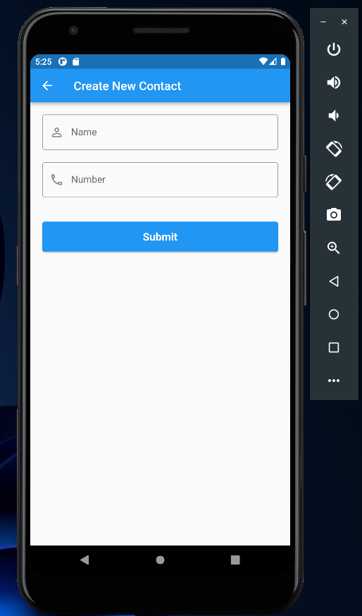
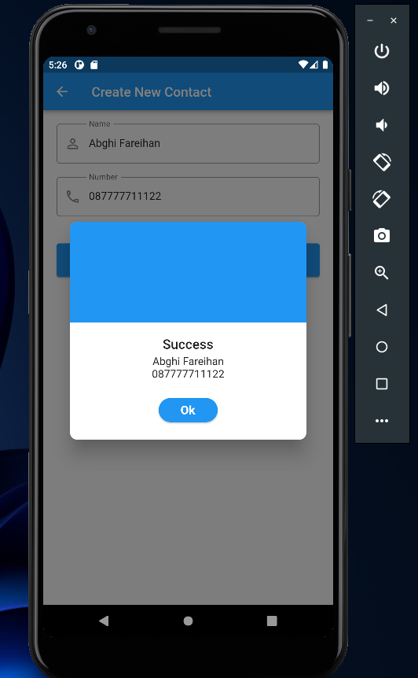

# (17) Form Input Button

## Data Diri

| Nomor       | Nama                    |
| ----------- | ----------------------- |
| 1_001FLB_42 | Abghi Fareihan Desailie |

## Task

Pertama saya membuat models untuk menyimpan data kontak nya

```dart
class Contacts {
  String avatar;
  String name;
  String phone;

  Contacts({
    required this.avatar,
    required this.name,
    required this.phone,
  });
}

List<Contacts> dataContact = [
  Contacts(
    avatar: 'A',
    name: 'Abdul Ghani',
    phone: '081234567890',
  ),
  Contacts(
    avatar: 'B',
    name: 'Bambang Sudrajat',
    phone: '081234567890',
  ),
],
```

<br>
<br>

Lalu saya membuat widget ContactItem untuk membungkusnya

```dart
class ContactItem extends StatelessWidget {
  final Contacts contacts;
  const ContactItem(this.contacts, {super.key});

  @override
  Widget build(BuildContext context) {
    return ListTile(
      leading: CircleAvatar(
        backgroundColor: Colors.blue,
        child: Center(
          child: Text(contacts.avatar),
        ),
      ),
      title: Text(contacts.name),
      subtitle: Text(contacts.phone),
    );
  }
}
```

<br>
<br>

Pada file `home_screen.dart` membuat listview separated untuk tampilan list pada chat

```dart
Scaffold(
      appBar: AppBar(
        title: const Text('Contacts'),
      ),
      body: ListView.separated(
        itemBuilder: (context, index) {
          final contact = dataContact.elementAt(index);
          return ContactItem(contact);
        },
        separatorBuilder: (context, index) => const Divider(),
        itemCount: dataContact.length,
      ),
      floatingActionButton: FloatingActionButton(
        onPressed: () {
          Navigator.pushNamed(context, '/form');
        },
        child: const Icon(Icons.add),
      ),
    );
```



<br>
<br>

Lalu pada file `form_sreen.dart` saya membuat statefull widget

```dart
class FormScreen extends StatefulWidget {
  const FormScreen({super.key});

  @override
  State<FormScreen> createState() => _FormScreenState();
}

class _FormScreenState extends State<FormScreen> {
  final formKey = GlobalKey<FormState>();
  final nameController = TextEditingController(); // membuat controller
  final numberController = TextEditingController();

  @override
  Widget build(BuildContext context) {
    return Scaffold(
      appBar: AppBar(
        title: const Text(
          'Create New Contact',
        ),
      ),
      body: SingleChildScrollView(
        child: Form(
          key: formKey,
          child: Container(
            margin: EdgeInsets.all(20),
            child: Column(
              crossAxisAlignment: CrossAxisAlignment.start,
              children: [
                TextField(
                  controller: nameController,
                  keyboardType: TextInputType.text,
                  textInputAction: TextInputAction.next,
                  textCapitalization: TextCapitalization.words,
                  decoration: InputDecoration(
                    labelText: 'Name',
                    hintText: 'Input your name',
                    prefixIcon: const Icon(Icons.person_outline),
                    border: OutlineInputBorder(
                      borderRadius: BorderRadius.circular(5),
                    ),
                  ),
                ),
                SizedBox(
                  height: 20,
                ),
                TextField(
                  controller: numberController,
                  keyboardType: TextInputType.number,
                  textInputAction: TextInputAction.done,
                  decoration: InputDecoration(
                    labelText: 'Number',
                    hintText: 'Input your number',
                    prefixIcon: const Icon(Icons.phone_outlined),
                    border: OutlineInputBorder(
                      borderRadius: BorderRadius.circular(5),
                    ),
                  ),
                ),
                const SizedBox(
                  height: 40,
                ),
                Container(
                  width: double.infinity,
                  height: 50,
                  child: ElevatedButton(
                    onPressed: () {
                      CoolAlert.show(
                        context: context,
                        type: CoolAlertType.success,
                        backgroundColor: Colors.blue,
                        confirmBtnColor: Colors.blue,
                        title: 'Success',
                        text:
                            "${nameController.text}\n${numberController.text}",
                      );
                    },
                    child: const Text(
                      'Submit',
                      style: TextStyle(
                        fontSize: 18,
                        fontWeight: FontWeight.bold,
                      ),
                    ),
                  ),
                ),
              ],
            ),
          ),
        ),
      ),
    );
  }
}
```



<br>
<br>

Saya menambahkan fungsi dari button submit dengan dialog alert dari data nama dan nomor yang di input

```dart
Container(
                  width: double.infinity,
                  height: 50,
                  child: ElevatedButton(
                    onPressed: () {
                      CoolAlert.show(
                        context: context,
                        type: CoolAlertType.success,
                        backgroundColor: Colors.blue,
                        confirmBtnColor: Colors.blue,
                        title: 'Success',
                        text:
                            "${nameController.text}\n${numberController.text}",
                      );
                    },
                    child: const Text(
                      'Submit',
                      style: TextStyle(
                        fontSize: 18,
                        fontWeight: FontWeight.bold,
                      ),
                    ),
                  ),
                ),
```


