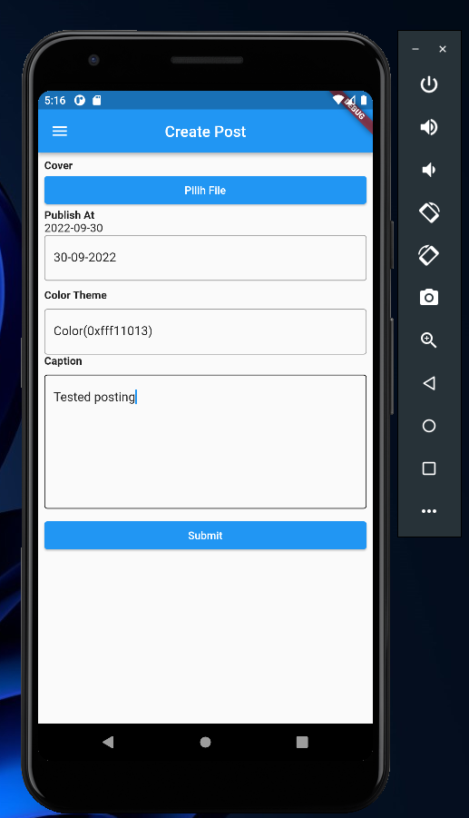
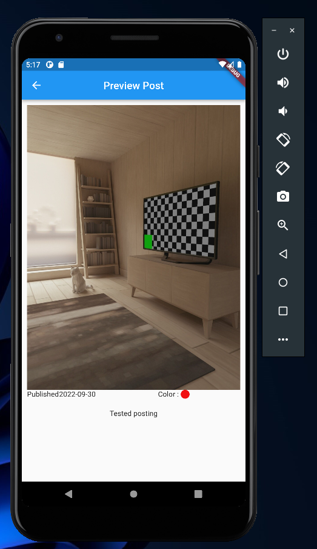

# (18) Form Picker

## Data Diri

| Nomor       | Nama                    |
| ----------- | ----------------------- |
| 1_001FLB_42 | Abghi Fareihan Desailie |

## Task

**Task 1 :**
Membuat halaman create post

```dart
class CreatePost extends StatefulWidget {
  const CreatePost({super.key});

  @override
  State<CreatePost> createState() => _CreatePostState();
}

Color _currentColor = Colors.black;

TextEditingController inputCaption = TextEditingController();
TextEditingController dateController = TextEditingController();
TextEditingController colorController = TextEditingController();
DateTime selectedDate = DateTime.now();

void _openFile(PlatformFile file) {
  OpenFile.open(file.path);
}

class _CreatePostState extends State<CreatePost> {
  Future<void> _selectDate(BuildContext context) async {
    final DateTime? picked = await showDatePicker(
        context: context,
        initialDate: selectedDate,
        firstDate: DateTime(1945, 1),
        lastDate: DateTime(2050));
    if (picked != null && picked != selectedDate) {
      setState(() {
        selectedDate = picked;

        dateController.text = DateFormat('dd-MM-yyyy').format(picked);
      });
    }
  }

  File? filePath;

  @override
  Widget build(BuildContext context) {
    return Scaffold(
      drawer: Drawer(
        child: ListView(
          padding: EdgeInsets.zero,
          children: <Widget>[
            DrawerHeader(
              child: Text(
                'Drawer Header',
              ),
              decoration: BoxDecoration(
                color: Colors.blue,
              ),
            ),
          ],
        ),
      ),
      appBar: AppBar(
        title: const Text("Create Post"),
        centerTitle: true,
      ),
      body: Padding(
        padding: const EdgeInsets.all(8.0),
        child: ListView(
          children: [
            const Text(
              "Cover",
              style: TextStyle(fontWeight: FontWeight.bold),
            ),
            ElevatedButton(
                style: ElevatedButton.styleFrom(
                  backgroundColor: Colors.blue,
                ),
                onPressed: () async {
                  final inputImage = await FilePicker.platform.pickFiles();
                  if (inputImage == null) return;
                  setState(() {
                    filePath = File(inputImage.files.first.path.toString());
                  });
                },
                child: const Text("Pilih File")),
            const Text(
              "Publish At",
              style: TextStyle(fontWeight: FontWeight.bold),
            ),
            Text(
              "${selectedDate.toLocal()}".split(' ')[0],
              style: const TextStyle(fontSize: 15),
            ),
            TextField(
              readOnly: true,
              controller: dateController,
              decoration: InputDecoration(
                  border: OutlineInputBorder(), hintText: "dd/mm/yyyy"),
              onTap: () => {
                _selectDate(context),
                print(
                    selectedDate.day + selectedDate.month + selectedDate.year),
              },
            ),
            const SizedBox(
              height: 10,
            ),
            const Text(
              "Color Theme",
              style: TextStyle(fontWeight: FontWeight.bold),
            ),
            const SizedBox(
              height: 10,
            ),
            TextField(
              readOnly: true,
              controller: colorController,
              decoration: InputDecoration(
                border: OutlineInputBorder(),
                hintText: 'Pick a color',
              ),
              onTap: () => {
                showDialog(
                  context: context,
                  builder: (context) {
                    return AlertDialog(
                      title: const Text("Pick Your Color"),
                      content: SingleChildScrollView(
                        scrollDirection: Axis.vertical,
                        child: ColorPicker(
                          pickerColor: _currentColor,
                          onColorChanged: (color) {
                            setState(
                              () {
                                _currentColor = color;
                                colorController.text = _currentColor.toString();
                              },
                            );
                          },
                        ),
                      ),
                      actions: [
                        TextButton(
                          onPressed: () {
                            Navigator.pop(context);
                          },
                          child: const Text(
                            'Save',
                          ),
                        ),
                      ],
                    );
                  },
                ),
              },
            ),
            const Text(
              'Caption',
              style: TextStyle(fontWeight: FontWeight.bold),
            ),
            Padding(
              padding: const EdgeInsets.symmetric(vertical: 10),
              child: TextFormField(
                maxLines: 7,
                controller: inputCaption,
                decoration: const InputDecoration(
                    focusedBorder: OutlineInputBorder(),
                    border: OutlineInputBorder(),
                    enabledBorder: OutlineInputBorder()),
              ),
            ),
            ElevatedButton(
              style: ElevatedButton.styleFrom(
                backgroundColor: Colors.blue,
              ),
              onPressed: () {
                if (filePath != null) {
                  Navigator.push(
                      context,
                      MaterialPageRoute(
                        builder: (context) => coba(filePath: filePath!),
                      ));
                }
              },
              child: const Text(
                'Submit',
              ),
            ),
          ],
        ),
      ),
    );
  }
}

class coba extends StatelessWidget {
  const coba({super.key, required this.filePath});

  final File filePath;

  @override
  Widget build(BuildContext context) {
    return Scaffold(
      appBar: AppBar(
        title: const Text('Preview Post'),
        centerTitle: true,
      ),
      body: ListView(padding: const EdgeInsets.all(10), children: [
        Container(child: Image.file(filePath)),
        SingleChildScrollView(
          scrollDirection: Axis.horizontal,
          child: Row(
            crossAxisAlignment: CrossAxisAlignment.start,
            children: [
              const Text('Published'),
              Text("${selectedDate.toLocal()}".split(' ')[0]),
              const SizedBox(
                width: 120,
              ),
              const Text('Color : '),
              Container(
                height: 17,
                width: 17,
                decoration: BoxDecoration(
                  borderRadius: BorderRadius.circular(50),
                  color: _currentColor,
                ),
              )
            ],
          ),
        ),
        const SizedBox(
          height: 20,
        ),
        Text(
          inputCaption.text,
          textAlign: TextAlign.center,
        )
      ]),
    );
  }
}

Widget buildFilePicker() {
  return Column(
    crossAxisAlignment: CrossAxisAlignment.start,
    children: [
      const Text(
        "Cover",
        style: TextStyle(fontWeight: FontWeight.bold),
      ),
      SizedBox(
        width: double.infinity,
        child:
            ElevatedButton(onPressed: () {}, child: const Text("Pilih File")),
      )
    ],
  );
}
```



<br>
<br>

**Task 2 :**
Membuat halaman post preview

```dart
class PostPreviewPage extends StatelessWidget {
  final PostModel post;

  const PostPreviewPage({
    super.key,
    required this.post,
  });

  @override
  Widget build(BuildContext context) {
    return Scaffold(
      appBar: AppBar(
        title: const Text('Preview Post'),
        leading: IconButton(
          onPressed: () {
            IntentPro(context).finish();
          },
          icon: const Icon(Icons.menu),
        ),
      ),
      body: Column(
        children: [
          Image(
            height: 200,
            width: MediaQuery.of(context).size.width,
            image: FileImage(post.fileImage),
            fit: BoxFit.cover,
          ),
          buildContent(),
        ],
      ),
      floatingActionButton: ButtonPub(
        onPressed: () {},
        icon: const Icon(Icons.share),
        title: 'Publish Post',
      ),
    );
  }

  Widget buildContent() {
    return Padding(
      padding: const EdgeInsets.all(16),
      child: Column(
        mainAxisAlignment: MainAxisAlignment.spaceBetween,
        crossAxisAlignment: CrossAxisAlignment.start,
        children: [
          Row(
            mainAxisAlignment: MainAxisAlignment.spaceBetween,
            children: [
              Text(
                "Published : ${DateFormat('dd/MM/yyyy').format(post.dateTime)}",
                style: TextStyle(
                  fontWeight: FontWeight.w600,
                  color: Colors.grey.shade600,
                ),
              ),
              Row(
                children: [
                  Text(
                    'Color :',
                    style: TextStyle(
                      fontWeight: FontWeight.w600,
                      color: Colors.grey.shade600,
                    ),
                  ),
                  const SizedBox(width: 8),
                  Container(
                    width: 20,
                    height: 20,
                    decoration: BoxDecoration(
                      borderRadius: const BorderRadius.all(
                        Radius.circular(10),
                      ),
                      color: post.color,
                    ),
                  ),
                ],
              ),
            ],
          ),
          const SizedBox(height: 8),
          const Text(
            'Caption',
            style: TextStyle(
              fontSize: 24,
              fontWeight: FontWeight.bold,
            ),
          ),
          const SizedBox(height: 8),
          Text(
            post.text,
            style: const TextStyle(height: 1.5),
          ),
        ],
      ),
    );
  }
}
```



**Membuat Model Untuk Menampung Data yang akan di kirim ke privew page**

```dart
class PostModel {
  final File fileImage;
  final DateTime dateTime;
  final Color color;
  final String text;

  const PostModel({
    required this.fileImage,
    required this.dateTime,
    required this.color,
    required this.text,
  });
}
```
