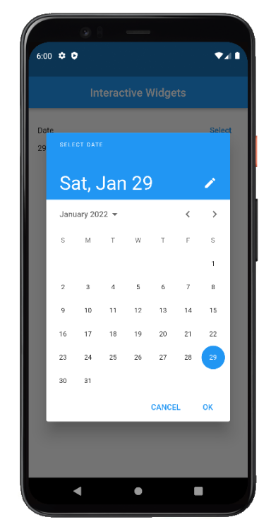
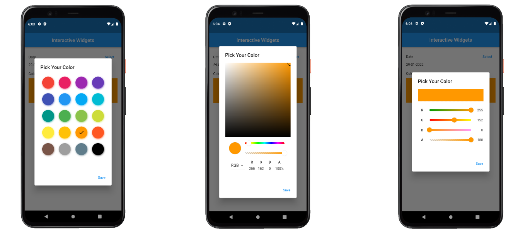
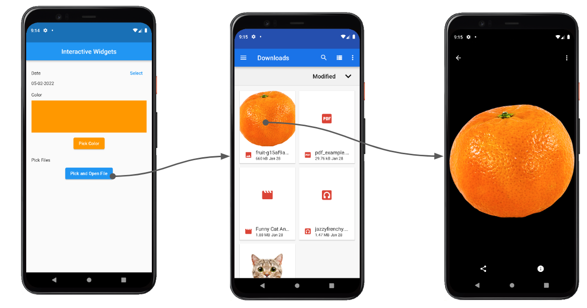

# (18) Form Picker

## Data Diri

Nomor Urut: 1_001FLB_42
Nama: Abghi Fareihan Desailie

## Summary

Pada section 18 ini, saya belajar tentang Form Picker : Date Picker, Color Picker dan File Picker.

### Date Picker

- Widget dimana user bisa memasukan tanggal
- Tanggal kelahiran, waktu pemesanan tiket, waktu reservasi restoran, jadwal meeting dll

**Cara Membuat Date Picker**

- Menggunakan fungsi bawaan flutter showDatePicker
- Fungsi showDatePicker memiliki tipe data future
- Menampilkan dialog material design date picker
- Menambahkan packages intl di pubspec.yaml
- Mempersiapkan variabel
- Membangun UI
- Menambahkan fungsi showDatePicker di dalam onPressed
- Memanggil fungsi setState di dalam onPressed

**Hasil Akhir**

- Saat select button ditekan akan muncul dialog date picker
- Tanggal yang ada di UI akan berubah sesuai dengan tanggal yang dipilih

 
 

### Color Picker

- Widget dimana user bisa memasukan color
- Penggunaan color picker bisa digunakan untuk berbagai macam kondisi

**Cara Membuat Color Picker**

- Menggunakan packages `flutter_colorpicker`
- Menambahkan packages `flutter_colorpicker` di pubspec.yaml
- Mempersiapkan variabel
- Membangun UI
- Menambahkan fungsi showdialog di dalam onPressed dengan return widget AlertDialog
- Import packages `flutter_colorpicker` dalam dart
- Membuat kode untuk penggunaan packages `flutter_colorpicker`

**Hasil Akhir**

- Packages `flutter_colorpicker` memiliki custom widget yang dapat digunakan, seperti BlockPicker, ColorPicker, dan SlidePicker

 
 

### File Picker

- Kemampuan 2idget untuk mengakses storage
- Memilih dan membuka file

**Cara Membuat File Picker**

- Menggunakan packages `file_picker` dan `open_file`
- Menambahkan packages `file_picker` dan `open_file` di pubspec.yaml
- Import `file_picker` dan `open_file` dalam file dart
- Membangun UI
- Membuat fungsi untuk mengexplore dan memilih files dari storage
- Memanggil fungsi `_pickFile` di dalam onPressed
- Membuat fungsi untuk membuka files yang telah dipilih
- Mengambil file dari object result dan memanggil fungsi `_openFile` di dalam fungsi `_pickFile`

**Hasil Akhir**

- Ketika button ditekan maka akan membuka storage device dan file yang dipilih akan terbuka

