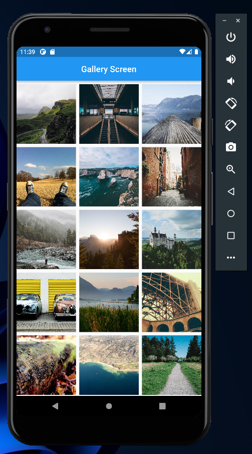
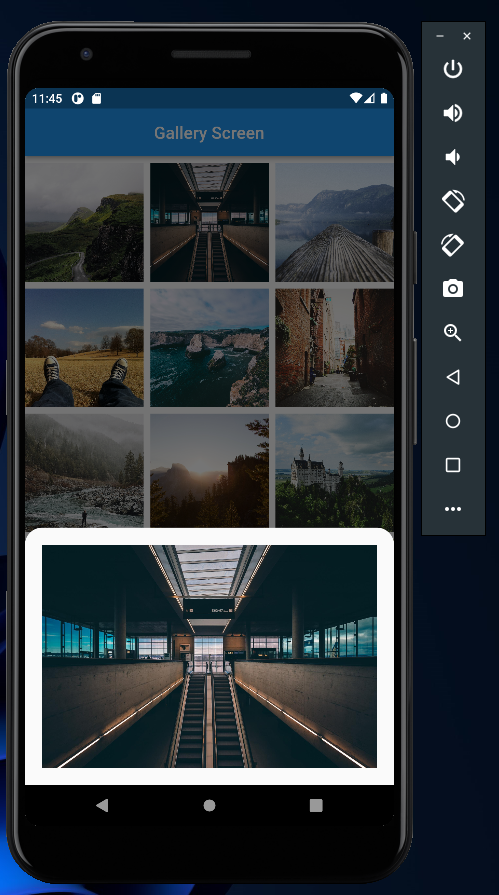
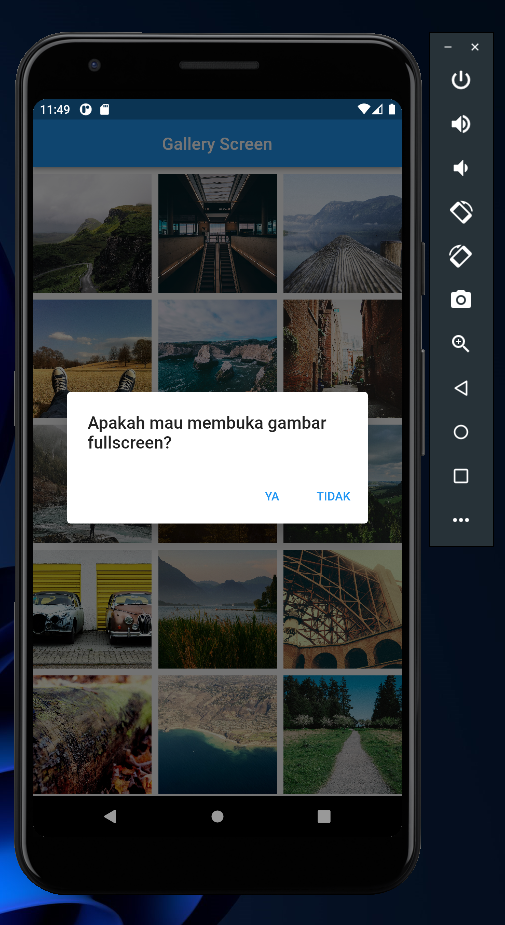
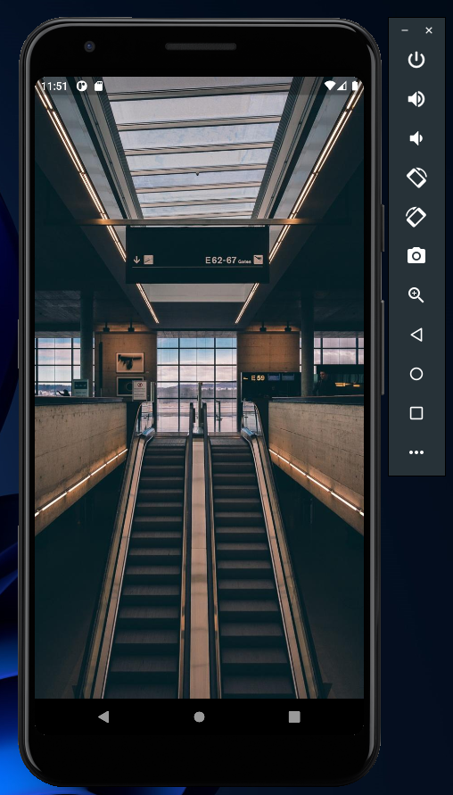

# (19) Dialog Bottom Sheet

## Data Diri

| Nomor       | Nama                    |
| ----------- | ----------------------- |
| 1_001FLB_42 | Abghi Fareihan Desailie |

## Task

**1. Buatlah gallery yang menampilkan gambar-gambar!**

Saya memakai gridview untuk menampilkan gambar nya :

```dart
GridView.builder(
    gridDelegate: const SliverGridDelegateWithFixedCrossAxisCount(
        crossAxisCount: 3,
        crossAxisSpacing: 8,
        mainAxisSpacing: 8,
        ),
    itemCount: dataGallery.length,
```

<br>

Data gambar tersebut saya ambil dari models yang telah saya buat :

```dart
class Gallery {
  String imageUrl;

  Gallery({
    required this.imageUrl,
  });
}

List<Gallery> dataGallery = [
  Gallery(
    imageUrl:
        'https://i.picsum.photos/id/1018/3914/2935.jpg?hmac=3N43cQcvTE8NItexePvXvYBrAoGbRssNMpuvuWlwMKg',
  ),
];
```



<br>
<br>

**2. Buatlah agar tiap gambar dapat ditampilkan pada bottom sheet saat ditekan!**

Saya menggunakan inkwell untuk onTap nya, dan menambahkan fungsi `showModalBottomSheet` untuk bottom sheet nya:

```dart
final galeri = dataGallery[index];
return InkWell(
    onTap: () {
        showModalBottomSheet(
            shape: const RoundedRectangleBorder(
                borderRadius: BorderRadius.vertical(
                    top: Radius.circular(20),
                ),
            ),
            context: context,
            builder: (context) => ProfileSheet(galeri),
        );
    },
```

<br>

Kemudian saya membuat widget ProfileSheet untuk menampilkan preview bottom sheet :

```dart
class ProfileSheet extends StatelessWidget {
  final Gallery gallery;

  const ProfileSheet(this.gallery, {super.key});

  @override
  Widget build(BuildContext context) {
    return Padding(
      padding: const EdgeInsets.all(20),
      child: Image.network(gallery.imageUrl),
    );
  }
}
```

Jadi, ketika gambar di tap sekali, akan muncul bottom sheet isinya gambar yg telah di tap (ditekan)



<br>
<br>

**3. Buatlah agar tiap gambar dapat di tampilkan pada dialog saat di tekan**

Masih menggunakan inkweel yang tadi, namun disini saya menggunakan `onLongPress` untuk showDialog:

```dart
onLongPress: () {
                showDialog(
                  context: context,
                  builder: (context) => AlertDialog(
                    title: const Text('Apakah mau membuka gambar fullscreen?'),
                    actions: <Widget>[
                      TextButton(
                        onPressed: () {
                          Navigator.of(context).push(
                            MaterialPageRoute(
                              builder: (context) => PreviewScreen(galeri),
                            ),
                          );
                        },
                        child: const Text('YA'),
                      ),
                      TextButton(
                        onPressed: () {
                          Navigator.of(context).pop();
                        },
                        child: const Text('TIDAK'),
                      ),
                    ],
                  ),
                );
              },
```

Jadi, ketika gambar di tekan lama, akan muncul showDialog seperti ini :



<br>

Jika saya klik 'YA' akan menampilkan gambar secara fullscreen, jika klik 'TIDAK' maka akan kembali (back) :


