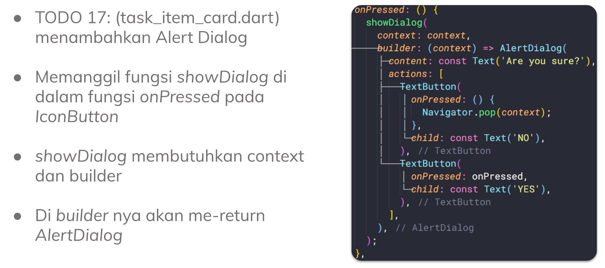
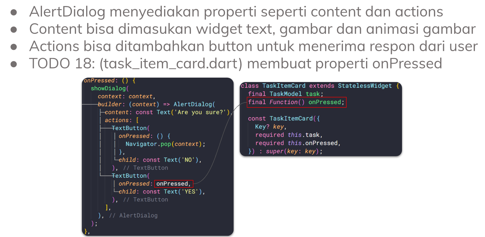
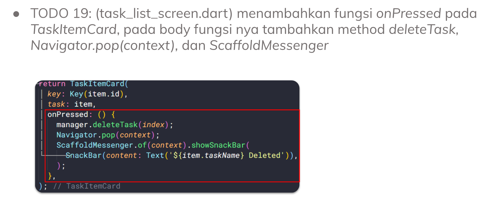
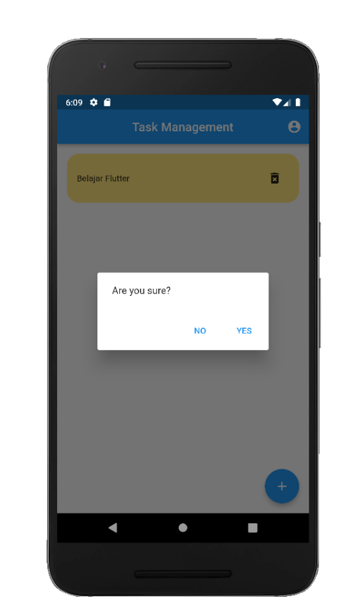
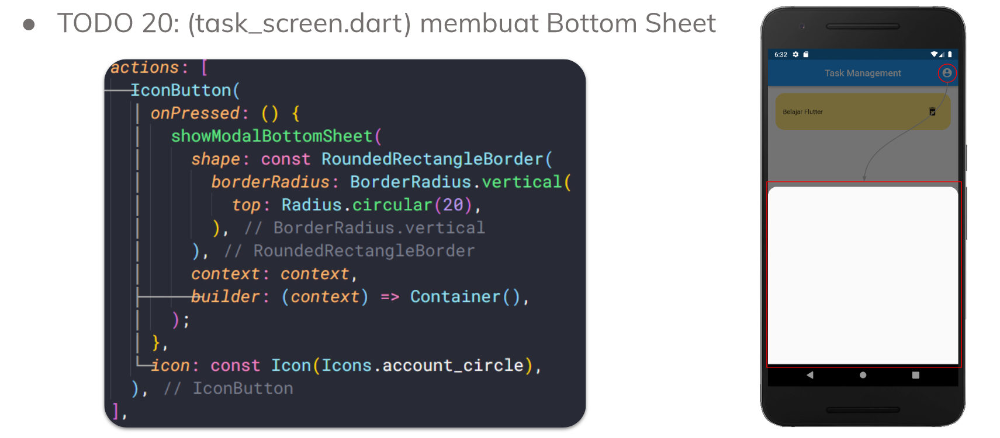
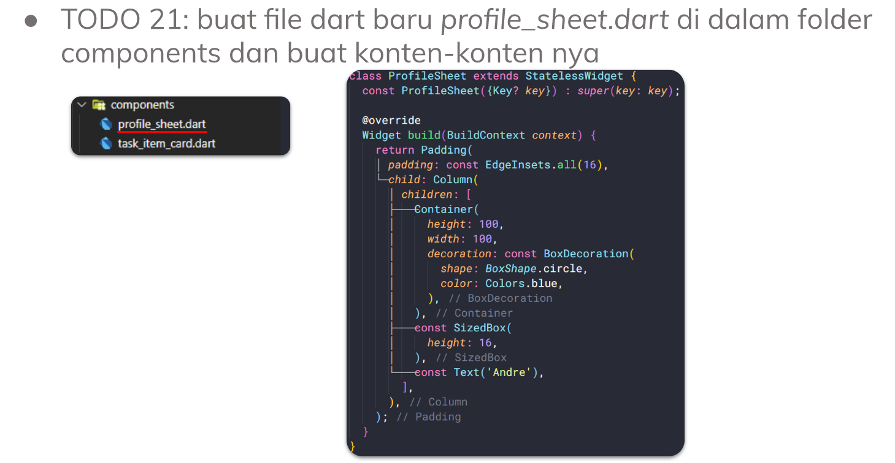
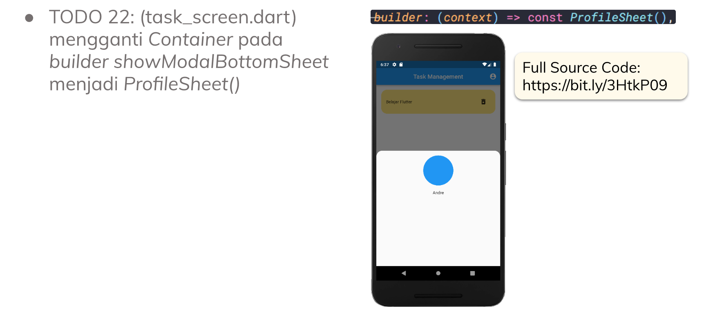
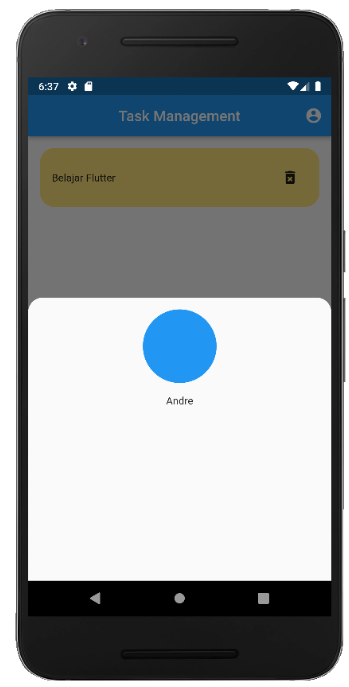

# (19) Dialog Bottom Sheet

## Data Diri

Nomor Urut: 1_001FLB_42
Nama: Abghi Fareihan Desailie

## Summary

Pada section 19 ini, saya belajar tentang Dialog Bottom Sheet : Alert Dialog, Bottom Sheet

### 1. Alert Dialog

- Untuk tampilan android, dari material design
- Menginformasikan pengguna tentang situasi tertentu
- Bisa digunakan untuk mendapatkan input dari user
- Membutuhkan helper method showDialog

**Cara Membuat Alert Dialog**

 

**Contoh Alert Dialog**

 
 

### 2. Bottom Sheet

- Seperti dialog tetapi muncul dari bawah layar aplikasi
- Menggunakan fungsi bawaan flutter showModalBottomSheet
- Membutuhkan dua properti, yaitu context dan builder

**Cara Membuat Bottom Sheet**

 

**Contoh Bottom Sheet**

