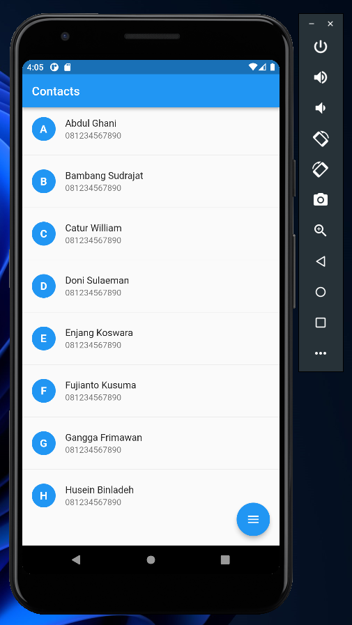
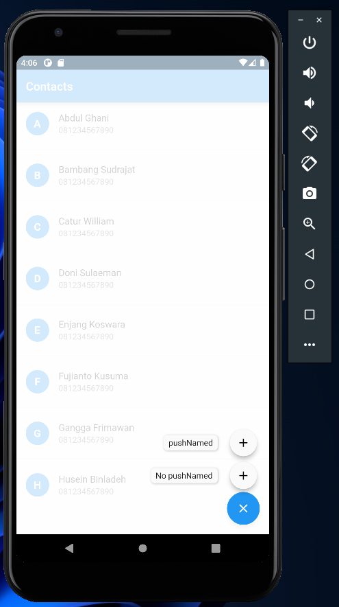

# (20) Flutter Navigation

## Data Diri

| Nomor       | Nama                    |
| ----------- | ----------------------- |
| 1_001FLB_42 | Abghi Fareihan Desailie |

## Task

**Buatlah halaman Contacts yang menampilkan data contacts menggunakan List View dan letakkan button untuk membuka halaman Create Contact!**

Membuat models contact untuk data list contact nya :

```dart
class Contacts {
  String name;
  String phone;

  Contacts({
    required this.name,
    required this.phone,
  });
}

List<Contacts> dataContact = [
  Contacts(
    name: 'Abdul Ghani',
    phone: '081234567890',
  ),
];
```

<br>

Buat ListView builder untuk menampilkan List data contact nya :

```dart
ListView.separated(
        itemBuilder: (context, index) {
          final contact = dataContact[index];
          return ListTile(
            leading: CircleAvatar(
              backgroundColor: Colors.blue,
              child: Center(
                child: Text(
                  dataContact[index].name[0],
                  style: const TextStyle(
                    fontSize: 18,
                    color: Colors.white,
                    fontWeight: FontWeight.bold,
                  ),
                ),
              ),
            ),
            title: Text(contact.name),
            subtitle: Text(contact.phone),
          );
        },
        separatorBuilder: (context, index) => const Divider(),
        itemCount: dataContact.length,
      ),
```



<br>
<br>

**Lakukan navigation di atas dengan dan tanpa named routes!**

Membuat button untuk membuka halaman, jadi jika di klik disitu ada dua button. dengan dan tanpa named routes :

```dart
floatingActionButton: SpeedDial(
        animatedIcon: AnimatedIcons.menu_close,
        children: [
          SpeedDialChild(
            child: const Icon(Icons.add),
            label: 'No pushNamed',
            onTap: () {
              Navigator.push(
                context,
                MaterialPageRoute(
                  builder: (context) => const CreateScreen(), // tanpa pushNamed
                ),
              );
            },
          ),
          SpeedDialChild(
            child: const Icon(Icons.add),
            label: 'pushNamed',
            onTap: () {
              Navigator.pushNamed(context, '/create'); // menggunakan pushNamed
            },
          ),
```



<br>
<br>

Pada file `main.dart` daftarkan terlebih dahulu routes :

```dart
routes: {
        '/create': (context) =>
            CreateScreen(), // mendaftarkan router (untuk pushNamed)
      },
```
