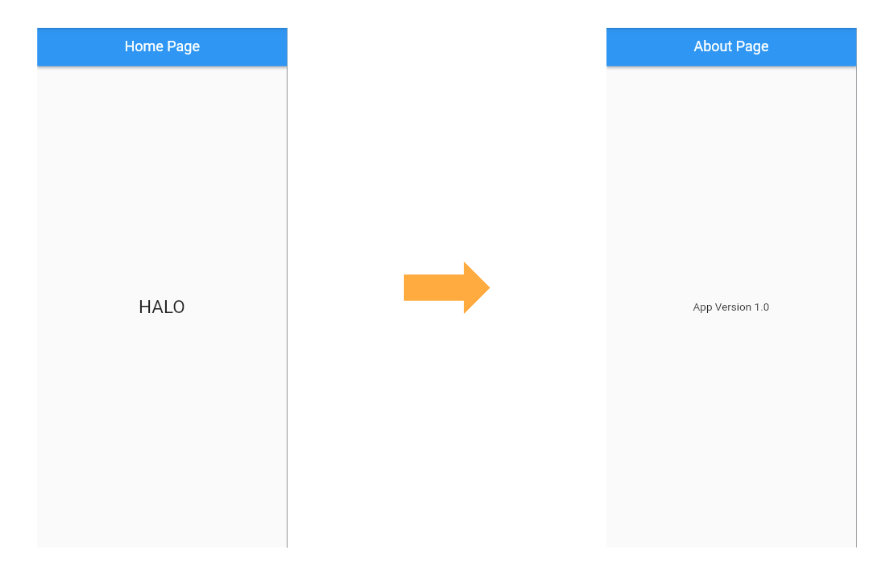
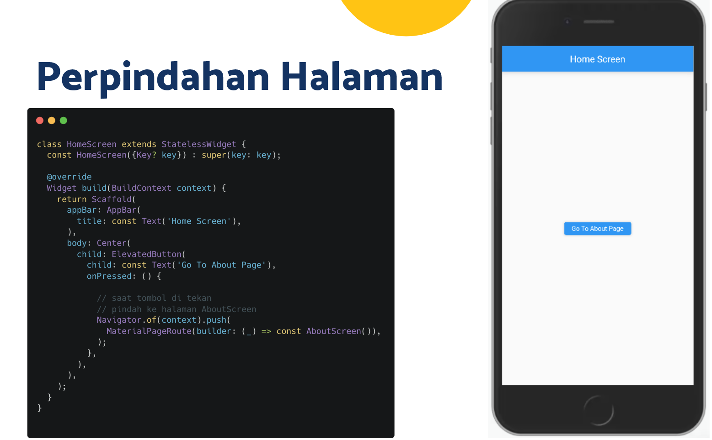
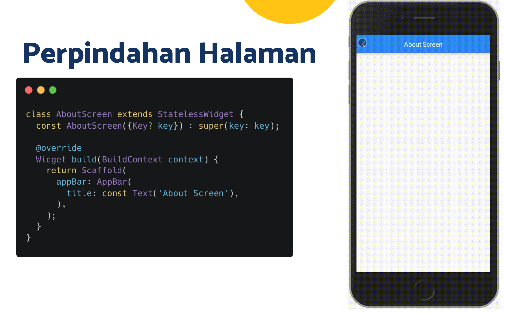
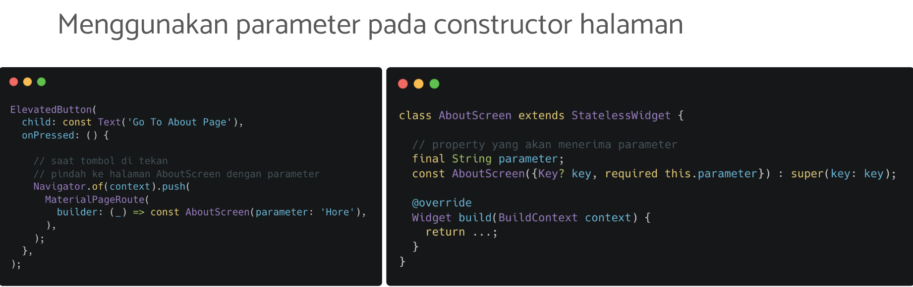
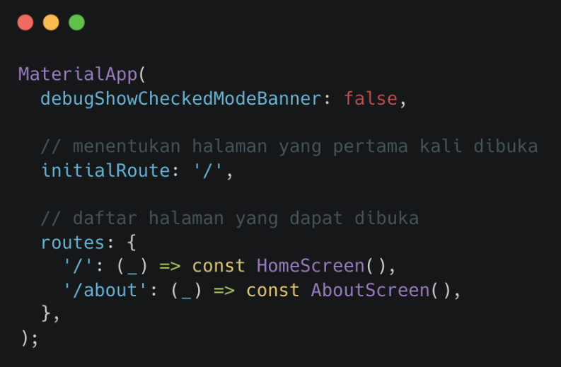
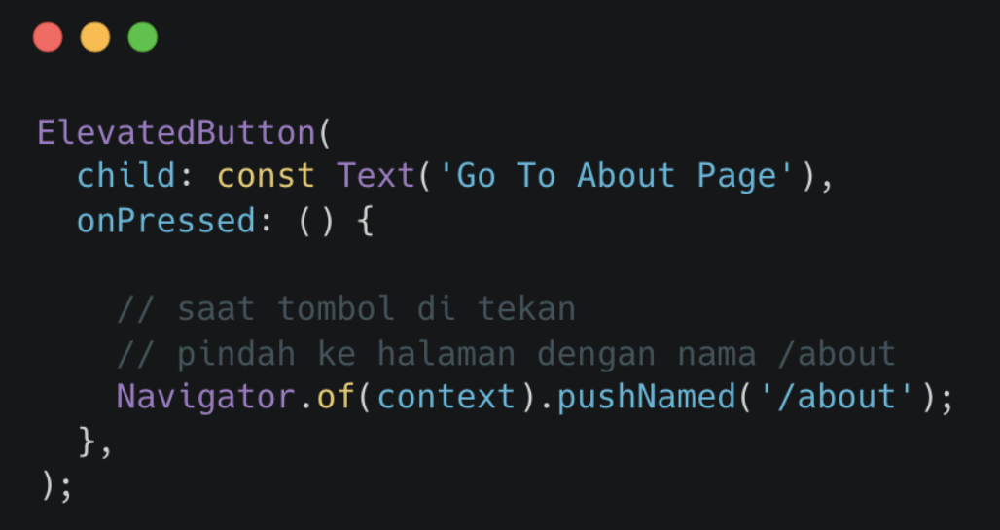
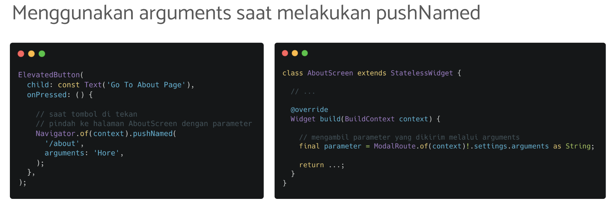

# (20) Flutter Navigation

## Data Diri

Nomor Urut: 1_001FLB_42
Nama: Abghi Fareihan Desailie

## Summary

Pada section 20 ini, saya belajar tentang Flutter Navigation ; Apa itu Navigatian ?, Navigation Dasar, Navigation dengan Named Routes.

### 1. Apa itu Navigation?

**Berpindah dari halaman satu ke halaman lain**

 
 

### 2. Navigation Dasar

- Perpindahan halaman menggunakan `Navigator.push()` (GO)
- Kembali ke halaman sebelumnya menggunakan `Navigator.pop()` (BACK)

**Perpindahan halaman :**

 

**Mengirim data ke halaman baru :**

 
 

### 3. Navigation dengan Named Routes

**Tiap halaman memiliki alamat yang disebut route**

- Perpindahan halaman menggunakan `Navigator.pushNamed()` (GO)
- Kembali ke halaman sebelumnya menggunakan `Navigator.pop()` (BACK)

**Mendaftarkan Route**

- Tambahkan initialRoute dan routes pada MaterialApp
- Tiap route adalah fungsi yang membentuk halaman

 

**Perpindahan Halaman**

 

**Mengirim data ke halaman baru :**

