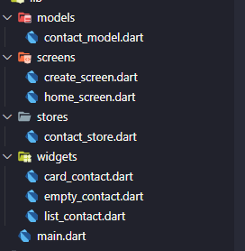
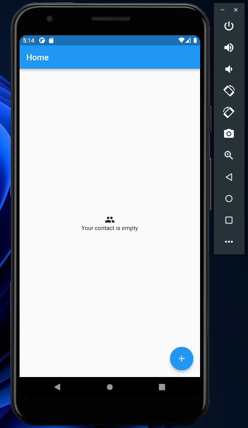
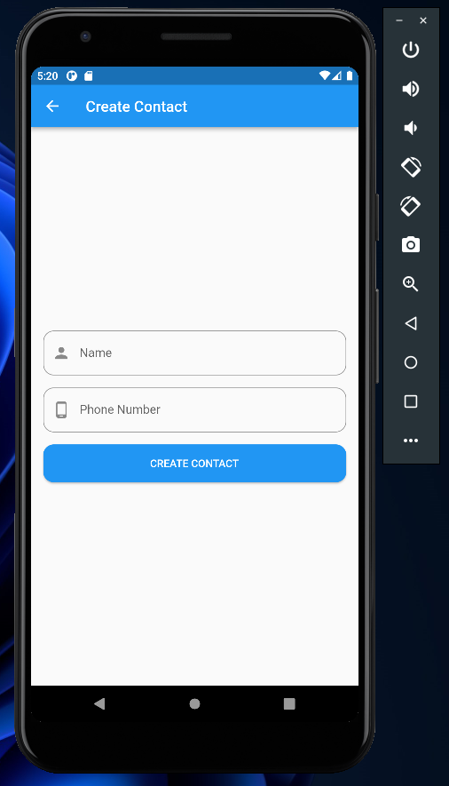
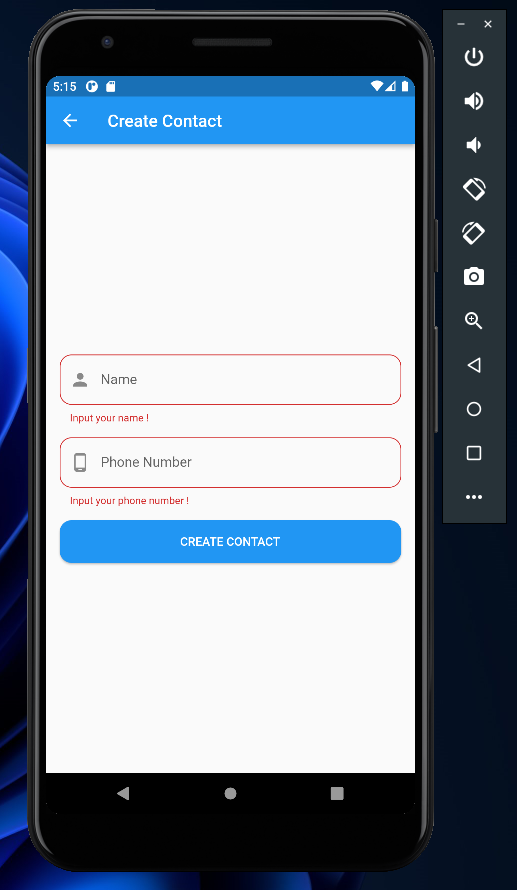
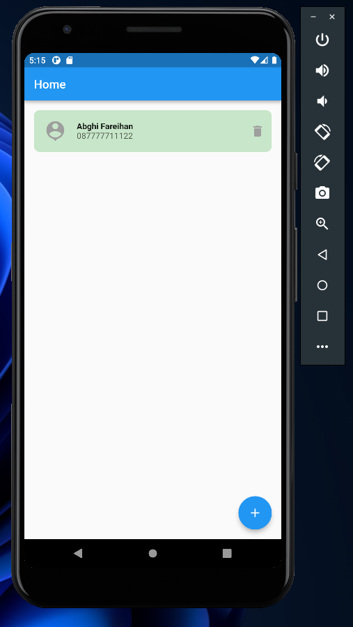
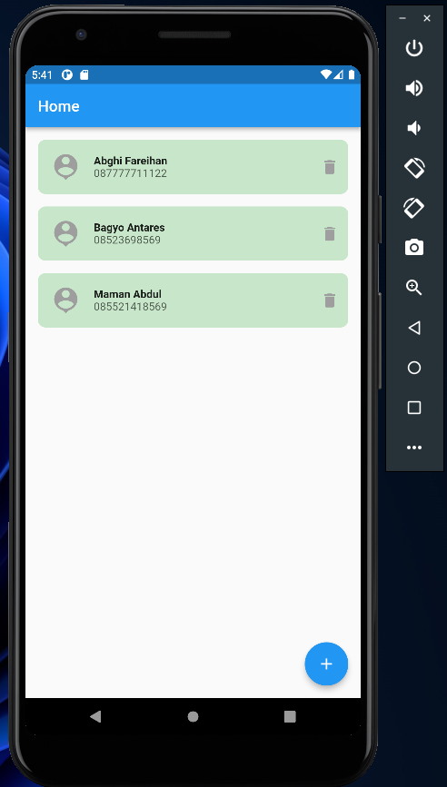

# (21) Flutter State Management (Provider)

## Data Diri

| Nomor       | Nama                    |
| ----------- | ----------------------- |
| 1_001FLB_42 | Abghi Fareihan Desailie |

## Task

**Berikut adalah daftar folder lib saya**



<br>

**Code `main.dart` yang menggunakan state managament provider**

```dart
class MyApp extends StatelessWidget {
  const MyApp({super.key});

  @override
  Widget build(BuildContext context) {
    return MultiProvider(
      providers: [
        ChangeNotifierProvider(
          create: (context) => ContactStore(),
        ),
      ],
      child: const MaterialApp(
        debugShowCheckedModeBanner: false,
        home: HomeScreen(),
      ),
    );
  }
}
```

<br>

**Code `contact_model.dart` membuat properties id (pakai nanoid), name dan phone pada contact**

```dart
class ContactModel {
  final String id;
  final String name;
  final String phone;
  ContactModel({
    required this.id,
    required this.name,
    required this.phone,
  });
}
```

<br>

**Code `contact_store.dart` yg isinya untuk menampung list serta fungsi add dan delete contact**

```dart
class ContactStore with ChangeNotifier {
  final _contacts = <ContactModel>[];
  List<ContactModel> get contacts => _contacts;

  void addContact(ContactModel contact) { // fungsi add contact
    _contacts.add(contact);
    notifyListeners();
  }

  void deleteContact(int index) { // fungsi delete contact
    _contacts.removeAt(index);
    notifyListeners();
  }
}
```

<br>
<br>

**Halaman `home_screen.dart` jika belum menambahkan kontak (kontak masih kosong)**

Code `home_screen.dart`
Jika data tidak ada akan me-return halaman `EmptyContact();`

```dart
Widget buildContactScreen() {
    return Consumer<ContactStore>(
      builder: (context, contact, child) {
        if (contact.contacts.isNotEmpty) {
          return ListContact(
            contact: contact,
          ); // jika isi contact akan menampilkan ListContact
        } else {
          return const EmptyContact();
        } // jika tidak ada data, maka akan menampilkan EmptyContact
      },
    );
  }
```

Code `empty_contact.dart`

```dart
Widget build(BuildContext context) {
    return Container(
      child: Center(
        child: Column(
          mainAxisAlignment: MainAxisAlignment.center,
          children: const [
            Icon(Icons.group),
            Text('Your contact is empty'),
          ],
        ),
      ),
    );
  }
```

<br>

Floating button add, jika di tekan akan mengarah ke halaman `create_screen.dart`

```dart
floatingActionButton: FloatingActionButton(
        onPressed: () {
          Navigator.of(context).push(
            MaterialPageRoute(
              builder: (context) => const CreateScreen(),
            ),
          );
        },
        child: const Icon(Icons.add),
      ),
```



<br>
<br>

**Halaman `create_screen.dart` untuk membuat kontak yang nantinya akan tampil di halaman `home_screen.dart`**

Code `create_screen.dart`

```dart
onPressed: () {
                    final isValid = formKey.currentState!.validate();
                    if (!isValid) return;

                    final contactItem = ContactModel(
                      id: nanoid(10),
                      name: nameController.text,
                      phone: phoneController.text,
                    );
                    contactProvider.addContact(contactItem); // fumgsi button untuk menambahkan data contact
                    Navigator.pop(context);
                    ScaffoldMessenger.of(context).showSnackBar(
                      SnackBar(
                        content: Text('${nameController.text} created.'),
                      ),
                    );
                  },
                  child: const Text('CREATE CONTACT'),
                  )
```



<br>

**Jika form (field) belum di isi akan mengeluarkan peringatan berupa text merah di bawah field, seperti ini**

Menggunakan validator pada textformfield

```dart
validator: (value) {
                  // jika field tidak di isi (empty) akan ada tulisan
                  if (value!.isEmpty) {
                    return 'Input your name !';
                  }
                  return null;
                },
```



<br>
<br>

**Halaman home jika kontak sudah di create (di buat) atau ditambahkan.**

Code `list_contact.dart` untuk menampilkan data contact yang di panggil di `home_screen.dart` tadi

```dart
Widget build(BuildContext context) {
    final contactItems = contact.contacts;
    return Padding(
      padding: const EdgeInsets.all(16.0),
      child: ListView.separated(
        itemCount: contactItems.length,
        itemBuilder: (context, index) {
          ContactModel item = contactItems[index];
          return CardContact(
            contact: item,
            onPressed: () {
              contact.deleteContact(index); // fungsi untuk menghapus list berdasarkan index
              ScaffoldMessenger.of(context).showSnackBar(
                SnackBar(
                  content: Text('${item.name} deleted.'),
                ),
              );
            },
          );
        },
        separatorBuilder: (context, index) {
          return const SizedBox(
            height: 16,
          );
        },
      ),
    );
  }
```





<br>
<br>
