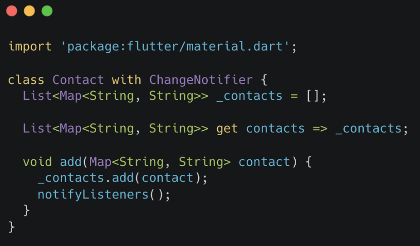
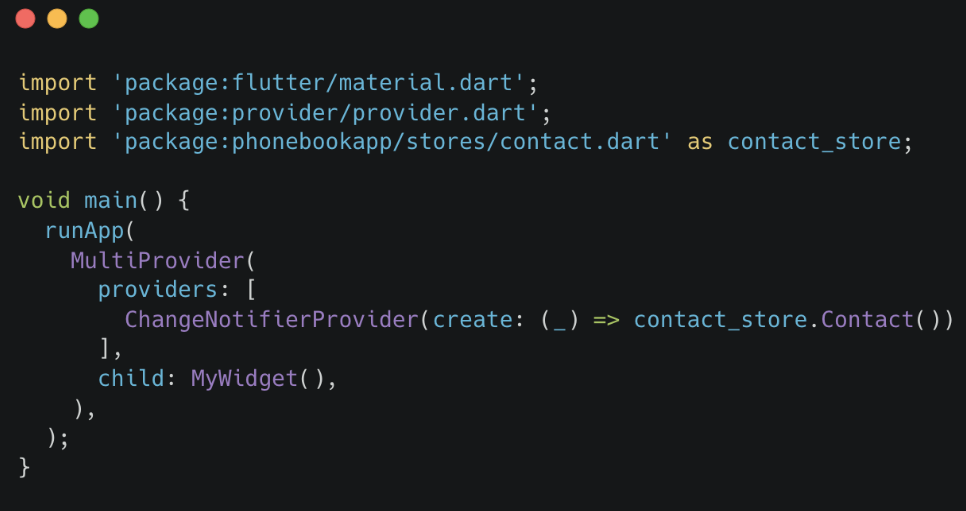
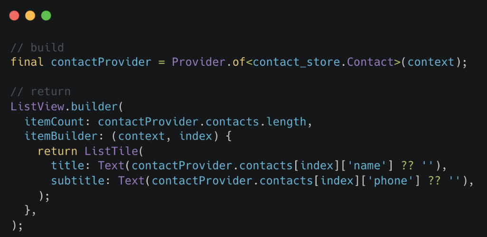

# (21) Flutter State Management (Provider)

## Data Diri

Nomor Urut: 1_001FLB_42
Nama: Abghi Fareihan Desailie

## Summary

Pada section 21 ini, saya belajar tentang Flutter Global State Management : Pengertian State, Global State.

### State

- Data yang dapat dibaca dibaca saat pembuatan widget
- Dapat berubah saat widget sedang aktif
- Hanya dimiliki oleh StatefulWidget

**Kenapa perlu global state?**
Agar antara widget dapat memanfaatkan state yang sama dengan mudah

**Memanfaatkan State**

- Dibuat sebagai property dari class
- Digunakan pada widget saat build

```dart
//property
var number = 0;

//build
Text('$number');
```

**Mengubah State**

- Menggunakan method `setState`

```dart
ElevatedButton(
    child: const Text('Tambah'),
    onPressed: () {
        setState(() {
            number = number + 1;
        });
    },
);
```

<br>
<br>

### Global State

- State biasa yang dapat digunakan pada seluruh widget

**Provider**

- State management
- Perlu di-install agar dapat digunakan

**Instalasi Provider**

- Menambahkan package provider pada bagian dependencies dalam file `pubspec.yaml`
- Jalankan perintah `flutter pub get`

**Membuat State Provider**

- Buat file bernama `contact.dart`
- Definisikan state dalam bentuk class



**Mendaftarkan State Provider**

- Import dalam file `main.dart`
- Daftarkan pada `runApp` dengan `MultiProvider`



**Menggunakan State dari Provider**

- Simpan provider dalam variable
- Ambil data dari provider melalui getter


