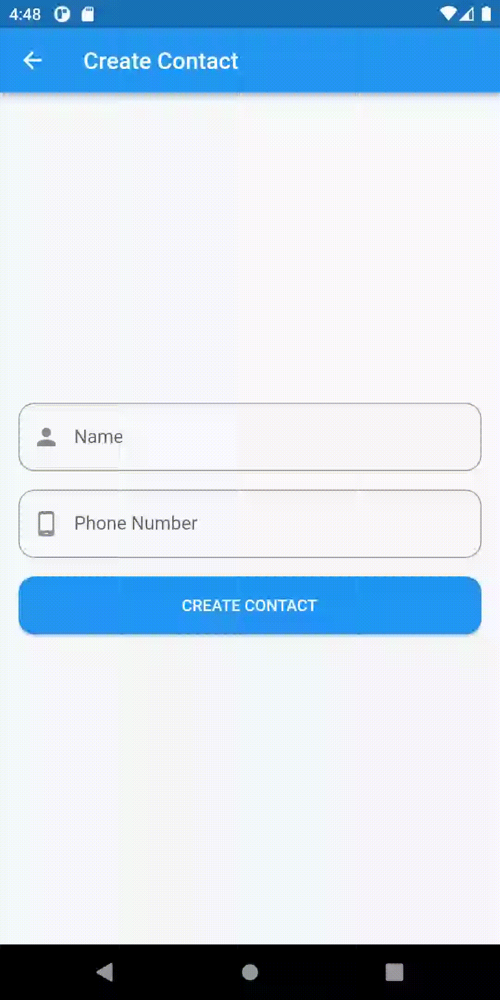

# (22) Flutter State Management (BLoC)

## Data Diri

| Nomor       | Nama                    |
| ----------- | ----------------------- |
| 1_001FLB_42 | Abghi Fareihan Desailie |

## Task

Pertama install package terlebih dahulu

```dart
  flutter_bloc: ^8.1.1
  equatable: ^2.0.5
```

<br>

isi folder lib saya


<br>

file `contact_bloc.dart`

```dart
class ContactBloc extends Bloc<ContactEvent, ContactState> {
  ContactBloc() : super(const Initial([])) {
    on<ContactEvent>(
      (event, emit) async {
        emit(Loading(state.contacts));

        await Future.delayed(const Duration(milliseconds: 2000)); // untuk proses loading nya, menggunakan fungsi await dengan durasi 2 detik setiap loading nya

        final existingContact = [...state.contacts]; // menagmbil data

        if (event is CreateContact) {
          existingContact.add(event.contact);
          emit(Loaded(existingContact));
        } // jika create contact akan terjadi loading terlebih dahulu

        if (event is RemoveContact) {
          existingContact.remove(event.contact);
          emit(Loaded(existingContact));
        } // jika remove contact akan terjadi loading terlebih dahulu

        if (event is FailedContact) {
          emit(Failed(state.contacts));
        }

        emit(Loaded(state.contacts));
      },
    );
  }
}
```

<br>

file `contact_event.dart`

```dart
abstract class ContactEvent extends Equatable {
  final ContactModel contact;
  const ContactEvent(this.contact);

  @override
  List<Object?> get props => [];
}

class CreateContact extends ContactEvent {
  const CreateContact(super.contact);
}

class RemoveContact extends ContactEvent {
  const RemoveContact(super.contact);
}

class FailedContact extends ContactEvent {
  const FailedContact(super.contact);
}
```

<br>

file `contact_state.dart`

```dart
abstract class ContactState extends Equatable {
  final List<ContactModel> contacts;

  const ContactState(this.contacts);

  @override
  List<Object> get props => [contacts];
}

class Initial extends ContactState {
  const Initial(super.contacts);
}

class Loading extends ContactState {
  const Loading(super.contacts);
}

class Loaded extends ContactState {
  const Loaded(super.contacts);
}

class Failed extends ContactState {
  const Failed(super.contacts);
}
```

<br>

file `contact_model.dart`

```dart
class ContactModel {
  String name;
  String phone;

  ContactModel({
    required this.name,
    required this.phone,
  });
}
```

<br>

Ini adalah tampilan home_screen.dart, jika tidak ada data contact akan me-return contact_empty.dart

```dart
class ContactEmpty extends StatelessWidget {
  const ContactEmpty({super.key});

  @override
  Widget build(BuildContext context) {
    return Center(
      child: Column(
        mainAxisAlignment: MainAxisAlignment.center,
        children: const [
          Icon(
            Icons.group,
            color: Colors.blue,
          ),
          Text(
            'Your contact is empty',
            style: TextStyle(
              fontSize: 16,
              fontWeight: FontWeight.w500,
            ),
          ),
        ],
      ),
    );
  }
}
```


<br>

file `contact_loading.dart`
jadi ketika create/remove contact akan mereturn contact_loading.dart terlebih dahulu, yang isinya CircularProgressBar

```dart
class ContactLoading extends StatelessWidget {
  const ContactLoading({super.key});

  @override
  Widget build(BuildContext context) {
    return const Center(
      child: CircularProgressIndicator(
        color: Colors.blue,
        backgroundColor: Colors.grey,
      ),
    );
  }
}
```

<br>
<br>

Halaman form create contact


<br>
<br>

Pada button Create Contact mengirim data meggunakan BlocBuilder
berikut ini code nya :

```dart
BlocBuilder<ContactBloc, ContactState>(
                builder: (context, state) {
                  return ElevatedButton(
                    style: ElevatedButton.styleFrom(
                      minimumSize: const Size.fromHeight(50),
                      shape: RoundedRectangleBorder(
                        borderRadius: BorderRadius.circular(14),
                      ),
                    ),
                    onPressed: () {
                      final isValid = formKey.currentState!.validate();
                      if (!isValid) return;

                      final contact = ContactModel(
                        name: nameController.text,
                        phone: phoneController.text,
                      );

                      context.read<ContactBloc>().add(
                            CreateContact(contact),
                          );

                      Navigator.pop(context);
                      ScaffoldMessenger.of(context).showSnackBar(
                        SnackBar(
                          content: Text('${nameController.text} created.'),
                        ),
                      );
                    },
                    child: const Text('CREATE CONTACT'),
                  );
```

<br>
<br>

Ketika Create Contact


<br>
<br>

Halaman setelah di isi data contact


<br>
<br>

Ketika Delete Contact


<br>
<br>

Berikut adalah code untuk memberi kondisi pada beberapa fungsi saat dijalankan `home_screen.dart`

```dart
Widget buildContactScreen() {
    final blocProvider = BlocProvider.of<ContactBloc>(context);
    return BlocBuilder<ContactBloc, ContactState>(
      bloc: blocProvider,
      builder: (context, state) {
        if (state is Loading) return const ContactLoading();
        // jika state loading akan return contactloading
        if (state is Failed) return const ContactFailed();
        // jika state failed akan return contactfailed
        if (state.contacts.isEmpty) return const ContactEmpty();
        // jika state ksoong akan return contactempty
        // jika tidak akan return list view yang berisi data contact yg telah di masukan pada halaman create_contact.dart
        return ListView.separated(
          padding: const EdgeInsets.all(16),
          itemBuilder: (context, index) {
            final contact = state.contacts[index];
            return ListTile(
              leading: CircleAvatar(
                child: Text(contact.name[0]),
              ),
              title: Text(contact.name),
              subtitle: Text(contact.phone),
              tileColor: Colors.blue.shade100,
              shape: RoundedRectangleBorder(
                borderRadius: BorderRadius.circular(8),
              ),
              trailing: IconButton(
                onPressed: () {
                  context.read<ContactBloc>().add(
                        RemoveContact(contact),
                      );

                  ScaffoldMessenger.of(context).showSnackBar(
                    SnackBar(
                      content: Text('${contact.name} deleted.'),
                    ),
                  );
                },
                icon: const Icon(Icons.delete),
              ),
            );
          },
          separatorBuilder: (context, index) => const SizedBox(height: 16),
          itemCount: state.contacts.length,
        );
      },
    );
```

<br>
<br>

Berikut adalah code pada `main.dart`

```dart
void main() {
  runApp(const MyApp());
}

class MyApp extends StatelessWidget {
  const MyApp({super.key});

  @override
  Widget build(BuildContext context) {
    return BlocProvider(
      create: (context) => ContactBloc(),
      child: const MaterialApp(
        debugShowCheckedModeBanner: false,
        home: HomeScreen(),
      ),
    );
  }
}
```

<br>
<br>

**Demo App:**

Demo app pada saat create contact


<br>
<br>
<br>

Demo app pada saat delete contact


<br>
<br>
<br>

Demo app pada saat form create tidak di isi, terjadi validasi


