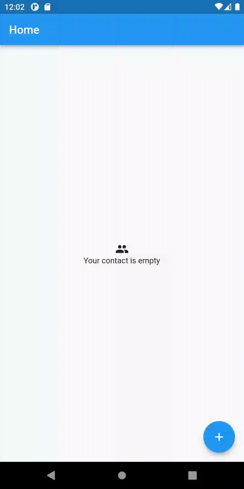

# (23) Flutter Animation

## Data Diri

| Nomor       | Nama                    |
| ----------- | ----------------------- |
| 1_001FLB_42 | Abghi Fareihan Desailie |

### Task 1

Buatlah sebuah halaman dengan spesifikasi sebagai berikut :
a. menampilkan sebuah gambar kecil di posisi tengah
b. jika gambar di klik akan membesar
c. jika di klik kembali, akan mengecil (ukuran semula)
d. proses perubahan gambar menggunakan animasi

Code `home_screen.dart` :

```dart
class HomeScreen extends StatefulWidget {
  const HomeScreen({super.key});

  @override
  State<HomeScreen> createState() => _HomeScreenState();
}

class _HomeScreenState extends State<HomeScreen> {
  bool _isTap = false; // membuat tipe data boolean untuk fungsi _isTap
  @override
  Widget build(BuildContext context) {
    return Scaffold(
      appBar: AppBar(
        title: const Text('Flutter Animation'),
        centerTitle: true,
      ),
      body: Center(
        child: Column(
          mainAxisAlignment: MainAxisAlignment.center,
          children: [
            InkWell(
              onTap: () => setState(() => _isTap = !_isTap),
              child: AnimatedContainer(
                width: _isTap ? 500 : 100,
                height: _isTap ? 500 : 100, // jika di tap maka gambar akan memperbesar ukuran 500 pixel, jika di tap kembali akan mengecil ukuran 100 pixel
                duration: const Duration(milliseconds: 300),
                decoration: BoxDecoration(
                  borderRadius: BorderRadius.circular(_isTap ? 0 : 60), // dan juga ukuran 100 pixel gambar akan membulat karna saya atur border radius
                  image: const DecorationImage(
                    fit: BoxFit.cover,
                    image: NetworkImage(
                      'https://images.unsplash.com/photo-1657299143437-b63ce1fc01aa?ixlib=rb-1.2.1&ixid=MnwxMjA3fDF8MHxwaG90by1wYWdlfHx8fGVufDB8fHx8&auto=format&fit=crop&w=687&q=80',
                    ),
                  ),
                ),
              ),
            ),
          ],
        ),
      ),
    );
  }
}

```

<br>

**Demo App Task 1**


<br>
<br>
<br>
<br>

### Task 2

Tambahkan transisi saat perpindahan halaman Contact ke Create Contact !
Saat floatingbutton di tekan sebelum berpindah halaman akan melakukan transisi terlebih dahulu

Code :

```dart
floatingActionButton: FloatingActionButton(
        onPressed: () {
          Navigator.of(context).push(
            PageRouteBuilder(
              pageBuilder: (context, animation, secondaryAnimation) {
                return const CreateScreen();
              },
              transitionsBuilder:
                  (context, animation, secondaryAnimation, child) {
                final tween = Tween(
                  begin: const Offset(1, 1), // akan membuat transisi dari bawah kanan
                  end: Offset.zero,
                );
                return SlideTransition( // menggunakan transisi slide
                  position: animation.drive(tween),
                  child: child,
                );
              },
            ),
          );
        },
        child: const Icon(Icons.add),
      ),
```

<br>

**Demo App Task 2**


