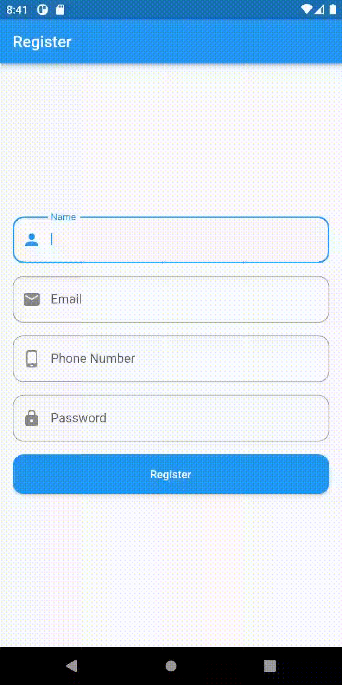
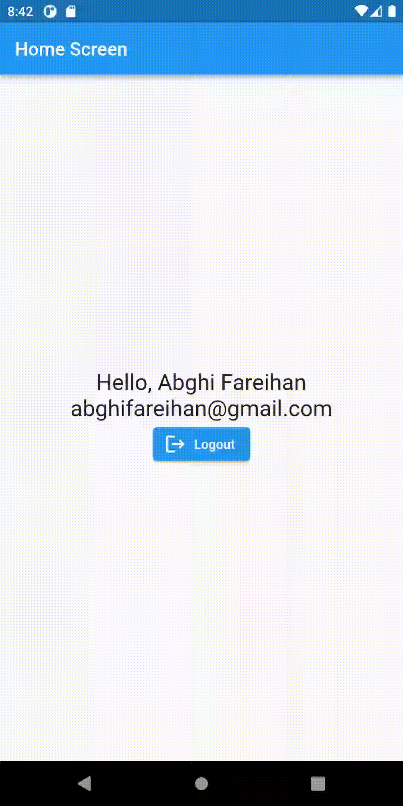

# (24) Storage

## Data Diri

| Nomor       | Nama                    |
| ----------- | ----------------------- |
| 1_001FLB_42 | Abghi Fareihan Desailie |

### TASK 1 dan 2

Buatlah halaman **Register** dan halaman **Home**, dengan ketentuan sebagai berikut :

- Halaman **Register**, buat tombol Register dan 4 kolom untuk nama, email, nomor telepon, dan password <br>
- Saat menekan tombol register, simpan data email (String), nama (String) dan isLogin (boolean) ke dalam shared preference dan navigasi ke halaman home. <br>
- Halaman **Home**, buat teks untuk menampilkan nama dan email & buat tombol logout. <br>
- Menekan tombol logout, hapus semua isi shared preference & navigasi ke halaman **Register** <br>
- Gunakan state management **Provider**
- Gunakan state management **Bloc**

<br>
<br>

main.dart **Provider** Code :

```dart
class MyApp extends StatelessWidget {
  const MyApp({super.key});

  @override
  Widget build(BuildContext context) {
    return MultiProvider(
      providers: [
        ChangeNotifierProvider(
          create: (context) => AccountProvider(),
        ),
      ],
      child: MaterialApp(
        debugShowCheckedModeBanner: false,
        initialRoute: '/register',
        routes: {
          '/home': (context) => const HomeScreen(),
          '/register': (context) => const RegisterScreen(),
        },
      ),
    );
  }
}
```

<br>

main.dart **BLoC** Code :

```dart
class MyApp extends StatelessWidget {
  const MyApp({super.key});

  // This widget is the root of your application.
  @override
  Widget build(BuildContext context) {
    return MultiBlocProvider(
      providers: [
        BlocProvider(
          create: (context) => AccountBloc(),
        ),
      ],
      child: MaterialApp(
        debugShowCheckedModeBanner: false,
        initialRoute: '/register',
        routes: {
          '/home': (context) => const HomeScreen(),
          '/register': (context) => const RegisterScreen(),
        },
      ),
    );
  }
}
```

<br>
<br>

Halaman (register_screen.dart) tombol register dan 4 kolom, name, email, phone dan password:

```dart
TextFormField(
                controller: _nameController,
                textCapitalization: TextCapitalization.words,
                keyboardType: TextInputType.text,
                textInputAction: TextInputAction.next,
                decoration: InputDecoration(
                  border: OutlineInputBorder(
                    borderRadius: BorderRadius.circular(14),
                  ),
                  label: const Text('Name'),
                  prefixIcon: const Icon(Icons.person),
                ),
                validator: (value) {
                  if (value == null || value.length < 5) {
                    return 'Silahkan input username yang valid';
                  }
                  return null;
                },
              ),
```

<br>

Tombol Register **Provider** Code :

```dart
Consumer<AccountProvider>(
                builder: (context, value, child) {
                  return ElevatedButton(
                    style: ElevatedButton.styleFrom(
                      minimumSize: const Size.fromHeight(50),
                      shape: RoundedRectangleBorder(
                        borderRadius: BorderRadius.circular(14),
                      ),
                    ),
                    onPressed: () async {
                      final isValid = _formKey.currentState!.validate();

                      if (!isValid) return;

                      final account = AccountModel(
                        _nameController.text,
                        _emailController.text,
                        _phoneController.text,
                        _phoneController.text,
                      );

                      final result = await context
                          .read<AccountProvider>()
                          .saveAccount(account);

                      if (mounted) {}

                      if (result) {
                        Navigator.pushNamedAndRemoveUntil(
                          context,
                          '/home',
                          (route) => false,
                        );
                      }
                    },
                    child: const Text('Register'),
                  );
                },
              ),
```

<br>

Tombol Register **BLoC** Code :

```dart
BlocListener<AccountBloc, AccountState>(
                listener: (context, state) {
                  if (state is AccountSuccess) {
                    var isLogin = state.isLogin;
                    if (isLogin!) {
                      Navigator.pushNamedAndRemoveUntil(
                        context,
                        '/home',
                        (route) => false,
                      );
                    }
                  }
                },
                child: ElevatedButton(
                  style: ElevatedButton.styleFrom(
                    minimumSize: const Size.fromHeight(50),
                    shape: RoundedRectangleBorder(
                      borderRadius: BorderRadius.circular(14),
                    ),
                  ),
                  onPressed: () async {
                    final isValid = _formKey.currentState!.validate();

                    if (!isValid) return;

                    final account = AccountModel(
                      _nameController.text,
                      _emailController.text,
                      _phoneController.text,
                      _phoneController.text,
                    );

                    var result = await context
                        .read<AccountBloc>()
                        .createAccount(account);

                    if (mounted) {}

                    if (result) {
                      Navigator.pushNamedAndRemoveUntil(
                        context,
                        '/home',
                        (route) => false,
                      );
                    }
                  },
                  child: const Text('Register'),
                ),
              ),
```

<br>
<br>

Membuat controller pada masing masing textfield :

```dart
final _formKey = GlobalKey<FormState>();
  final _nameController = TextEditingController();
  final _emailController = TextEditingController();
  final _phoneController = TextEditingController();
  final _passwordController = TextEditingController();
```

<br>
<br>

Halaman **HomeScreen** pada masing masing state, untuk menampilkan nama dan email

<br>

home_screen.dart **Provider** Code :

```dart
Consumer<AccountProvider>(
              builder: (context, value, child) {
                return Text(
                  'Hello, ${value.account?.name}',
                  style: const TextStyle(
                    fontSize: 24,
                  ),
                );
              },
            ),
            Consumer<AccountProvider>(
              builder: (context, value, child) {
                return Text(
                  '${value.account?.email}',
                  style: const TextStyle(
                    fontSize: 24,
                  ),
                );
              },
            ),
```

<br>

home_screen.dart **BLoC** Code :

```dart
BlocBuilder<AccountBloc, AccountState>(
              builder: (context, state) {
                if (state is AccountSuccess) {
                  return Text(
                    'Hello, ${state.account?.name}',
                    style: const TextStyle(fontSize: 24),
                  );
                }

                return const SizedBox();
              },
            ),
            BlocBuilder<AccountBloc, AccountState>(
              builder: (context, state) {
                if (state is AccountSuccess) {
                  return Text(
                    '${state.account?.email}',
                    style: const TextStyle(fontSize: 24),
                  );
                }

                return const SizedBox();
              },
            ),
```

<br>

Mengambil data akun di **Provider** dan **BLoC** :

```dart
Future<AccountModel?> getAccount() {
    return Future(() async {
      final store = await SharedPreferences.getInstance();
      final name = store.getString(_name);
      final email = store.getString(_email);
      final phone = store.getString(_phone);
      final password = store.getString(_password);

      if (name != null && email != null && phone != null && password != null) {
        return AccountModel(name, email, phone, password);
      }

      return null;
    });
  }
```

<br>

State **Provider** :

```dart
class AccountProvider extends ChangeNotifier {
  bool _isLogin = false;
  AccountModel? _accountModel;
  late SharedPref _sharedPref;

  AccountProvider() {
    _sharedPref = SharedPref();
  }

  Future<bool> get isLogin async {
    _isLogin = await _sharedPref.isLogin();
    return _isLogin;
  }

  AccountModel? get account => _accountModel;

  Future<bool> saveAccount(AccountModel account) async {
    final result = await _sharedPref.saveAccount(account);
    return result;
  }

  Future<void> getAccount() async {
    _accountModel = await _sharedPref.getAccount();
    notifyListeners();
  }

  Future<bool> removeAccount() async {
    return await _sharedPref.removeAccount();
  }
}
```

<br>

State **BLoC** :

account_bloc.dart

```dart
class AccountBloc extends Bloc<AccountEvent, AccountState> {
  late SharedPref _sharedPref;
  AccountBloc() : super(AccountInitial()) {
    _sharedPref = SharedPref();
  }

  void getAccount() async {
    var account = await _sharedPref.getAccount();
    var isLogin = await _sharedPref.isLogin();
    emit(AccountSuccess(account: account, isLogin: isLogin));
  }

  Future<bool> removeAccount() async {
    var status = await _sharedPref.removeAccount();
    getAccount();
    return status;
  }

  Future<bool> createAccount(AccountModel account) async {
    var status = await _sharedPref.saveAccount(account);
    getAccount();
    return status;
  }
}
```

<br>

account_state.dart

```dart
abstract class AccountState extends Equatable {
  const AccountState();

  @override
  List<Object?> get props => List.empty();
}

class AccountInitial extends AccountState {}

class AccountLoading extends AccountState {}

class AccountSuccess extends AccountState {
  final AccountModel? account;
  final bool? statusAction;
  final bool? isLogin;

  AccountSuccess({
    this.account,
    this.statusAction,
    this.isLogin,
  });

  @override
  List<Object?> get props => [account, statusAction, isLogin];
}

```

<br>
<br>

**DEMO APPS REGISTER APP PROVIDER DAN BLOC**

<br>

**Menampilkan nama dan email, serta tombol logout :**
_(perhatikan demo apps di bawah (gif)_



<br>
<br>
<br>

**Saat menekan tombol logout, akan terhapus datanya, dan navigasi ke halaman register :**
_(perhatikan demo apps di bawah (gif)_



<br>
<br>
<br>

**Saat aplikasi di tutup, (tanpa logout) maka data yg di register akan muncul :**
_(perhatikan demo apps di bawah (gif)_


