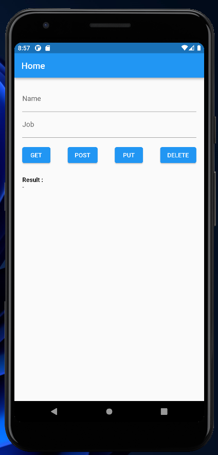
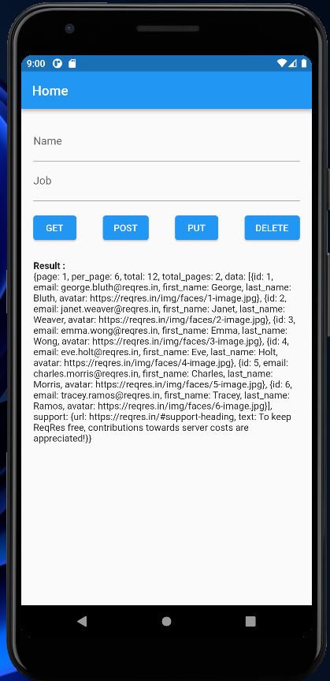
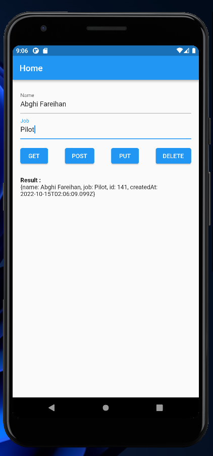
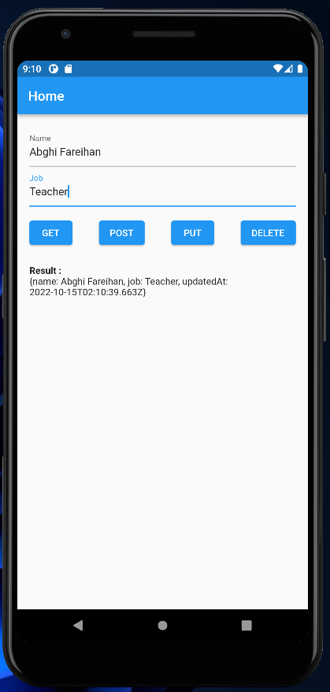
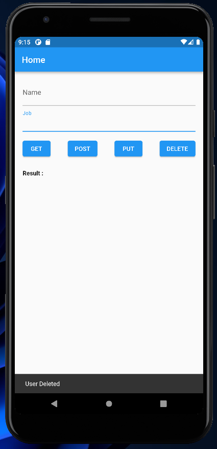
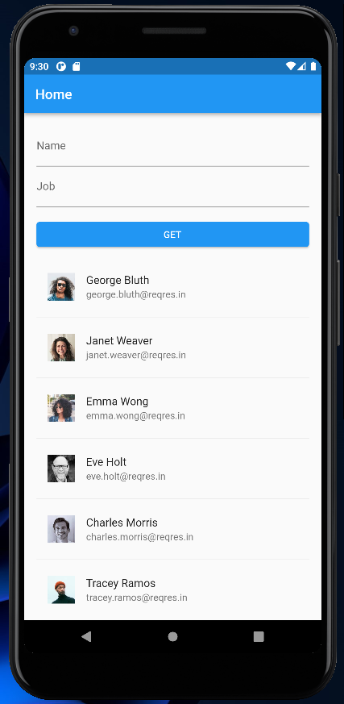

# (25) Introduction REST API JSON serialization deserialization

## Data Diri

| Nomor       | Nama                    |
| ----------- | ----------------------- |
| 1_001FLB_42 | Abghi Fareihan Desailie |

### TASK 1

**Buatlah halaman yang terdiri dari 4 tombol, 2 kolom (Textfield) dan satu text untuk menampilkan data hasil request API**



<br>

Tombol 1 : melakukan **GET** request menggunakan Dio, tampilkan hasil responsenya

source code **GET** :

```dart
void getAllUser() async {
    try {
      Response response = await Dio().get('https://reqres.in/api/users'); // memanggil api dengan menggunakan package Dio()
      setState(() {
        this.response = response.data.toString();
      });
    } catch (e) {
      rethrow;
    }
  }
```

hasil response **GET** :



<br>
<br>

Tombol 2 : melakukan **POST** request menggunakan Dio, data request yang digunakan untuk url ini adalah **Map** dengan key berupa **name** dan **job**. Gunakan data dari **Textfield** sebagai value untuk data request.

source code **POST** :

fungsi post adalah untuk create data

```dart
void createUser() async {
    Map<String, dynamic> data = {
      'name': _nameController.text,
      'job': _jobController.text,
    }; // memanggil controller properties yang sudah dibuat, value nya adalah name dan job
    try {
      Response response = await Dio().post(
        'https://reqres.in/api/users',
        data: data,
      ); // memanggil api, value nya adalah data
      setState(() {
        this.response = response.data.toString();
      });
    } catch (e) {
      rethrow;
    }
  }
```

hasil response **POST** :



<br>
<br>

Tombol 3 : melakukan **PUT** request menggunakan Dio, data request yang digunakan untuk url ini adalah **Map** dengan key berupa **name** dan **job**. Gunakan data dari **Textfield** sebagai value untuk data request.

source code **PUT** :

fungsi put adalah untuk mengedit data

```dart
void editUser() async {
    Map<String, dynamic> data = {
      'name': _nameController.text,
      'job': _jobController.text,
    }; // memanggil controller properties yang sudah dibuat, value nya adalah name dan job
    try {
      Response response = await Dio().put(
        'https://reqres.in/api/users/4',
        data: data,
      ); // memanggil api, value nya adalah data yg sudah di edit
      setState(() {
        this.response = response.data.toString();
      });
    } catch (e) {
      rethrow;
    }
  }
```

hasil response **PUT** :



<br>
<br>

Tombol 4 : melakukan **DELETE** request menggunakan Dio

source code **DELETE** :

```dart
void deleteUser() async {
    try {
      Response response = await Dio().delete('https://reqres.in/api/users/4');
      setState(() {
        this.response = response.data.toString();
        ScaffoldMessenger.of(context).showSnackBar(
          const SnackBar(
            content: Text('User Deleted'),
          ),
          // menambahkan snackbar saat delete
        );
        _nameController.clear();
        _jobController.clear();
        // menghapus data di textfield saat tombol delete di tekan
      });
    } catch (e) {
      rethrow;
    }
  }
```

hasil response **DELETE** :



<br>
<br>

konversi json :

```dart
Map<String, dynamic> parseAndDecode(String response) {
    return json.decode(response);
  }
```

<br>
<br>

fungsi di ke-4 elevated button :

```dart
ElevatedButton(
  onPressed: () {
    getAllUser();
  },
  child: const Text('GET'),
),
ElevatedButton(
  onPressed: () {
    createUser();
  },
  child: const Text('POST'),
),
ElevatedButton(
  onPressed: () {
    editUser();
  },
  child: const Text('PUT'),
),
ElevatedButton(
  onPressed: () {
    deleteUser();
  },
  child: const Text('DELETE'),
),
```

<br>

**PERHATIKAN DEMO APP DI BAWAH INI (GIF)**
_harap ditunggu jika gif belum ke load_


<br>
<br>
<br>
<br>

### TASK 2

**Buatlah sebuah Object/Map dari suatu Class(model class) menggunakan hasil response dari soal nomor 1(b)**

saya membuat `user_model.dart` terlebih dahulu :

```dart
class UserModel {
  late int id;
  late String email;
  late String firstName;
  late String lastName;
  late String avatar;

  UserModel({
    required this.id,
    required this.email,
    required this.firstName,
    required this.lastName,
    required this.avatar,
  });

  UserModel.fromJson(Map<String, dynamic> json) {
    id = json['id'];
    email = json['email'].toString();
    firstName = json['first_name'].toString();
    lastName = json['last_name'].toString();
    avatar = json['avatar'].toString();
  }

  Map<String, dynamic> toJson() {
    final map = <String, dynamic>{};
    map['id'] = id;
    map['email'] = email;
    map['first_name'] = firstName;
    map['last_name'] = lastName;
    map['avatar'] = avatar;
    return map;
  }
}
```

<br>

pada button **GET** memanngil value id nama firstname lastname avatar,dari model dan juga API nya :

```dart
ElevatedButton(
              onPressed: () async {
                final res = await Dio().get('https://reqres.in/api/users');
                final listMap = List<Map<String, dynamic>>.from(
                  res.data['data'].map(
                    (user) => {
                      'id': user['id'],
                      'email': user['email'].toString(),
                      'firstName': user['first_name'].toString(),
                      'lastName': user['last_name'].toString(),
                      'avatar': user['avatar'].toString(),
                    },
                  ),
                );

                setState(() {
                  response = listMap.runtimeType.toString();
                  listUsers = List<UserModel>.from(
                    res.data['data']
                        .map((user) => UserModel.fromJson(user))
                        .toList(),
                  );
                  _listMapUsers = listMap;
                });
              },
              child: const Text('GET'),
            ),
```

<br>

lalu pada result (output) tampilkan data secara listview :

```dart
Expanded(
              child: ListView.separated(
                itemBuilder: (context, index) {
                  final user = _listMapUsers[index];
                  return ListTile(
                    leading: CircleAvatar(
                      child: Image.network(user['avatar']),
                    ),
                    title: Text(
                        '${user['firstName'].toString()} ${user['lastName'].toString()}'),
                    subtitle: Text(user['email']),
                  );
                },
                separatorBuilder: (context, index) => const Divider(),
                itemCount: _listMapUsers.length,
              ),
            ),
```

<br>


