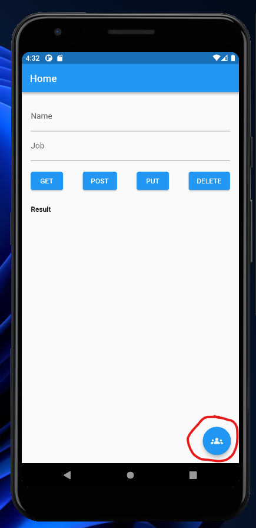
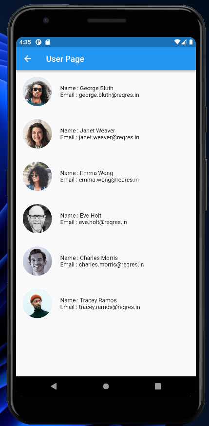
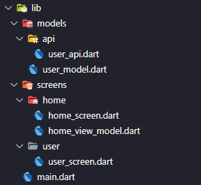
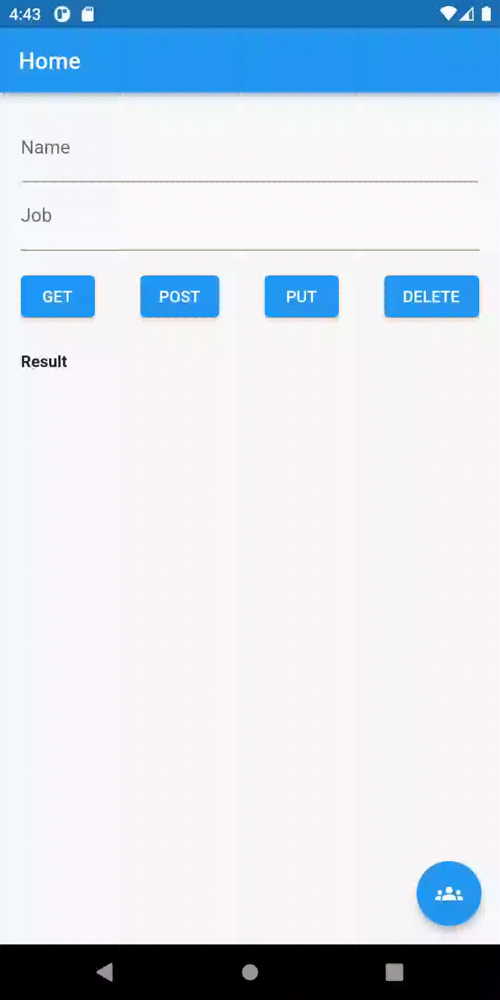

# (26) MVVM Architecture

## Data Diri

| Nomor       | Nama                    |
| ----------- | ----------------------- |
| 1_001FLB_42 | Abghi Fareihan Desailie |

<br>

Saya menerapan MVVM Architecture ke project sebelumnya, lalu saya menambahkan floating button yang menuju ke **screen baru** yaitu `user_screen.dart` :



<br>

Berikut adalah tampilan pada`UserScreen` menampilkan data user yang mengambil dari restAPI :

```dart
ListView.builder(
        itemCount: modelView.user.length,
        itemBuilder: (context, index) {
          final user = modelView.user[index];
          return Padding(
            padding: const EdgeInsets.all(16.0),
            child: Column(
              children: [
                Row(
                  children: [
                    CircleAvatar(
                      radius: 35,
                      backgroundImage: NetworkImage(user.avatar),
                    ),
                    const SizedBox(
                      width: 20,
                    ),
                    Expanded(
                      child: Column(
                        crossAxisAlignment: CrossAxisAlignment.start,
                        children: [
                          Text('Name : ${user.firstName} ${user.lastName}'),
                          Text('Email : ${user.email}'),
                        ],
                      ),
                    )
                  ],
                ),
              ],
            ),
          );
        },
      ),
```



<br>

isi folder lib untuk penerapan **MVVM Architecture** :



<br>

Di dalam folder models ada folder api yang berisi `user_api.dart`:

```dart
class UserAPI {
  final Dio dio = Dio();

  Future<Map<String, dynamic>> fetchUser() async {
    try {
      final Response response = await dio.get('https://reqres.in/api/users');

      debugPrint(response.data.toString());

      return response.data;
    } catch (e) {
      rethrow;
    }
  }


```

<br>

code `user_model.dart` :

```dart
class UserModel {
  late int id;
  late String email;
  late String firstName;
  late String lastName;
  late String avatar;

  UserModel({
    required this.id,
    required this.email,
    required this.firstName,
    required this.lastName,
    required this.avatar,
  });

  UserModel.fromJson(Map<String, dynamic> json) {
    id = json['id'];
    email = json['email'].toString();
    firstName = json['first_name'].toString();
    lastName = json['last_name'].toString();
    avatar = json['avatar'].toString();
  }

  Map<String, dynamic> toJson() {
    final map = <String, dynamic>{};
    map['id'] = id;
    map['email'] = email;
    map['first_name'] = firstName;
    map['last_name'] = lastName;
    map['avatar'] = avatar;
    return map;
  }
}

```

Di dalam folder screens terdapat folder home dan user. Folder home terdiri dari `home_screen.dart` dan `home_view_model.dart`

<br>

`home_view_model.dart` berisi code untuk state management provider :

```dart
class HomeViewModel with ChangeNotifier {
  List<UserModel> _user = [];
  String _result = '';

  List<UserModel> get user => _user;
  String get result => _result;

  getAllUsers() async {
    final response = await UserAPI().fetchUser();
    _result = response.toString();
    notifyListeners();
  }

  createUser(String name, String job) async {
    final response = await UserAPI().createUser(name: name, job: job);
    _result = response.toString();
    notifyListeners();
  }

  updateUser(String name, String job) async {
    final response = await UserAPI().createUser(name: name, job: job);
    _result = response.toString();
    notifyListeners();
  }

  deleteUser() async {
    final response = await UserAPI().deleteUser();
    _result = response.toString();
    notifyListeners();
  }

  getUsers() async {
    final response = await UserAPI().fetchData();
    _user = response;
    notifyListeners();
  }
}
```

<br>

`home_screen.dart` berisi tampilan form untuk mengisi data :

```dart
ListView(
          children: [
            TextFormField(
              controller: _nameController,
              decoration: const InputDecoration(
                label: Text('Name'),
              ),
            ),
            TextFormField(
              controller: _jobController,
              decoration: const InputDecoration(
                label: Text('Job'),
              ),
            ),
            const SizedBox(height: 16),
```

<br>

**PERHATIKAN DEMO APP DI BAWAH INI (GIF) UNTUK PERGI KE HALAMAN BARU**
_harap ditunggu jika gif belum ke load_


