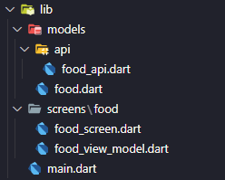
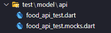
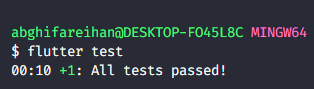
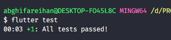

# (27) Finite State Machine dan Unit Testing

## Data Diri

| Nomor       | Nama                    |
| ----------- | ----------------------- |
| 1_001FLB_42 | Abghi Fareihan Desailie |

<br>

### TASK 1

Buatlah sebuah halaman baru dengan MVVM lengkap dengan menampilkan data dari API !

**Lib folder :**



<br>

**Folder api/food_api.dart :**

```dart
class FoodAPI {
  Future<List<Food>> getAllFoods() async {
    final response = await Dio().get(
        'https://my-json-server.typicode.com/hadihammurabi/flutter-webservice/foods');

    List<Food> foods = (response.data as List)
        .map(
          (food) => Food(
            id: food['id'],
            name: food['name'],
          ),
        )
        .toList();

    return foods;
  }
```

<br>

**Menampilkan data dari API :**


<br>
<br>

### TASK 2

Dari MVVM di atas, lakukan unit test pada model api dengan menerapkan mocking !

**Install dev_dependencies :**
`mockito: ^5.3.2`
`build_runner: ^2.3.2`

<br>

**Pada folder test buatkan food_api_test.dart**



`food_api_test.mocks.dart` adalah sebuah hasil generate dari packages `build_runner`

<br>

**Code food_api_test.dart :**

```dart
@GenerateMocks([FoodAPI])
void main() {
  group('Food API test', () {
    FoodAPI foodAPI = MockFoodAPI();
    test('get all foods returns data', () async {
      when(foodAPI.getAllFoods()).thenAnswer(
        (_) async => <Food>[
          Food(id: 1, name: 'a'),
        ],
      );
      var food = await FoodAPI().getAllFoods();
      expect(food.isNotEmpty, true);
    });
  });
}
```

<br>

**Test pengujian tanpa mocking (test biasa) :**



<br>

**Test pengujian menggunakan mocking :**



<br>

**Terjadi perbedaan durasi test yang cukup cepat, maka dari itu unit testing menggunakan mocking lebih efektif di banding test biasa.**
