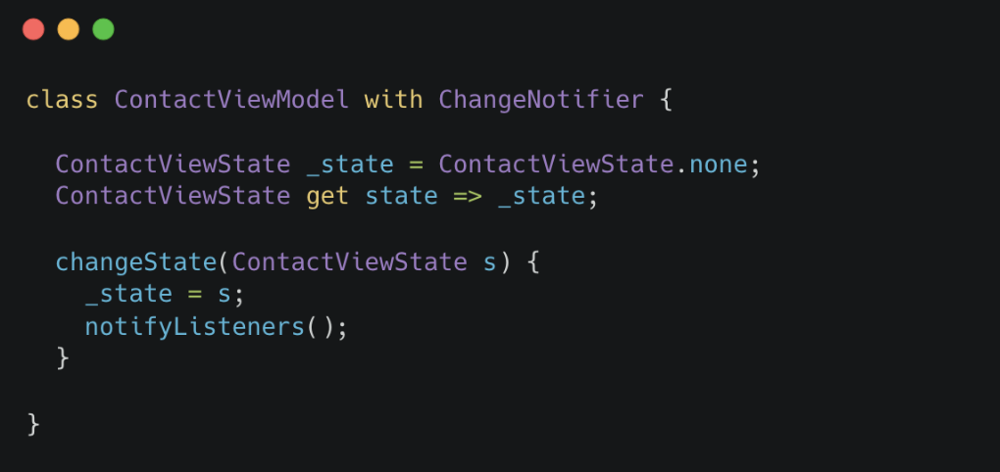
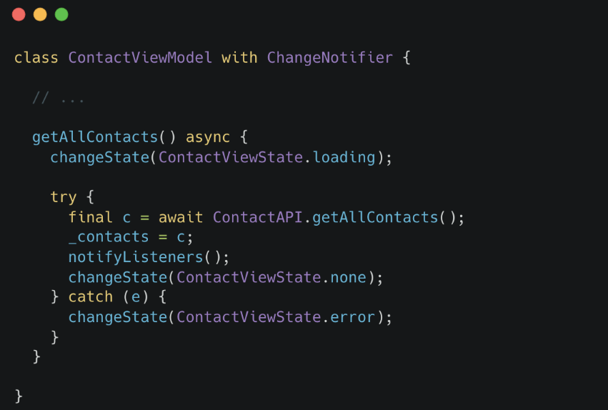
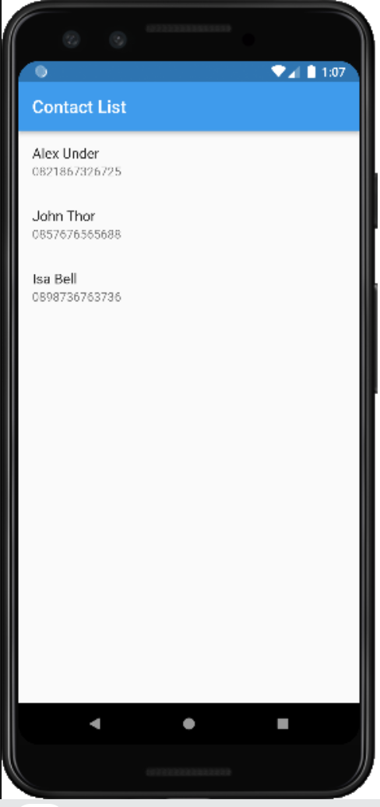
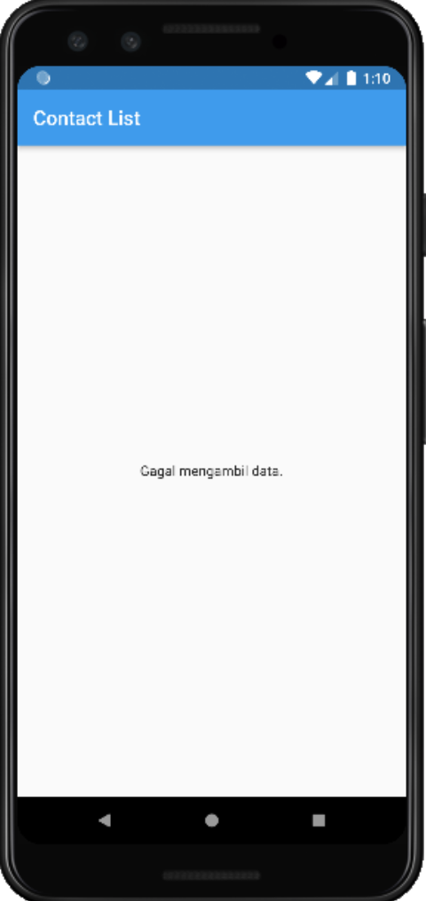

# (27) Finite State Machine dan Unit Testing

## Data Diri

Nomor Urut: 1_001FLB_42
Nama: Abghi Fareihan Desailie

## Summary

Pada section 27 ini, saya belajar tentang Finite State Machine dan Unit Testing

### Finite State Machine

- Mesin yang memiliki sejumlah state
- Tiap state menunjukan apa yang terjadi sebelumnya

**Contoh :**
Terdapat 3 state yang menunjukan kejadian dalam sutu proses.

- IDDLE saat tidak terjadi proses
- RUNNING saat proses sedang berjalan
- ERROR saat proses gagal diselesaikan

**Contoh Sukses:**

- IDDLE berubah menjadi RUNNING saat proses berjalan
- RUNNING kembali menjadi IDDLE saat proses selesai

**Contoh Gagal:**

- IDDLE berubah menjadi RUNNING saat proses berjalan
- RUNNING menjadi ERROR saat terjadi kegagalan
- ERROR kembali menjadi IDDLE

### Implementasi pada View-Model

**Menambah Enum**
Membuat enum untuk masing-masing state:

- none saat IDDLE
- loading saat RUNNING
- error saat ERROR

```dart
enum ContactViewState {
    none,
    loading,
    error,
}
```

**Menambah Getter-Setter**
Membuat getter-setter untuk menyimpan state dari widget



<br>

**Gunakan State**
Tiap proses yang perlu state tersebut, dapan memanfaatkannya



### Implementasi pada Widget

**Perbedaan Tampilan Tiap State**
Informasi finite state dapat berguna untuk menentukan seperti apa tampilan yang dimunculkan

Saat state menunjukkan IDDLE setelah RUNNING, maka ditampilkan data yang didapatkan



<br>

Saat state menunjukkan ERROR, maka ditampilkan pesan yang menunjukkan bahwa proses tidak dapat diselesaikan



<br>
<br>

### Unit Test

- Salah satu jenis pengujian pada perangkat lunak
- Pengujian dilakukan pada unit dalam perangkat lunak
- Unit yang dimaksud umumnya adalah fungsi atau method

**Tujuan Unit Testing**

- Memastikan fungsi dapat mengolah berbagai jenis input
- Memastikan hasil dari suatu fungsi atau method sudah sesuai
- Menjadi dokumentasi

### Mocking

- Proses yang terkait dengan sistem eksternal dapat mempengaruhi berjalannya pengujian
- Pengaruh tersebut dapat mengganggu proses pengujian
- Dilakukan mocking untuk menghindari masalah-masalah tersebut

**Cara Kerja Mocking**

- Suatu object dibuat bentuk tiruan
- Bentuk tiruan tersebut memiliki input dan output yang sama dengan asli
- Bentuk tiruan menghilangkan ketergantungan pada sistem ekternal
