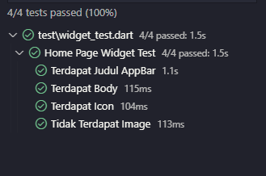
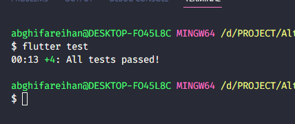

# (28) UI Testing

## Data Diri

| Nomor       | Nama                    |
| ----------- | ----------------------- |
| 1_001FLB_42 | Abghi Fareihan Desailie |

<br>

### TASK

- Lakukan test halaman yang pernah dibuat pada bagian judul, body, dan elemen yang ada pada halaman tersebut

- Lakukan test pada halaman yang belum dibuat

<br>

Import package `import 'package:flutter_test/flutter_test.dart'`

**Source code folder test :**

```dart
Widget testHomePage() {
  return const MaterialApp(
    debugShowCheckedModeBanner: false,
    home: HomePage(),
  ); // membuat widget agar nanti hanya di panggil widget nya saja
}

void main() {
  group('Home Page Widget Test', () {
    testWidgets('Terdapat Judul AppBar', (WidgetTester tester) async {
      await tester.pumpWidget(
        testHomePage(), // fungsi membuat widget di atas
      );
      expect(find.text('List Contact'), findsOneWidget);
    }); // pengetesan terhadap judul text yang mengandung text 'List Contact'
    testWidgets('Terdapat Body', (WidgetTester tester) async {
      await tester.pumpWidget(
        testHomePage(),
      );
      expect(find.byType(ListView), findsOneWidget);
    }); // pengetesan terhadap body yang mengandung type ListView
    testWidgets('Terdapat Icon', (WidgetTester tester) async {
      await tester.pumpWidget(
        testHomePage(),
      );
      expect(find.byIcon(Icons.add), findsOneWidget);
    }); // pengetesan terhadap icon yang mengandung icons.add
    testWidgets('Tidak Terdapat Image', (WidgetTester tester) async {
      await tester.pumpWidget(
        testHomePage(),
      );
      expect(find.byType(Image), findsNothing);
    }); // pengetesan terhadap halaman yang belum di buat, di halaman saya tidak ada image maka dari itu saya menggunakan findsNothing
  });
}
```

<br>

**Hasil test pengujian menggunakan debug console :**



<br>

**Hasil test pengujian menggunakan terminal :**


