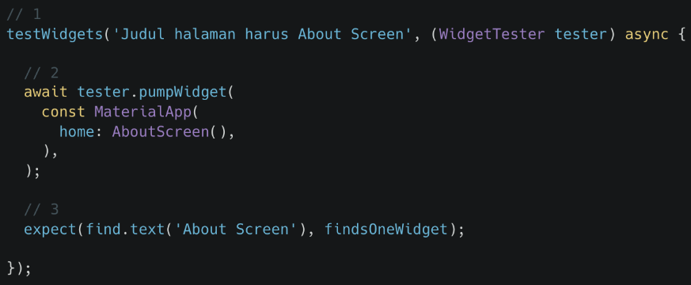
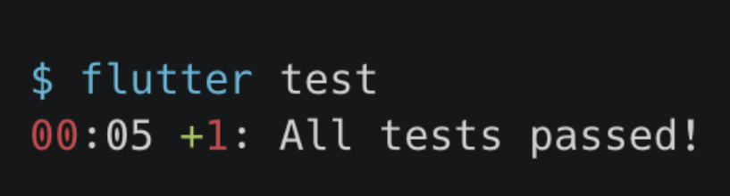
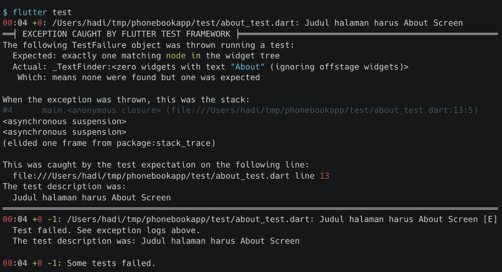

# (28) UI Testing

## Data Diri

Nomor Urut: 1_001FLB_42
Nama: Abghi Fareihan Desailie

## Summary

Pada section 28 ini, saya belajar tentang UI Testing (widget testing)

### Pengertian UI Testing

**UI Testing** adalah Pengujian yang dilakukan pada tampilan suatu aplikasi untuk memastikan aplikasi dapat menerima interaksi dan memberi respon kepada pengguna

**UI Testing di Flutter** disebut juga widget testing sehingga pengujian dilakukan pada widgest dengan menuliskan script yang dapat dijalankan secara otomatis

**Keuntungan UI Testing**

- Memastikan seluruh widget memberi tampilan yang sesuai
- Memastikan seluruh interaksi dapat diterima dengan baik
- Menjadi ketetntuan yang harus diikuti saat diperlukan perubahan pada widget

### Melakukan UI Testing

**Instalasi Package Testing**
Package testing biasanya sudah terinstall sejak project pertama dibuat, tapi kalian bisa juga menginstall secara manual

**Penulisan Script Testing**

- Dilakukan pada folder test
- Nama file harus diikuti _test.dart_, contoh `contact_test.dart`
- Tiap file berisi fungsi _main()_ yang didalamnya dapat dituliskan script testing
- Tiap skenario pengujian disebut _test case_

 
 

**Contoh Testing**

1. Test case diawali dengan testWidgets dan diberi judul
2. Simulasi proses mengaktifkan halaman AboutScreen
3. Memeriksa apakah halaman tersebut terdapat teks "About Screen"

 

**Menjalankan Testing (Berhasil)**

- Perintah **flutter test** akan menjalankan seluruh file test yang dibuat
- Hasil dari pengujian ini adalah lamanya pengujian, total pengujian yang dilakukan dan pesan bahwa pengujain berhasil

 
 

**Menjalankan Testing (Gagal)**

Akan ditampilkan penyebab gagalnya pengujian

