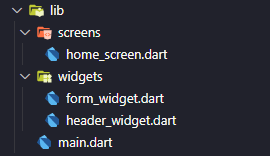
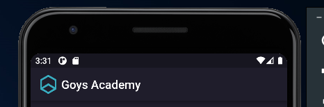
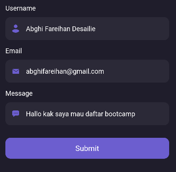
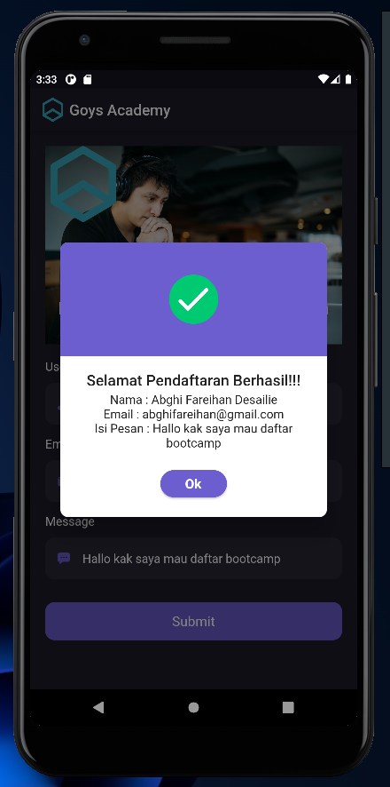
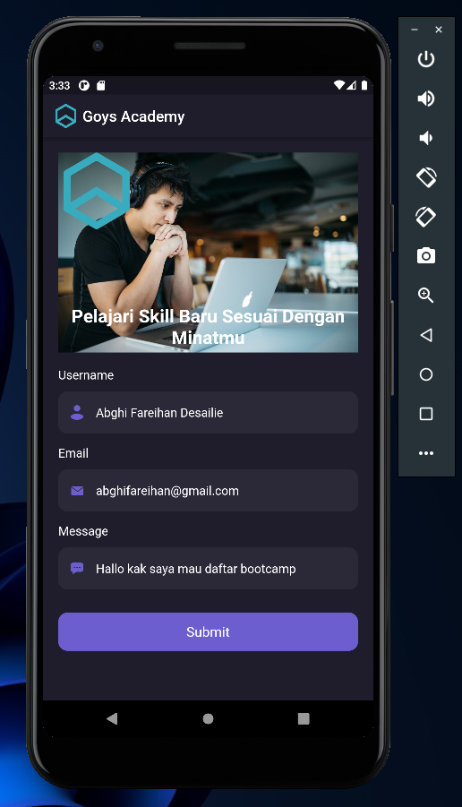

# Weekly 1

## Data Diri

| Nomor       | Nama                    |
| ----------- | ----------------------- |
| 1_001FLB_42 | Abghi Fareihan Desailie |

## Task Weekly

Saya membuat folder dan file di dalam folder `lib` :



<br>

Buatlah header pada application kalian :



Code :

```dart
return Scaffold(
      backgroundColor: const Color(0xFF1F1D2B),
      // merubah warna background
      appBar: AppBar(
        backgroundColor: const Color(0xFF1F1D2B), // merubah warna background appBar
        title: Row( // saya bikin row agar logo dan text 'Goys' sejajar
          children: [
            Image.asset(
              'images/logo.png',
              fit: BoxFit.contain,
              height: 32,
            ),
            const SizedBox( // untuk memberi jarak (spasi) logo dan text
              width: 8,
            ),
            const Text(
              'Goys Academy',
            ),
          ],
        ),
      ),
      body: ListView(
        children: const [
          HeaderWidget(), // memanggil headerwidget
          FormWidget(), // memanggil formwidget
        ],
      ),
    );
```

<br>
<br>

Welcome section (terdapat gambar dan kata-kata) :
Isi dari `widgets/header_widget.dart`


Code :

```dart
Container(
      margin: const EdgeInsets.only(
        top: 20,
        left: 20,
        right: 20,
      ),
      child: Stack( // menggunakan stack agar text berada di depan gambar
        children: [
          Image.asset(
            'images/welcome_header.jpg',
          ),
          Image.asset(
            'images/logo_utama.png',
            width: 100,
            height: 100,
          ),
          Container(
            margin: const EdgeInsets.only(
              top: 200,
            ),
            child: Center(
              child: Column(
                mainAxisAlignment: MainAxisAlignment.center,
                children: const [
                  Text(
                    'Pelajari Skill Baru Sesuai Dengan Minatmu',
                    style: TextStyle(
                        color: Colors.white,
                        fontSize: 24,
                        fontWeight: FontWeight.bold),
                    textAlign: TextAlign.center,
                  ),
                ],
              ),
            ),
          ),
        ],
      ),
    );
```

<br>
<br>

Memiliki 3 buah form(username, email, message) dan memiliki button submit :
Isi dari `widgets/form_widget.dart`



Code :

```dart
class FormWidget extends StatefulWidget {
  const FormWidget({super.key});

  @override
  State<FormWidget> createState() => _FormWidgetState();
}

class _FormWidgetState extends State<FormWidget> {
  TextEditingController txtName = TextEditingController();
  TextEditingController txtEmail = TextEditingController();
  TextEditingController txtMessage = TextEditingController();

  // saya membuat statefull widget agar inputan yang saya masukan bisa tampil nantinya di dialog alert
```

Code bagian form :

```dart
Container(
      margin: const EdgeInsets.all(20),
      child: Column(
        crossAxisAlignment: CrossAxisAlignment.start,
        children: [
          const Text( // text username yg ada di atas textfield
            'Username',
            style: TextStyle(
              color: Colors.white,
              fontSize: 16,
            ),
          ),
          const SizedBox( // memberi jarak
            height: 12,
          ),
          Container( // saya bungkus pakai container dulu
            height: 55, // tinggi dari textfield
            padding: const EdgeInsets.symmetric(
              horizontal: 16,
            ),
            decoration: BoxDecoration(
              color: const Color(0xFF2B2937),
              borderRadius: BorderRadius.circular(12),
            ),
            child: Center(
              child: Row(
                children: [
                  Image.asset( // memasukan icon di dalam container (text field) form
                    'images/icon_user.png',
                    width: 17,
                  ),
                  const SizedBox(
                    width: 16,
                  ),
                  Expanded(
                    child: TextFormField(
                      controller: txtName, // ini berfungsi memanggil parameter yg sebelumnya di buat di atas
                      style: const TextStyle(color: Colors.white),
                      decoration: const InputDecoration.collapsed( // agar ketika di klik tidak ada outline
                        hintText: 'Your Name',
                        hintStyle: TextStyle(
                          color: Color(0xFF504F5E),
                        ),
                      ),
                    ),
                  ),
                ],
              ),
            ),
          ),
```

<br>
<br>

Jika kita menekan tombol submit maka keluar alert yang berisikan data yang kita masukkan pada form :
Saya menggunakan package `cool_alert: ^1.1.0` untuk alert nya agar lebih bagus dan menarik https://pub.dev/packages/cool_alert



Code :

```dart
Container(
            width: double.infinity, // agar lebar button memenuhi halaman
            height: 50, // tinggi buttom
            margin: const EdgeInsets.only(top: 30),
            child: TextButton(
              onPressed: () {
                CoolAlert.show( // saya menggunakan Alert Cool agar tampilan lebih bagus
                  context: context,
                  type: CoolAlertType.success,
                  backgroundColor: const Color(0xFF6C5ECF),
                  confirmBtnColor: const Color(0xFF6C5ECF),
                  title: 'Selamat Pendaftaran Berhasil !!',
                  text:
                      "Nama : ${txtName.text}\nEmail : ${txtEmail.text}\nIsi Pesan : ${txtMessage.text} ",
                ); // fungsi controller tadi untuk di panggil disini
              },
              style: TextButton.styleFrom( // style pada button
                backgroundColor: const Color(0xFF6C5ECF),
                shape: RoundedRectangleBorder(
                  borderRadius: BorderRadius.circular(12),
                ),
              ),
              child: const Text(
                'Submit',
                style: TextStyle(
                  color: Colors.white,
                  fontSize: 18,
                  fontWeight: FontWeight.w400,
                ),
              ),
            ),
          ),
```

<br>

**Output Hasil :**


