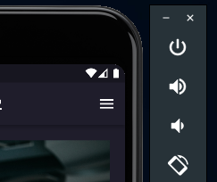
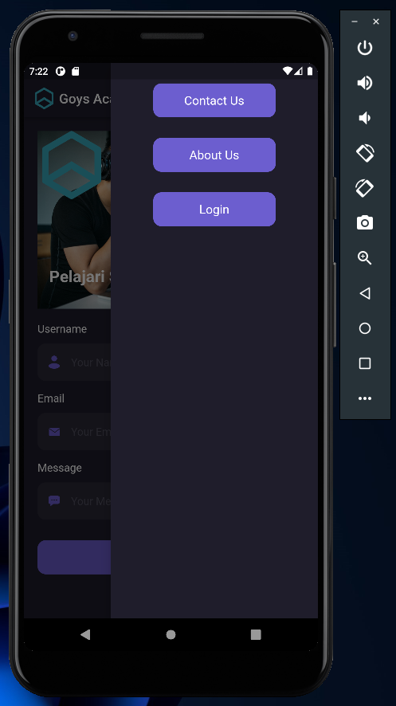
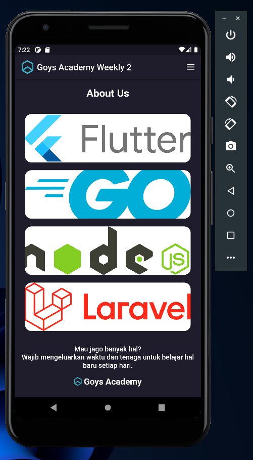

# Weekly 2

## Data Diri

| Nomor       | Nama                    |
| ----------- | ----------------------- |
| 1_001FLB_42 | Abghi Fareihan Desailie |

## Task Weekly

**Buatlah button untuk memunculkan sidebar :**



**Code :**
Saya membuat drawer agar memunculkan sidebar, untuk ButtonWidget saya membuat widget khusus untuk memanggil button.

```dart
Container(
      margin: const EdgeInsets.all(0),
      child: Drawer(
        backgroundColor: const Color(0xff1F1D2B),
        child: Column(
          children: const [
            ButtonWidget(
              btnTitle: 'Contact Us',
            ),
            ButtonWidget(
              btnTitle: 'About Us',
            ),
            ButtonWidget(
              btnTitle: 'Login',
            ),
          ],
        ),
      ),
    );
```

<br>

**Sidebar berisikan 3 navigation button :**



**Code ButtonWidget :**
Agar drawer(sidebar) muncul di sebelah kanan saya menggunakan `endDrawer: const DrawerWidget()`

```dart
class ButtonWidget extends StatelessWidget {
  final String btnTitle;

  const ButtonWidget({
    super.key,
    required this.btnTitle,
  });

  @override
  Widget build(BuildContext context) {
    return Container(
      width: 180,
      height: 50,
      margin: const EdgeInsets.only(top: 30),
      child: TextButton(
        onPressed: () {},
        style: TextButton.styleFrom(
          backgroundColor: const Color(0xFF6C5ECF),
          shape: RoundedRectangleBorder(
            borderRadius: BorderRadius.circular(12),
          ),
        ),
        child: Text(
          btnTitle,
          style: const TextStyle(
            color: Colors.white,
            fontSize: 18,
            fontWeight: FontWeight.w400,
          ),
        ),
      ),
    );
  }
}
```

<br>

**Buatlah title bertuliskan 'about us' terdapat list dalam bentuk card :**



**Code Card :**
Untuk menyusun card nya saya membungkus widget Card dengan container agar width dan height nya bisa di atur

```dart
    Container(
        width: double.infinity,
        height: 120,
            child: Card(
                shape: RoundedRectangleBorder(
                    borderRadius: BorderRadius.circular(15),
                ), // untuk memberikan rounded pada card
                child: Image.asset(
                    'images/logo_flutter.png',
                    fit: BoxFit.cover,
                ),
        ),
    ),
```
