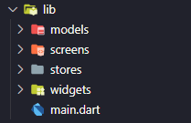
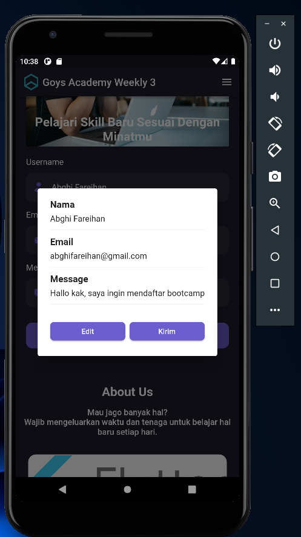
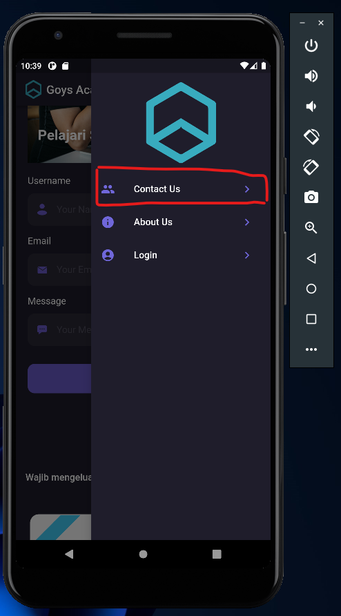
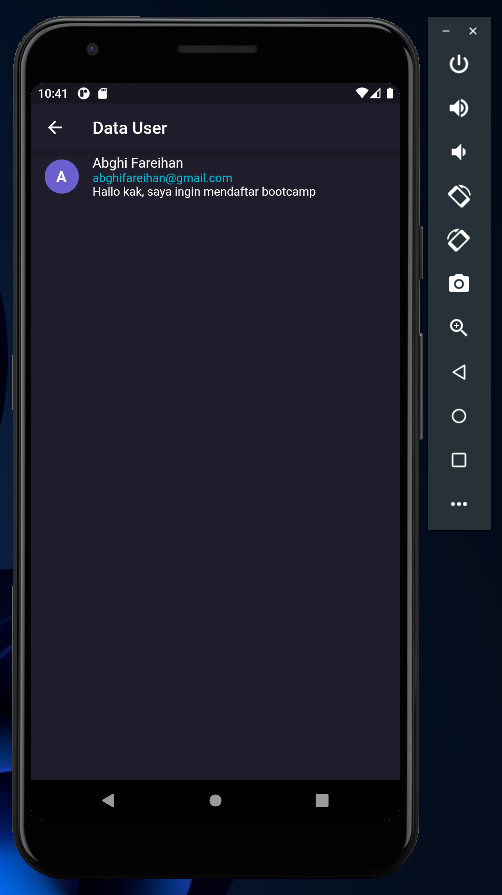

# Weekly 3

## Data Diri

| Nomor       | Nama                    |
| ----------- | ----------------------- |
| 1_001FLB_42 | Abghi Fareihan Desailie |

## Task Weekly

**Terapkan flutter state management pada project :**

saya menambahkan dependencies `provider: ^6.0.3`

```dart
void main() {
  runApp(
    MultiProvider(
      providers: [
        ChangeNotifierProvider(
          create: (_) => ContactStore(),
        ),
      ],
      child: const MyApp(),
    ),
  );
}
```

<br>
<br>

**Terapkan mvvm arsitektur :**

Ini adalah isi folder lib saya



<br>
<br>

**Jika user mengisi form dan melakukan click pada button submit maka akan terdapat alert yang menunjukan data. Selain itu data yang dimasukkan akan berada pada halaman baru :**

Jika user tekan tombol submit maka akan muncul alert yang berisi data pada form

```dart
void _showAlertDialog(ContactStore contactStore) {
    showDialog(
      context: context,
      builder: (BuildContext context) {
        return AlertDialog(
          content: SingleChildScrollView(
            child: Column(
              crossAxisAlignment: CrossAxisAlignment.start,
              children: [
                const Text(
                  'Nama',
                  style: TextStyle(
                    fontWeight: FontWeight.w600,
                    fontSize: 18,
                  ),
                ),
                const SizedBox(
                  height: 8,
                ),
                Text(nameController.text),
                const Padding(
                  padding: EdgeInsets.symmetric(vertical: 4),
                  child: Divider(),
                ),
                const Text(
                  'Email',
                  style: TextStyle(
                    fontWeight: FontWeight.w600,
                    fontSize: 18,
                  ),
                ),
                const SizedBox(height: 8),
                Text(emailController.text),
                const Padding(
                  padding: EdgeInsets.symmetric(vertical: 4),
                  child: Divider(),
                ),
                const Text(
                  'Message',
                  style: TextStyle(
                    fontWeight: FontWeight.w600,
                    fontSize: 18,
                  ),
                ),
                const SizedBox(height: 8),
                Text(messageController.text),
                const Padding(
                  padding: EdgeInsets.symmetric(vertical: 4),
                  child: Divider(),
                ),
                const SizedBox(height: 16),
                Row(
                  children: [
                    Expanded(
                      child: ElevatedButton(
                        onPressed: () {
                          Navigator.pop(context);
                        },
                        style: ElevatedButton.styleFrom(
                          backgroundColor: Color(0xFF6C5ECF),
                          shape: RoundedRectangleBorder(
                            borderRadius: BorderRadius.circular(8),
                          ),
                        ),
                        child: const Text('Edit'),
                      ),
                    ),
                    const SizedBox(width: 8),
                    Expanded(
                      child: ElevatedButton(
                        onPressed: () {
                          if (nameController.text.isEmpty) return;
                          if (emailController.text.isEmpty) return;
                          if (messageController.text.isEmpty) return;

                          // Menambahkan data ke list
                          final contact = ContactModel(
                            name: nameController.text,
                            email: emailController.text,
                            message: messageController.text,
                          );

                          contactStore.add(contact);
                          ScaffoldMessenger.of(context).showSnackBar(
                            const SnackBar(
                              content: Text('Berhasil Mengirim Data'),
                            ),
                          );

                          nameController.clear();
                          emailController.clear();
                          messageController.clear();

                          Navigator.pop(context);
                        },
                        style: ElevatedButton.styleFrom(
                          backgroundColor: Color(0xFF6C5ECF),
                          shape: RoundedRectangleBorder(
                            borderRadius: BorderRadius.circular(8),
                          ),
                        ),
                        child: const Text('Kirim'),
                      ),
                    ),
                  ],
                ),
              ],
            ),
          ),
        );
      },
    );
  }
```



<br>
<br>

Lalu pada bagian **Contact Us** di bagian drawer, akan di arahkan ke halaman yang berisi data tadi `contact_screen.dart`

```dart
ListTile(
              leading: const Icon(Icons.group),
              iconColor: const Color(0xFF7067DA),
              onTap: () {
                Navigator.push(
                  context,
                  MaterialPageRoute(
                    builder: (context) => ContactScreen(),
                  ),
                );
              },
              title: const Text(
                'Contact Us',
                style: TextStyle(
                  fontSize: 16,
                  color: Colors.white,
                ),
              ),
              trailing: IconButton(
                onPressed: () {},
                icon: const Icon(Icons.keyboard_arrow_right),
                color: const Color(0xFF7067DA),
              ),
            ),
```



<br>
<br>

Berikut, adalah isi dari halaman `contact_screen.dart`, ini merupakan data dari form yang telah di isi


